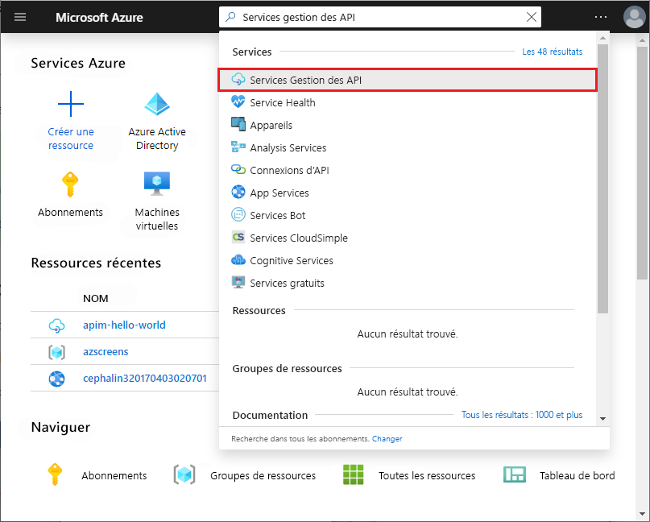
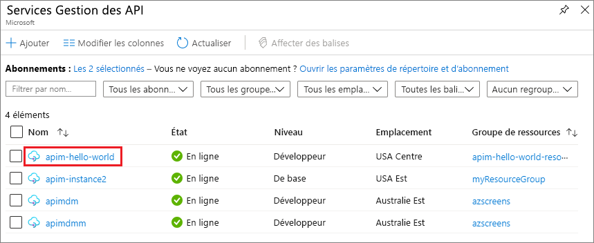

## Accéder à votre instance Gestion des API

1. Sur le portail Azure, recherchez et sélectionnez **Services Gestion des API**.

   

1. Dans la page **Services Gestion des API**, sélectionnez votre instance Gestion des API.

   

