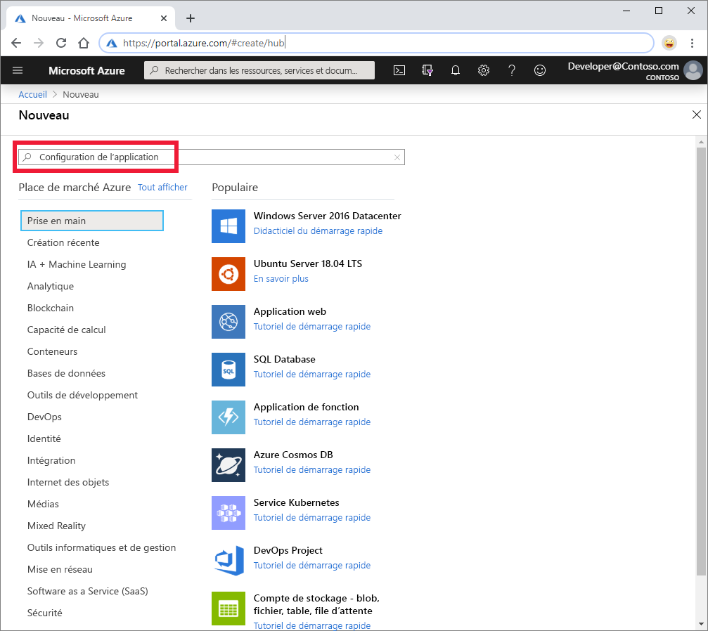
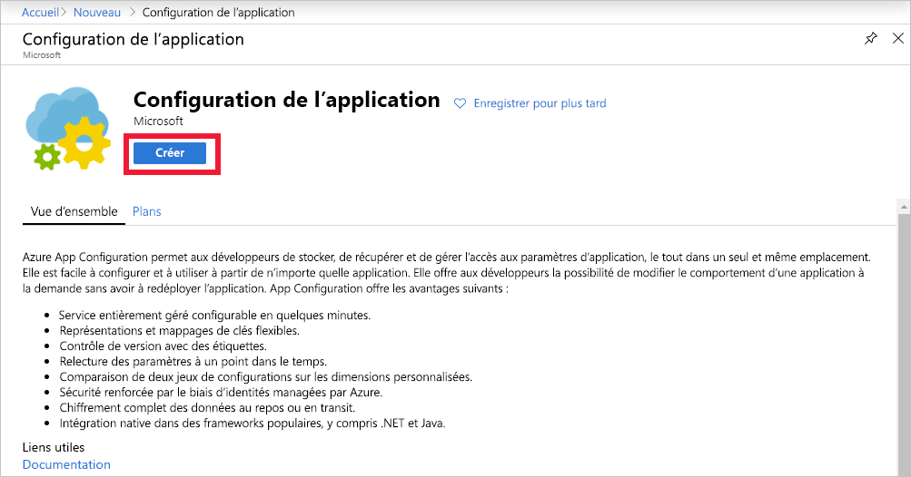

1. Pour créer un magasin App Configuration, connectez-vous au [portail Azure](https://portal.azure.com). En haut à gauche de la page d’accueil, sélectionnez **Créer une ressource**. Dans la zone **Rechercher dans la Place de marché**, entrez *App Configuration* et sélectionnez <kbd>Entrée</kbd>.

    

1. Sélectionnez **Configuration d’application** dans les résultats de la recherche, puis **Créer**.

    

1. Dans le volet **Créer une ressource App Configuration**, entrez les paramètres suivants :

    | Paramètre | Valeur suggérée | Description |
    |---|---|---|
    | **Abonnement** | Votre abonnement | Sélectionnez l’abonnement Azure à utiliser pour tester App Configuration. Si votre compte n’a qu’un seul abonnement, il est automatiquement sélectionné et la liste **Abonnement** n’est pas affichée. |
    | **Groupe de ressources** | *AppConfigTestResources* | Sélectionnez ou créez un groupe de ressources pour votre ressource du magasin App Configuration. Ce groupe est utile pour organiser plusieurs ressources que vous souhaitez supprimer en même temps que vous supprimez ce groupe de ressources. Pour plus d’informations, consultez [Utilisation des groupes de ressources pour gérer vos ressources Azure](/azure/azure-resource-manager/resource-group-overview). |
    | **Nom de la ressource** | Nom globalement unique | Entrez un nom de ressource unique à utiliser pour la ressource du magasin App Configuration. Le nom doit être une chaîne de 5 à 50 caractères. Il doit contenir uniquement des chiffres, des lettres et le caractère `-`. Le nom ne peut ni commencer ni finir par le caractère `-`. |
    | **Lieu** | *USA Centre* | Utilisez **Emplacement** pour indiquer l’emplacement géographique de l’hébergement de votre magasin de configuration d’application. Pour des performances optimales, créez la ressource dans la même région que les autres composants de votre application. |
    | **Niveau tarifaire** | *Gratuit* | Sélectionnez le niveau tarifaire souhaité. Pour plus d’informations, consultez la [page de tarification App Configuration](https://azure.microsoft.com/pricing/details/app-configuration). |

1. Sélectionnez **Vérifier + créer** pour valider vos paramètres.

1. Sélectionnez **Create** (Créer). Le déploiement peut prendre quelques minutes.

1. Une fois le déploiement terminé, accédez à la ressource App Configuration. Sélectionnez **Paramètres** > **Clés d’accès**. Notez la chaîne de connexion de la clé primaire en lecture seule. Vous utilisez cette chaîne de connexion plus tard pour configurer votre application, afin qu’elle communique avec le magasin App Configuration que vous avez créé.
