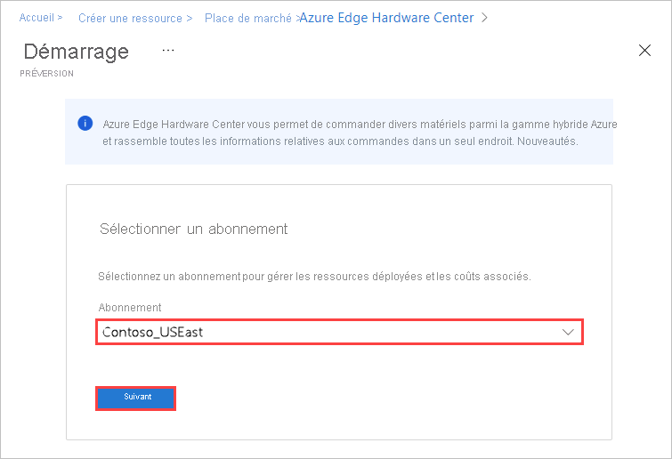
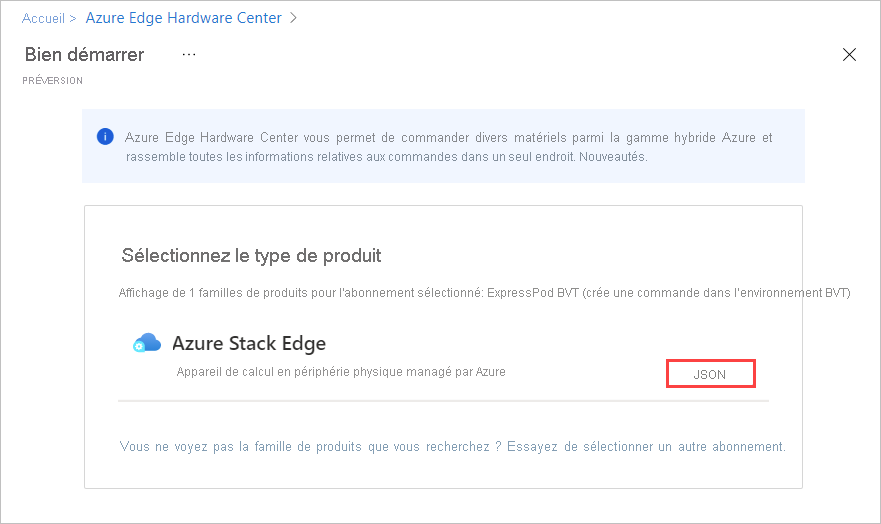
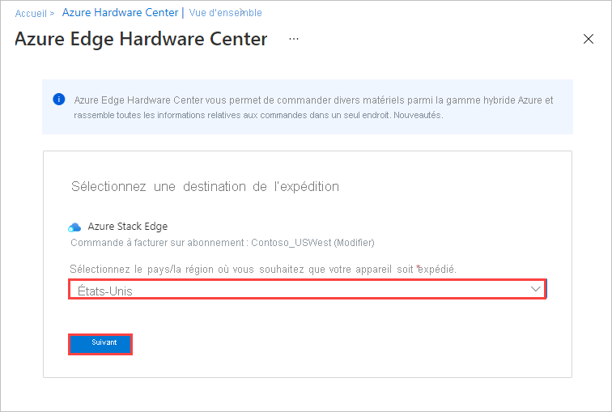
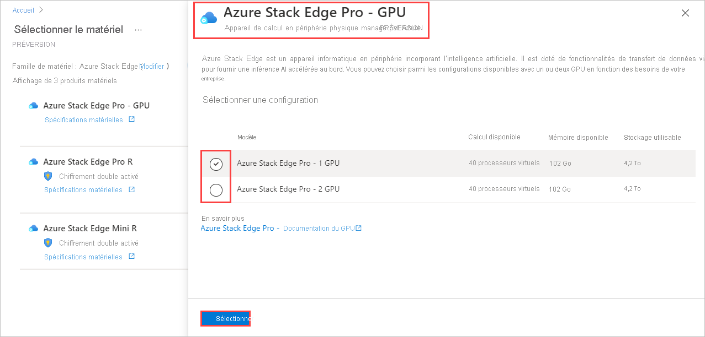
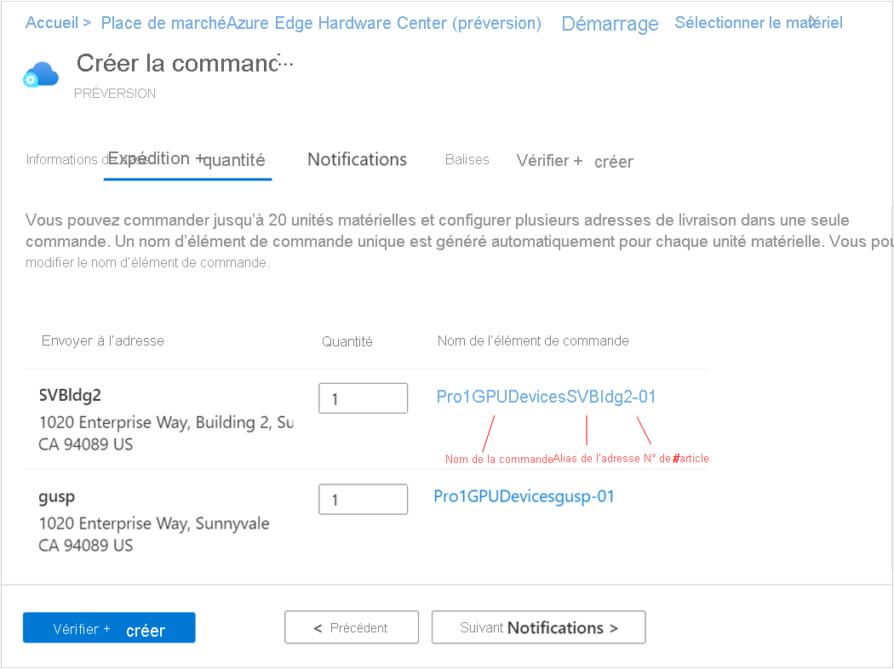

Pour passer une commande via Azure Edge Hardware Center, procédez comme suit :

1. Utilisez vos informations d’identification Microsoft Azure pour vous connecter au portail Azure en suivant cette URL : [https://portal.azure.com](https://portal.azure.com).

2. Sélectionnez **+ Créer une ressource**. Recherchez et sélectionnez **Azure Edge Hardware Center**. Dans Azure Edge Hardware Center, sélectionnez **Créer**.

    

3. Choisissez un abonnement, puis **Suivant**.

    

4. Pour démarrer votre commande, sélectionnez **Commander** à côté de la famille de produits que vous souhaitez commander, par exemple **Azure Stack Edge**. Si la famille de produits ne s’affiche pas, vous devez peut-être utiliser un autre abonnement ; sélectionnez **Essayer de sélectionner un autre abonnement**. 

     

5. Sélectionnez la destination d’expédition pour votre commande.

    

6. Sur la page **Sélectionner le matériel**, utilisez le bouton **Sélectionner** pour choisir le produit matériel à commander. Par exemple, sélectionnez **Azure Stack Edge Pro - GPU**. 

    

    Une fois que vous avez sélectionné un produit matériel, vous devez sélectionner la configuration de l’appareil à commander. Les produits matériels et configurations d’appareil suivants sont disponibles dans Azure Edge Hardware Center (préversion).

    |Produit matériel              |Configurations                                                                                              |
    |------------------------------|------------------------------------------------------------------------------------------------------------|
    |Azure Stack Edge Pro - GPU    |<ul><li>Azure Stack Edge Pro - 1 GPU</li><li>Azure Stack Edge Pro - 2 GPU</li><ul>                          |
    |Azure Stack Edge Pro R        |<ul><li>Azure Stack Edge Pro R - single node</li><li>Azure Stack Edge Pro R - single node with UPS</li></ul>|
    |Azure Stack Edge Mini R       |Une configuration, sélectionnée automatiquement.                 |

7. Sélectionnez la configuration de l’appareil, puis choisissez **Sélectionner**. L’écran ci-dessous montre les configurations disponibles pour les appareils Azure Stack Edge Pro-GPU.

    Si vous commandez des appareils Azure Stack Edge Mini R, qui ont tous la même configuration, vous ne verrez pas cet écran. 

    

    L’assistant **Créer une commande** s’ouvre.

8.  Dans l’onglet **Général**, fournissez un **Nom de commande**, un **Groupe de ressources** et une **Région**. Sélectionnez **Suivant : Expédition + quantité >** .

    
  
    Ensuite, vous allez ajouter chaque adresse de livraison à laquelle vous souhaitez envoyer des appareils, puis spécifier le nombre d’appareils à envoyer à chaque adresse. Vous pouvez commander jusqu’à 20 unités (appareils) par commande.

9. Sur l’onglet **Expédition + quantité**, ajoutez chaque adresse d’expédition à laquelle envoyer des appareils : 

    - Pour ajouter une adresse d’expédition, sélectionnez **Ajouter une adresse**. 

       Un champ **Alias d’adresse** sur l’écran **Nouvelle adresse** identifie l’adresse pour une utilisation ultérieure. Sélectionnez **Ajouter** lorsque vous avez fini de remplir les champs d’adresse. Ensuite, utilisez **Sélectionner la ou les adresses** pour ajouter l’adresse à votre commande.

       

    - Pour utiliser l’adresse de livraison d’une commande précédente ou pour utiliser une adresse que vous venez d’ajouter, cliquez sur **Sélectionner la ou les adresses**. Ensuite, sur l’écran **Sélectionner la ou les adresses**, sélectionnez une ou plusieurs adresses, puis choisissez **Sélectionner**.

       

    L’onglet **Expédition + quantité** a maintenant un élément séparé pour chaque adresse d’expédition.

    Chaque nom d’article de commande comprend un préfixe de nom (le nom de la commande suivi de l’alias d’adresse), avec un numéro d’article pour chaque appareil expédié à cette adresse.

    

10. Pour chaque adresse, entrez **Quantité** d’appareils à expédier dans l’onglet **Expédition + quantité**.

    Lorsque vous entrez une quantité supérieure à un, un libellé **+n de plus** apparaît après le nom de l’article de commande.

     

11. Si vous souhaitez modifier le nom des articles de la commande, sélectionnez et cliquez sur le nom de l’article de commande pour ouvrir le volet **Renommer l’article de commande**. Si vous expédiez plus d’un article à une adresse, sélectionnez **+n de plus**.

    Vous pouvez effectuer deux types de modification de nom :
 
    * Pour utiliser un préfixe de nom différent pour tous les articles de la commande, modifiez le **Préfixe du nom**, puis sélectionnez **Appliquer**, comme indiqué sur l’écran suivant.

    * Vous pouvez également modifier le nom de chaque article de commande individuellement. 

    Lorsque vous avez terminé, sélectionnez **Terminé**.

    

    Sélectionnez **Suivant : Notifications >** pour continuer.

12. Si vous souhaitez recevoir des notifications d’état à mesure de l’avancement de votre commande, saisissez l’adresse e-mail de chaque destinataire dans l’onglet **Notifications**. 

    Pour ajouter une adresse e-mail, entrez l’adresse et sélectionnez **Ajouter**. Vous pouvez ajouter jusqu’à 20 adresses e-mail.

    

    Lorsque vous avez terminé, sélectionnez **Vérifier + créer** pour continuer.

13. Sous l’onglet **Vérifier + créer** :

    1. Vérifiez votre commande. La commande est validée automatiquement lorsque vous ouvrez cet écran. Si vous voyez une bannière **La validation a échoué**, vous devrez résoudre les problèmes avant de créer la commande.
    
    1. Lisez les **Conditions de confidentialité** et cochez la case pour les accepter.
 
    1. Sélectionnez **Create** (Créer).

    

    Pendant le déploiement, la commande s’ouvre dans le portail, avec l’état de chaque article de commande affiché. Une fois le déploiement terminé, vous devrez peut-être cliquer sur la flèche vers le bas à côté de **Détails du déploiement** pour voir l’état des éléments individuels.

    

14. Pour afficher les détails d’un article de commande, illustrés ci-dessous, sélectionnez l’article dans la colonne **Ressource** des détails de déploiement.

    

15. Une fois qu’un appareil est expédié (le libellé **Expédié** est vert), une option **Configurer le matériel** est ajoutée aux détails de l’article. Sélectionnez cette option pour créer une ressource de gestion pour l’appareil dans Azure Stack Edge.    

    <!--Requested from Anam: Screenshot of an Azure Edge Hardware Center resource with Shipped status, with the Configure hardware option displayed. Graphical display of tags.-->

    L’abonnement, le groupe de ressources et la zone de déploiement sont renseignés à partir de la commande, mais vous pouvez les modifier.

    

    Une fois l’appareil activé, vous pouvez ouvrir la ressource de gestion à partir de l’article et ouvrir l’article de commande à partir de la ressource de gestion.<!--Detailed procedure to be provided in an article on managing Hardware Center orders.-->
