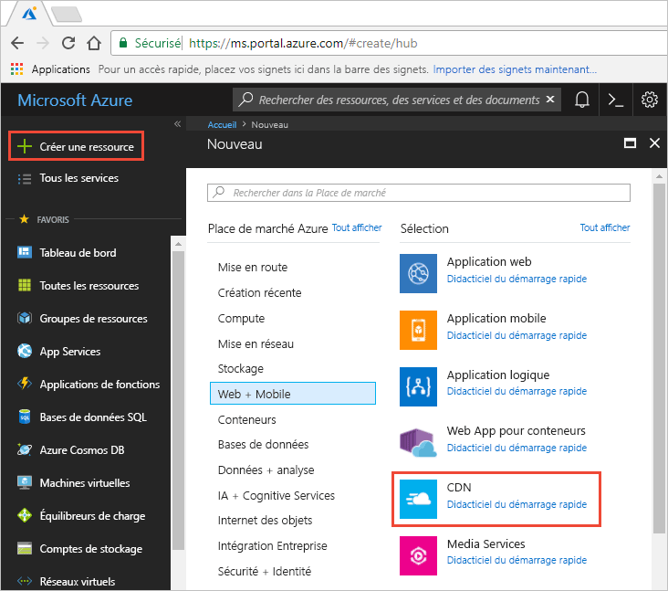
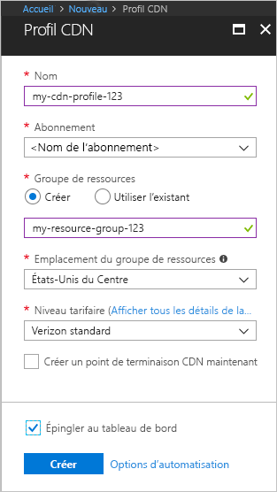

## Créer un profil CDN

Un profil CDN est un conteneur pour les points de terminaison CDN, qui spécifie un niveau tarifaire.

1. Dans le portail Azure (en haut à gauche), sélectionnez **Créer une ressource**. Le volet **Nouveau** s’affiche.
   
1. Recherchez et sélectionnez **CDN**, puis **Créer** :
   
    

    Le volet du **profil CDN** s’affiche.

1. Saisissez les valeurs suivantes :
   
    | Paramètre  | Valeur |
    | -------- | ----- |
    | **Nom** | Entrez *cdn-profile-123* comme nom de profil. Ce nom doit être globalement unique. S’il est déjà utilisé, saisissez-en un autre. |
    | **Abonnement** | Sélectionnez un abonnement Azure dans la liste déroulante. |
    | **Groupe de ressources** | Sélectionnez **Créer nouveau** et entrez *CDNQuickstart-rg* pour le nom de votre groupe de ressources, ou sélectionnez **Utiliser existant** et choisissez *CDNQuickstart-rg* si vous disposez déjà du groupe. | 
    | **Emplacement du groupe de ressources** | Sélectionnez un emplacement près de vous dans la liste déroulante. |
    | **Niveau tarifaire** | Sélectionnez une option **Akamai standard** dans la liste déroulante. (Le temps de déploiement du niveau Akamai est d’environ une minute. Le niveau Microsoft prend environ 10 minutes et les niveaux Verizon prennent environ 90 minutes.) |
    | **Créer un point de terminaison CDN maintenant** | Laissez non sélectionné. |  
   
    

1. Cliquez sur **Créer** pour créer le profil.

