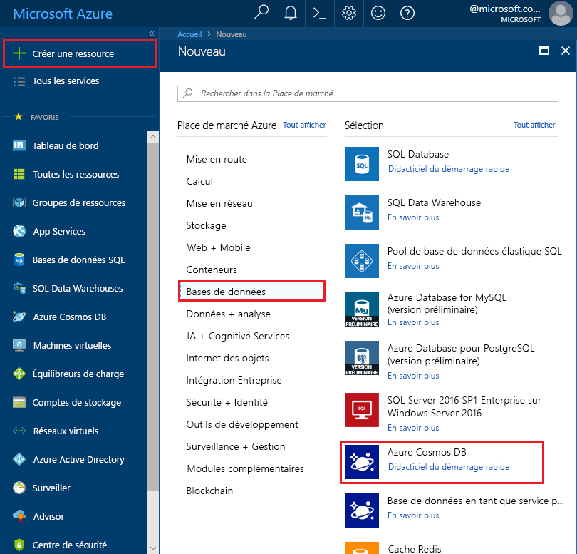
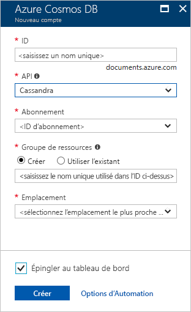

1. Dans une nouvelle fenêtre du navigateur, connectez-vous au [portail Azure](https://portal.azure.com/).

2. Sélectionnez **Créer une ressource** > **Bases de données** > **Azure Cosmos DB**.
   
   

3. Dans la page **Nouveau compte**, entrez les paramètres pour le nouveau compte Azure Cosmos DB. 
 
    Paramètre|Valeur suggérée|Description
    ---|---|---
    ID|*Entrez un nom unique*|Entrez un nom unique pour identifier ce compte Azure Cosmos DB. Étant donné que *cassandra.cosmosdb.azure.com* est ajouté à l’ID que vous fournissez pour créer votre point de contact, utilisez un ID unique, mais identifiable.  L’ID ne peut contenir que des lettres minuscules, des chiffres et le caractère de trait d’union (-), et doit comporter entre 3 et 50 caractères.
    API|Cassandra|L’API détermine le type de compte à créer. Azure Cosmos DB fournit cinq API pour répondre aux besoins de votre application : SQL (base de données Document), Gremlin (base de données graphe), MongoDB (base de données Document), Table Azure et Cassandra, qui nécessitent toutes un compte distinct.   Sélectionnez **Cassandra**, car dans ce guide de démarrage rapide, vous créez une base de données avec colonnes larges qui peut être interrogée avec la syntaxe CQL.  [Découvrez plus d’informations sur l’API Cassandra](../articles/cosmos-db/cassandra-introduction.md).|
    Abonnement|*Votre abonnement*|Sélectionnez l’abonnement Azure que vous voulez utiliser pour ce compte Azure Cosmos DB. 
    Groupe de ressources|Création  *Entrez ensuite le même nom unique que celui fourni plus haut dans ID*|Sélectionnez **Créer**, puis entrez le nom du nouveau groupe de ressources pour votre compte. Pour plus de simplicité, vous pouvez utiliser le même nom que votre ID. 
    Lieu|*Sélectionner la région la plus proche de vos utilisateurs*|Sélectionnez l’emplacement géographique où héberger votre compte Azure Cosmos DB. Utilisez l’emplacement le plus proche de vos utilisateurs, pour leur donner l’accès le plus rapide possible aux données.
    Épingler au tableau de bord | Sélectionnez | Cochez cette case pour que votre nouveau compte de base de données soit ajouté à votre tableau de bord du portail pour un accès facilité.

    Cliquez ensuite sur **Créer**.

    

4. La création du compte prend quelques minutes. Attendez que le portail affiche la page indiquant **Félicitations ! Votre compte Azure Cosmos DB a été créé**.

