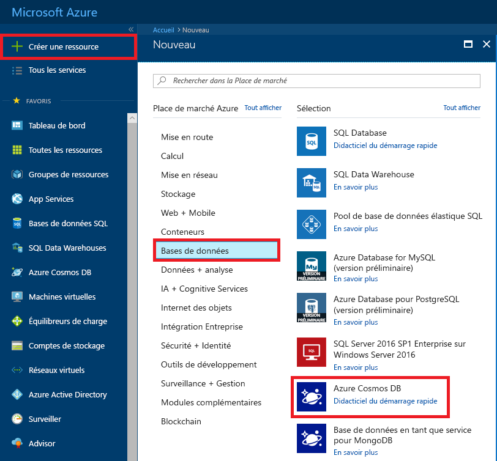
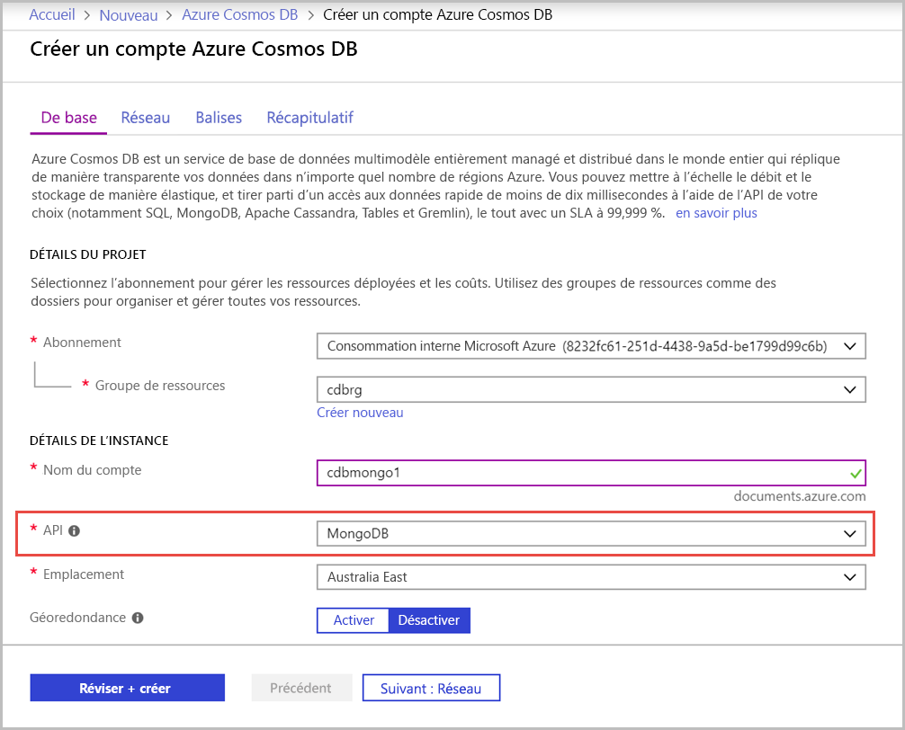
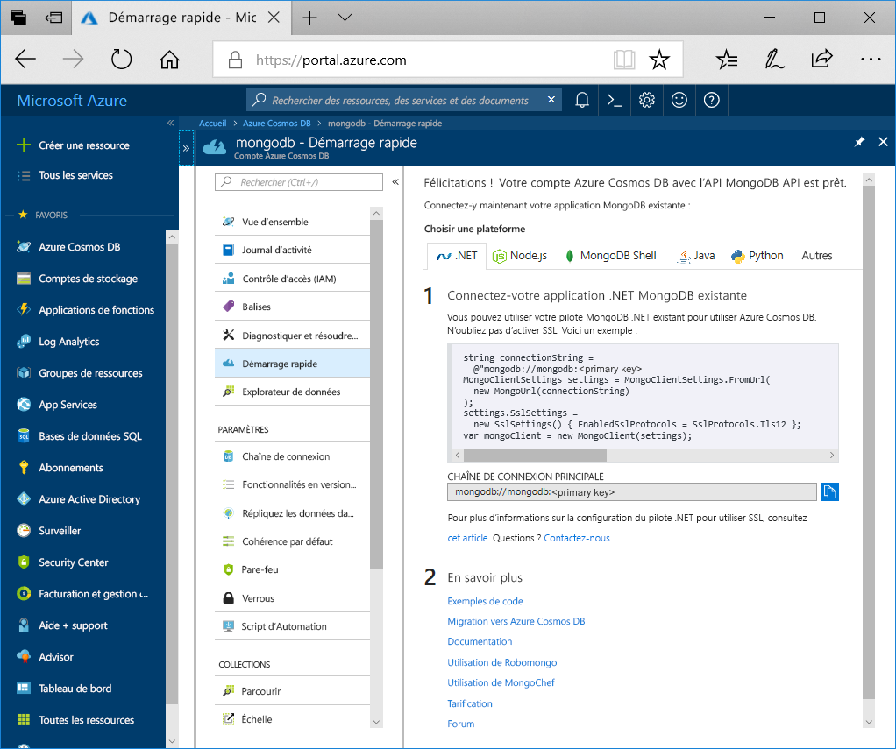

1. Dans une nouvelle fenêtre du navigateur, connectez-vous au [portail Azure](https://portal.azure.com/).

2. Dans le menu de gauche, sélectionnez **Créer une ressource**.
   
   
   
3. Dans la page **Nouveau**, sélectionnez **Bases de données** > **Azure Cosmos DB**.
   
   
   
3. Dans la page **Créer un compte Azure Cosmos DB**, entrez les paramètres du nouveau compte Azure Cosmos DB. 
 
    Paramètre|Valeur|Description
    ---|---|---
    Abonnement|Votre abonnement|Sélectionnez l’abonnement Azure que vous souhaitez utiliser pour ce compte Azure Cosmos DB. 
    Groupe de ressources|Création  Entrez ensuite le même nom que le nom du compte.|Sélectionnez **Créer nouveau**. Entrez ensuite le nom du nouveau groupe de ressources pour votre compte. Pour rester simple, utilisez le nom de votre compte Azure Cosmos DB. 
    Nom du compte|Entrer un nom unique|Entrez un nom unique pour identifier votre compte Azure Cosmos DB. L’URI de votre compte sera *mongo.cosmos.azure.com* apposé à votre nom de compte unique.  Le nom peut contenir uniquement des lettres minuscules, des chiffres et des traits d’union (-), et doit comporter entre 3 et 31 caractères.
    API|API Azure Cosmos DB pour Mongo DB|L’API détermine le type de compte à créer. Azure Cosmos DB fournit cinq API : Core (SQL) pour les bases de données de documents, Gremlin pour les bases de données de graphes, API Azure Cosmos DB pour Mongo DB pour les bases de données de documents, Table Azure et Cassandra. Actuellement, vous devez créer un compte distinct pour chaque API.   Sélectionnez **API Azure Cosmos DB pour Mongo DB**, car dans ce guide de démarrage rapide, vous allez créer une collection qui fonctionne avec MongoDB.  [Découvrez-en plus sur l’API Azure Cosmos DB pour MongoDB](../articles/cosmos-db/mongodb-introduction.md).|
    Emplacement|Sélectionner la région la plus proche de vos utilisateurs|Sélectionnez la zone géographique dans laquelle héberger votre compte Azure Cosmos DB. Utilisez l’emplacement le plus proche de vos utilisateurs pour leur donner l’accès le plus rapide possible aux données.|

    Sélectionnez **Vérifier + créer**. Vous pouvez ignorer les sections **Réseau** et **Étiquettes**. 

    

4. La création du compte prend quelques minutes. Attendez que le portail affiche la page **Félicitations ! Votre compte d’API Azure Cosmos DB pour Mongo DB est prêt**.

    
