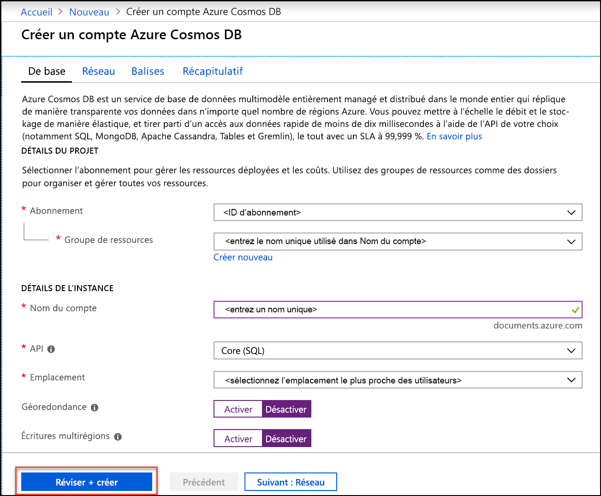
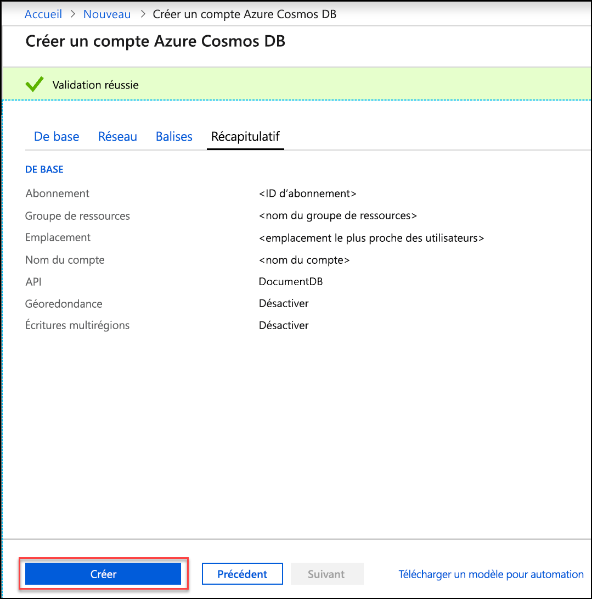
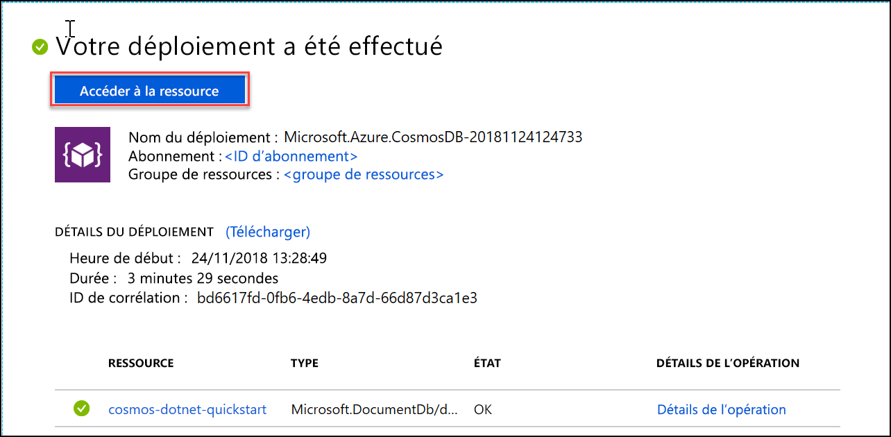

1. Dans une nouvelle fenêtre du navigateur, connectez-vous au [portail Azure](https://portal.azure.com/).
2. Cliquez sur **Créer une ressource** > **Bases de données** > **Azure Cosmos DB**.
   
   

3. Dans la page **Créer un compte Azure Cosmos DB**, entrez les paramètres du nouveau compte Azure Cosmos DB. 
 
    Paramètre|Valeur|Description
    ---|---|---
    Abonnement|*Votre abonnement*|Sélectionnez l’abonnement Azure que vous souhaitez utiliser pour ce compte Azure Cosmos DB. 
    Groupe de ressources|Création  *Entrez un nom unique*|Sélectionnez **Créer**, puis entrez le nom du nouveau groupe de ressources pour votre compte. Pour plus de simplicité, vous pouvez utiliser votre nom de compte. 
    Nom du compte|*Entrez un nom unique*|Entrez un nom unique pour identifier votre compte Azure Cosmos DB. Étant donné que *documents.azure.com* est ajouté à l’ID que vous fournissez pour créer votre URI, utilisez un ID unique.  L’ID ne peut contenir que des lettres minuscules, des chiffres et le caractère de trait d’union (-), et doit comporter entre 3 et 50 caractères.
    API|Core (SQL)|L’API détermine le type de compte à créer. Azure Cosmos DB fournit cinq API : SQL (base de données orientée document), Gremlin (base de données orientée graphe), MongoDB (base de données orientée document), API Table et Cassandra. Pour chaque API, vous devez créer un compte distinct.   Sélectionnez **Core (SQL)**, car dans cet article, vous allez créer une base de données de documents et faire des requêtes avec une syntaxe SQL.   [En savoir plus sur l’API SQL](../articles/cosmos-db/documentdb-introduction.md)|
    Lieu|*Sélectionner la région la plus proche de vos utilisateurs*|Sélectionnez la zone géographique dans laquelle héberger votre compte Azure Cosmos DB. Utilisez l’emplacement le plus proche de vos utilisateurs, pour leur donner l’accès le plus rapide possible aux données.
    Activer la géoredondance| Laisser vide | Ceci crée une version répliquée de votre base de données dans une seconde région (appairée). Laissez ce champ vide.  
    Écritures multirégions| Laisser vide | Ce paramètre permet de rendre vos régions de base de données accessibles en lecture et en écriture. Laissez ce champ vide.  

    Puis, cliquez sur **Vérifier + créer**. Vous pouvez ignorer les sections **Réseau** et **Balises**. 

    

    Examinez les informations récapitulatives et cliquez sur **Créer**. 

    

4. La création du compte prend quelques minutes. Attendez que le portail affiche le message **Votre déploiement a été effectué** et cliquez sur **Accéder à la ressource**.     

    

5. Le portail affiche maintenant la page **Félicitations ! Votre compte Azure Cosmos DB a été créé**.

    

