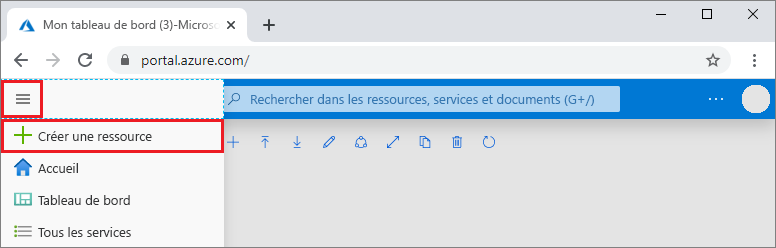
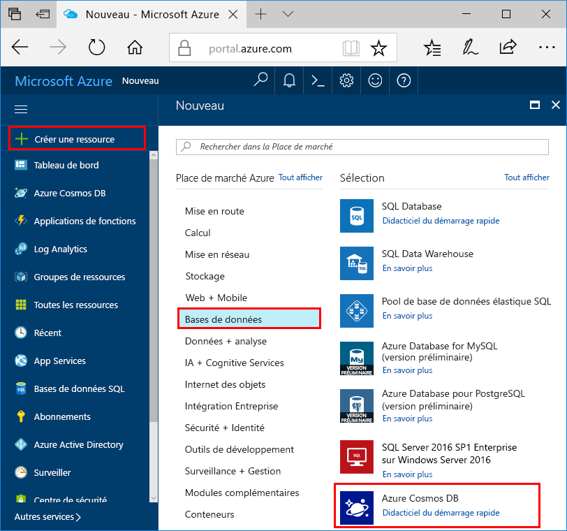
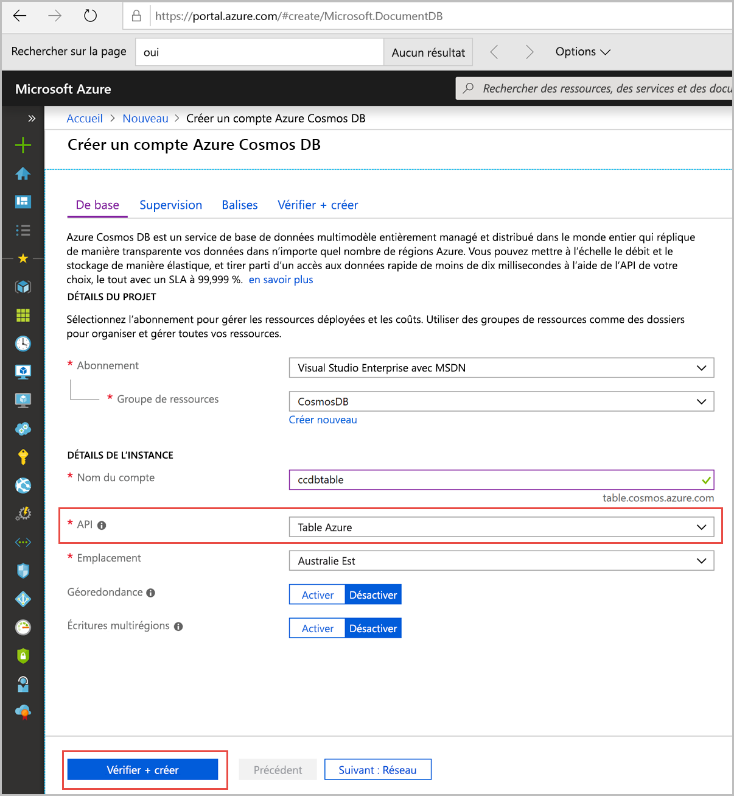
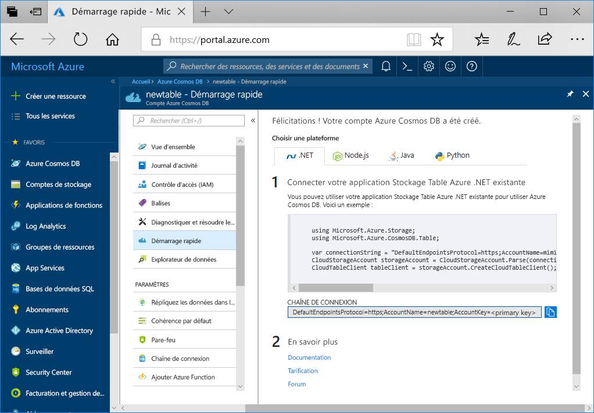

1. Dans une nouvelle fenêtre du navigateur, connectez-vous au [portail Azure](https://portal.azure.com/).

2. Dans le menu de gauche, sélectionnez **Créer une ressource**.
   
   
   
3. Dans la page **Nouveau**, sélectionnez **Bases de données** > **Azure Cosmos DB**.
   
   
   
3. Dans la page **Créer un compte Azure Cosmos DB**, entrez les paramètres du nouveau compte Azure Cosmos DB. 
 
    Paramètre|Valeur|Description
    ---|---|---
    Abonnement|Votre abonnement|Sélectionnez l’abonnement Azure que vous souhaitez utiliser pour ce compte Azure Cosmos DB. 
    Groupe de ressources|**Créer nouveau**, puis Nom du compte|Sélectionnez **Créer nouveau**. Entrez ensuite le nom du nouveau groupe de ressources pour votre compte. Pour rester simple, utilisez le nom de votre compte Azure Cosmos DB. 
    Nom du compte|Un nom unique|Entrez un nom unique pour identifier votre compte Azure Cosmos DB.  Le nom peut contenir uniquement des lettres minuscules, des chiffres et des traits d’union (-), et doit comporter entre 3 et 31 caractères.
    API|Table de charge de travail|L’API détermine le type de compte à créer. Azure Cosmos DB fournit cinq API : Core (SQL) pour les bases de données de documents, Gremlin pour les bases de données de graphes, MongoDB pour les bases de données de documents, Table Azure et Cassandra. Vous devez créer un compte distinct pour chaque API.   Sélectionnez **Table Azure**, car ce guide de démarrage rapide vous permet de créer une table qui fonctionne avec l’API Table.   [Découvrez plus d’informations sur l’API Table](../articles/cosmos-db/table-introduction.md).|
    Emplacement|La région la plus proche de vos utilisateurs|Sélectionnez la zone géographique dans laquelle héberger votre compte Azure Cosmos DB. Utilisez l’emplacement le plus proche de vos utilisateurs pour leur donner l’accès le plus rapide possible aux données.

    Vous pouvez laisser les options **Géoredondance** et **Écritures multirégions** définies sur **Désactiver** pour éviter d’avoir des frais supplémentaires, et ignorer les sections **Réseau** et **Étiquettes**.

5. Sélectionnez **Vérifier + créer**. Une fois la validation terminée, sélectionnez **Créer** pour créer le compte. 
 
   

6. La création du compte prend quelques minutes. Un message vous indique que **Votre déploiement est en cours**. Attendez la fin du déploiement, puis sélectionnez **Accéder à la ressource**.

    

