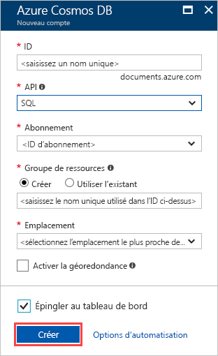

1. Dans une nouvelle fenêtre du navigateur, connectez-vous au [portail Azure](https://portal.azure.com/).
2. Cliquez sur **Créer une ressource** > **Bases de données** > **Azure Cosmos DB**.
   
   

3. Dans la page **Nouveau compte**, entrez les paramètres pour le nouveau compte Azure Cosmos DB. 
 
    Paramètre|Valeur|Description
    ---|---|---
    ID|*Entrez un nom unique*|Entrez un nom unique pour identifier ce compte Azure Cosmos DB. Étant donné que *documents.azure.com* est ajouté à l’ID que vous fournissez pour créer votre URI, utilisez un ID unique mais identifiable.  L’ID ne peut contenir que des lettres minuscules, des chiffres et le caractère de trait d’union (-), et doit comporter entre 3 et 50 caractères.
    API|SQL|L’API détermine le type de compte à créer. Azure Cosmos DB fournit cinq API : SQL (base de données orientée document), Gremlin (base de données orientée graphe), MongoDB (base de données orientée document), Azure Table et Cassandra. Pour chaque API, vous devez créer un compte distinct.   Sélectionnez **SQL**. En effet, dans ce démarrage rapide, vous créez une base de données de documents qu’il est possible d’interroger au moyen de la syntaxe SQL et à laquelle il est possible d’accéder avec l’API SQL.  [En savoir plus sur l’API SQL](../articles/cosmos-db/documentdb-introduction.md)|
    Abonnement|*Votre abonnement*|Sélectionnez l’abonnement Azure que vous voulez utiliser pour ce compte Azure Cosmos DB. 
    Groupe de ressources|Création  *Entrez ensuite le même nom unique que celui fourni plus haut dans ID*|Sélectionnez **Créer**, puis entrez le nom du nouveau groupe de ressources pour votre compte. Pour plus de simplicité, vous pouvez utiliser le même nom que votre ID. 
    Lieu|*Sélectionner la région la plus proche de vos utilisateurs*|Sélectionnez l’emplacement géographique où héberger votre compte Azure Cosmos DB. Utilisez l’emplacement le plus proche de vos utilisateurs, pour leur donner l’accès le plus rapide possible aux données.
    Activer la géoredondance| Laisser vide | Ceci crée une version répliquée de votre base de données dans une seconde région (appairée). Laissez ce champ vide.  
    Épingler au tableau de bord | Sélectionnez | Cochez cette case pour que votre nouveau compte de base de données soit ajouté à votre tableau de bord du portail pour un accès facilité.

    Cliquez ensuite sur **Créer**.

    

4. La création du compte prend quelques minutes. Attendez que le portail affiche la page **Félicitations ! Votre compte Azure Cosmos DB a été créé**.

    

