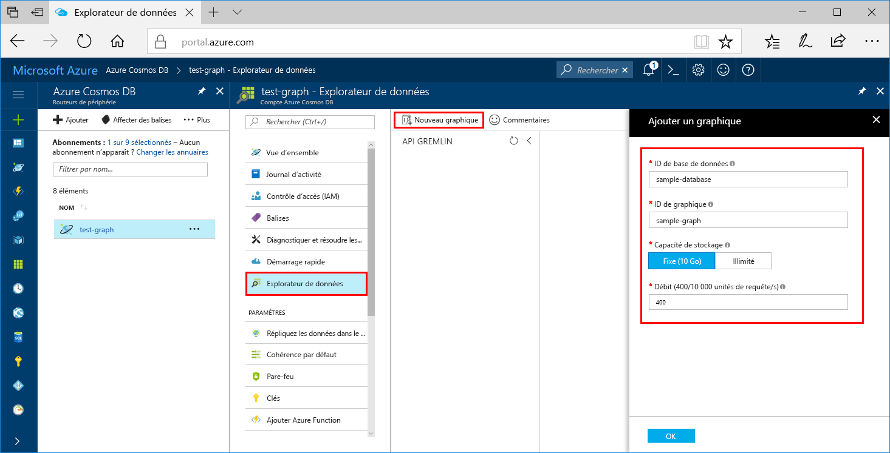

Vous pouvez désormais utiliser l’outil Explorateur de données dans le portail Azure pour créer une base de données de graphiques. 

1. Cliquez sur **Explorateur de données** > **New Graph** (Nouveau graphique).

    La zone **Ajouter un graphique** est affichée à l’extrême droite. Il peut donc être nécessaire de faire défiler à droite pour l’afficher.

    

2. Dans la page **Ajouter un graphique**, entrez les paramètres relatifs au nouveau graphique.

    Paramètre|Valeur suggérée|Description
    ---|---|---
    ID de base de données|sample-database|Entrez le nom *sample-database* pour la nouvelle base de données. Les noms de base de données doivent inclure entre 1 et 255 caractères et ne peuvent pas contenir `/ \ # ?` ni d’espace de fin.
    ID du graphique|sample-graph|Entrez le nom *sample-graph* pour votre nouvelle collection. Les noms de graphiques sont soumis aux mêmes exigences de nombre de caractères que les ID de bases de données.
    Capacité de stockage|Fixe (10 Go)|Conservez la valeur par défaut **Fixe (10 Go)**. Cette valeur correspond à la capacité de stockage de la base de données.
    Throughput|400 unités de requête|Changez le débit en indiquant 400 unités de requête par seconde (RU/s). Si vous souhaitez réduire la latence, vous pourrez augmenter le débit par la suite.

3. Une fois le formulaire rempli, cliquez sur **OK**.
