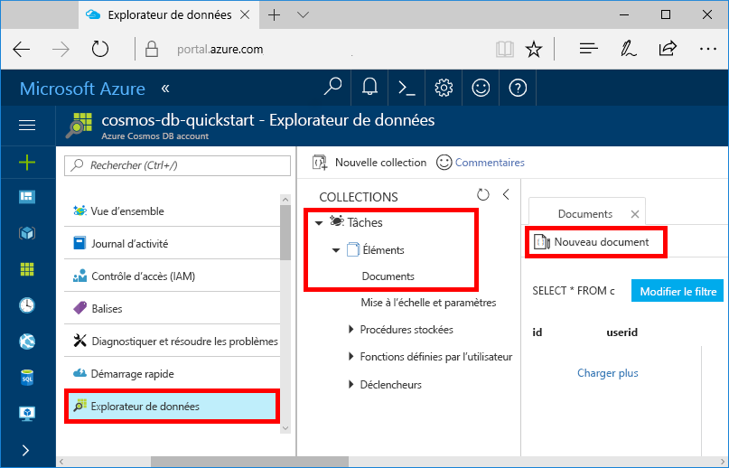
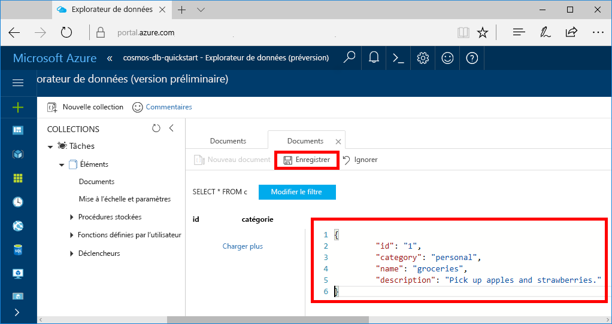

Vous pouvez maintenant ajouter des données à votre nouvelle collection grâce à l’Explorateur de données.

1. Dans l’Explorateur de données, la nouvelle base de données apparaît dans le volet Collections. Développez la base de données **Tâches**, développez la collection **Éléments**, cliquez sur **Documents**, puis cliquez sur **Nouveaux documents**. 

   
  
2. À présent, ajoutez un document à la collection avec la structure suivante.

     ```json
     {
         "id": "1",
         "category": "personal",
         "name": "groceries",
         "description": "Pick up apples and strawberries.",
         "isComplete": false
     }
     ```

3. Une fois le fichier json ajouté à l’onglet **Documents**, cliquez sur **Enregistrer**.

    

4.  Créez et enregistrez un document supplémentaire dans lequel vous insérez une valeur unique pour la propriété `id` et modifiez les autres propriétés selon vos besoins. Vos nouveaux documents peuvent avoir la structure de votre choix car Azure Cosmos DB n’impose aucun schéma pour vos données.