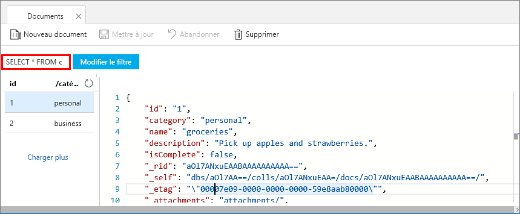
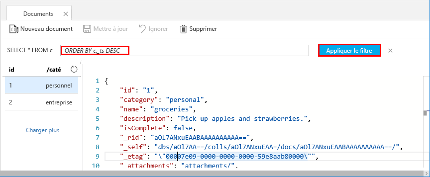
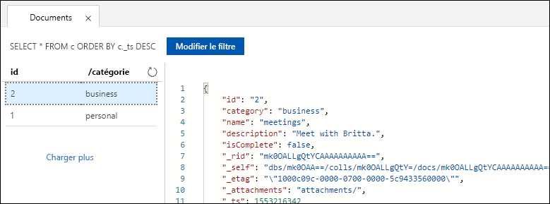

Vous pouvez utiliser des requêtes dans l’Explorateur de données pour récupérer et filtrer vos données.

1. Dans l’Explorateur de données, en haut de l’onglet **Éléments**, examinez la requête par défaut `SELECT * FROM c`. Cette requête par défaut récupère et affiche tous les documents de la collection, classés par ID. 
   
   
   
1. Pour modifier la requête, sélectionnez **Modifier le filtre**, remplacez la requête par défaut par `ORDER BY c._ts DESC`, puis sélectionnez **Appliquer le filtre**.
   
   

   Cette requête modifiée affiche les documents dans l’ordre décroissant en fonction de leur horodatage. Votre deuxième document s’affiche désormais en tête de liste. 
   
   

Si vous êtes à l’aise avec la syntaxe SQL, vous pouvez saisir n’importe quelle [requête SQL](../articles/cosmos-db/sql-api-sql-query.md) prise en charge dans la zone du prédicat de requête. Vous pouvez également utiliser l’Explorateur de données pour créer des procédures stockées, des fonctions définies par l’utilisateur et des déclencheurs pour la logique métier côté serveur. 

L’Explorateur de données permet d’accéder facilement à toutes les fonctionnalités intégrées d’accès aux données par programmation qui sont disponibles dans les API, à partir du portail Azure. Vous pouvez également utiliser le portail pour mettre à l’échelle le débit, pour obtenir des clés et des chaînes de connexion, ainsi que pour passer en revue les métriques et les contrats SLA de votre compte Azure Cosmos DB. 

