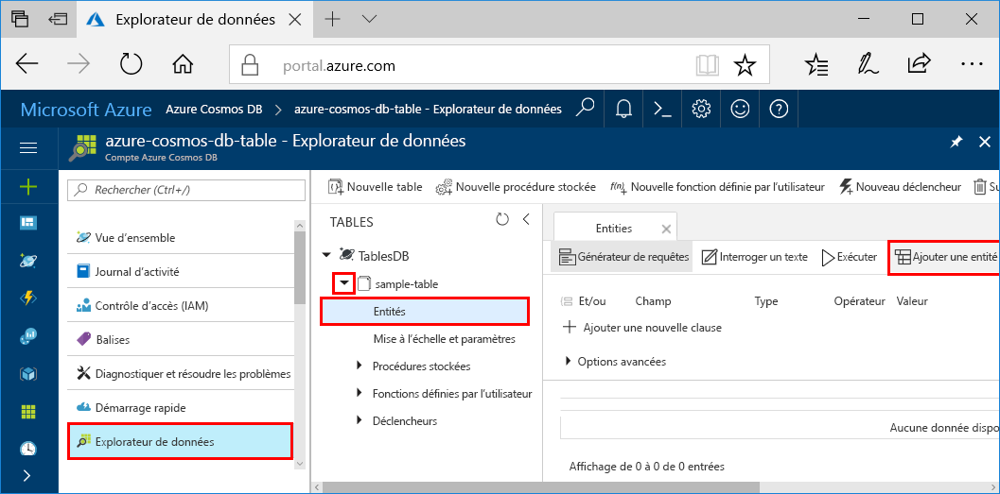
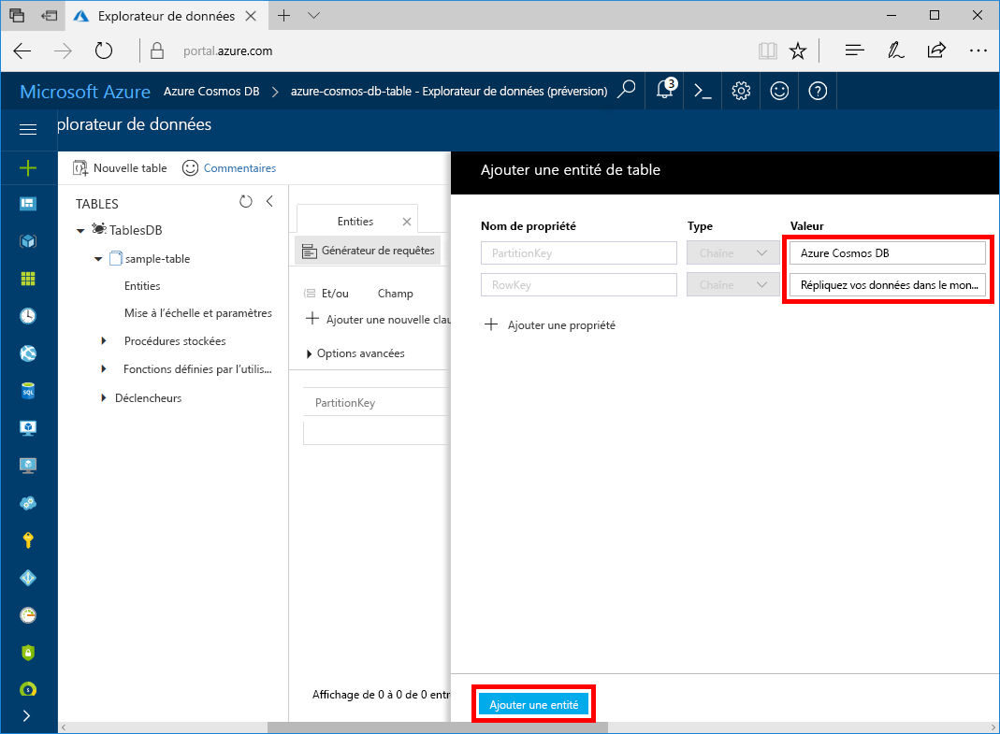

Vous pouvez maintenant ajouter des données à votre nouvelle table grâce à l’Explorateur de données.

1. Dans l’Explorateur de données, développez **exemple de table**, cliquez sur **Entités**, puis cliquez sur **Ajouter une entité**.

   
2. À présent, ajoutez des données à la zone de valeur PartitionKey et à la zone de valeur RowKey, puis cliquez sur **Ajouter une entité**.

   
  
    Vous pouvez maintenant ajouter des entités supplémentaires à votre table, éditer vos entités, ou interroger vos données dans l’Explorateur de données. À partir de l’Explorateur de données, vous pouvez également faire évoluer votre débit et ajouter des procédures stockées, des fonctions définies par l’utilisateur, et ajouter à votre table des déclencheurs.