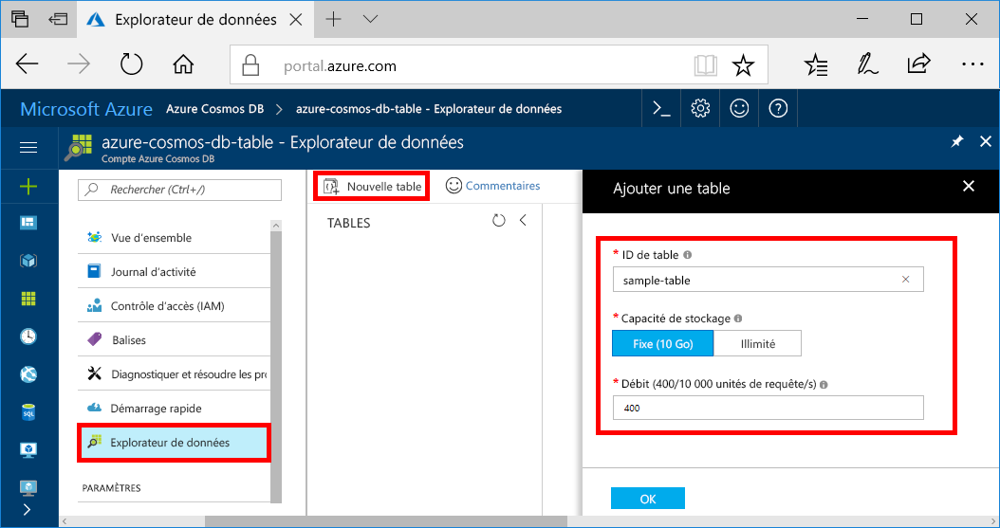
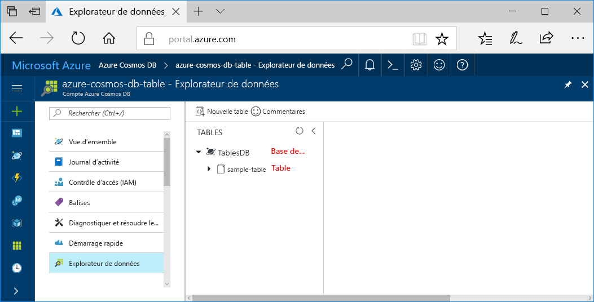

Vous pouvez désormais utiliser l’outil Explorateur de données dans le portail Azure pour créer une base de données et une table. 

1. Cliquez sur **Explorateur de données** > **Nouvelle table**. 
    
    La zone **Ajouter une table** est affichée à l’extrême droite. Il peut donc être nécessaire de faire défiler à droite pour l’afficher.

    

2. Dans la page **Ajouter une table**, entrez les paramètres de la nouvelle table.

    Paramètre|Valeur suggérée|Description
    ---|---|---
    ID de la table|sample-database|L’ID de votre nouvelle table. Les noms de tables sont soumis aux mêmes exigences de nombre de caractères que les ID de bases de données. Les noms de base de données doivent inclure entre 1 et 255 caractères et ne peuvent pas contenir `/ \ # ?` ni d’espace de fin.
    Débit|400 unités de requête|Changez le débit en indiquant 400 unités de requête par seconde (RU/s). Si vous souhaitez réduire la latence, vous pourrez augmenter le débit par la suite.

3. Cliquez sur **OK**.

4. L’Explorateur de données affiche la nouvelle base de données et la nouvelle table.

   