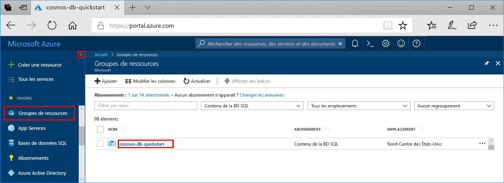
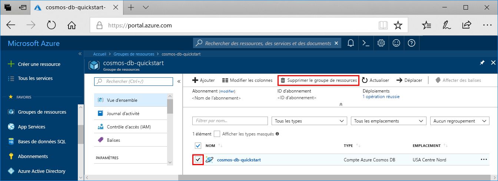

Quand vous en avez terminé avec votre application et votre compte Azure Cosmos DB, vous pouvez supprimer les ressources Azure que vous avez créées afin d’éviter des frais supplémentaires. Pour supprimer les ressources :

1. Depuis la barre de recherche du portail Azure, recherchez et sélectionnez **Groupes de ressources**.

2. Dans la liste, sélectionnez le groupe de ressources créé pour ce guide de démarrage rapide.  

   

2. Dans la page **Vue d’ensemble** du groupe de ressources, sélectionnez **Supprimer un groupe de ressources**.

      

3. Dans la fenêtre suivante, entrez le nom du groupe de ressources à supprimer, puis sélectionnez **Supprimer**.

