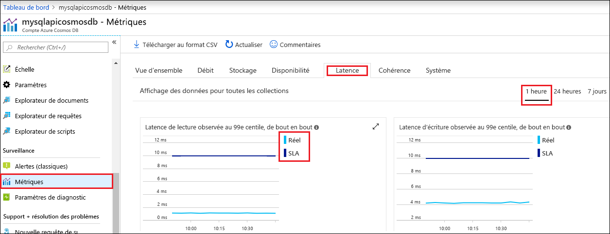

Le portail Azure supervise le débit, le stockage, la disponibilité, la latence et la cohérence de votre compte Cosmos DB. Des graphiques de métriques associées à un [contrat de niveau Service (SLA) Azure Cosmos DB](https://azure.microsoft.com/support/legal/sla/cosmos-db/) montrent la valeur des contrats SLA par rapport aux performances réelles. Cette suite de métriques vous permet de superviser vos contrats SLA de manière transparente.

Pour consulter les métriques et les contrats SLA : 

1. Sélectionnez **Métriques** dans le menu de navigation de votre compte Cosmos DB.
   
2. Sélectionnez un onglet comme **Latence**, puis sélectionnez un intervalle de temps à droite. Comparez les lignes **Réel** et **SLA** des graphiques.
   
   
   
3. Consultez les métriques des autres onglets. 

