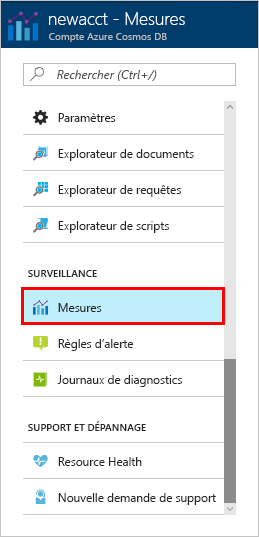
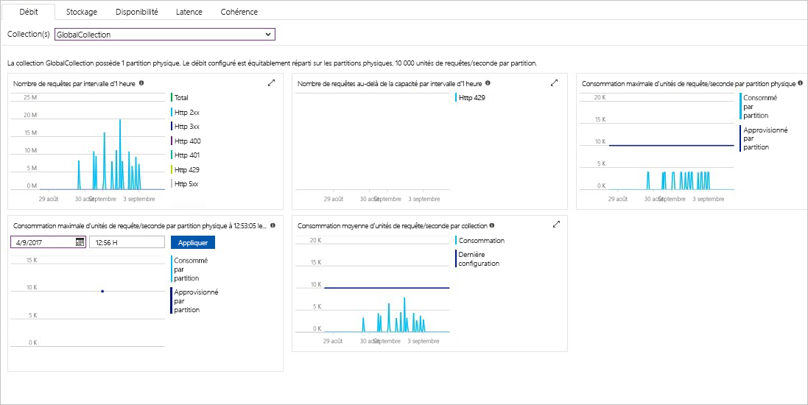

Le débit, le stockage, la disponibilité, la latence et la cohérence des ressources de votre compte sont surveillés dans le portail Azure. Voici quelques informations sur ces mesures. 

1. Cliquez sur **Métriques** dans le menu de navigation.

   

2. Cliquez sur chacun des onglets pour découvrir les métriques fournies par Azure Cosmos DB. 

    Chaque graphique associé aux [Contrats de niveau de service (SLA) d’Azure Cosmos DB](https://azure.microsoft.com/support/legal/sla/cosmos-db/) contient une ligne indiquant si un ou plusieurs des SLA n’ont pas été respectés. Azure Cosmos DB rend transparente la surveillance de vos SLA avec cet ensemble de métriques. 

   