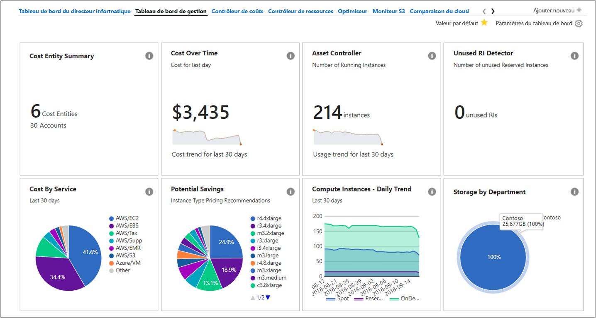
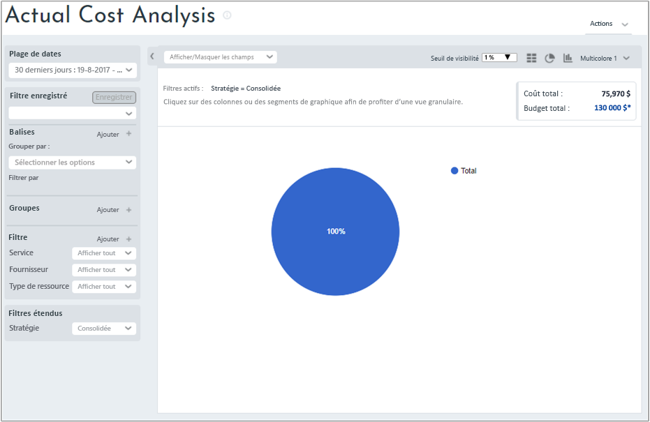
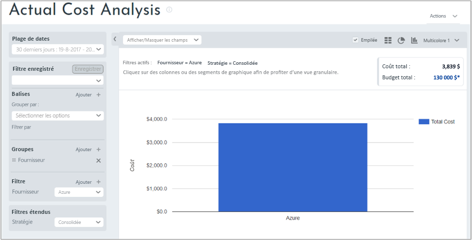
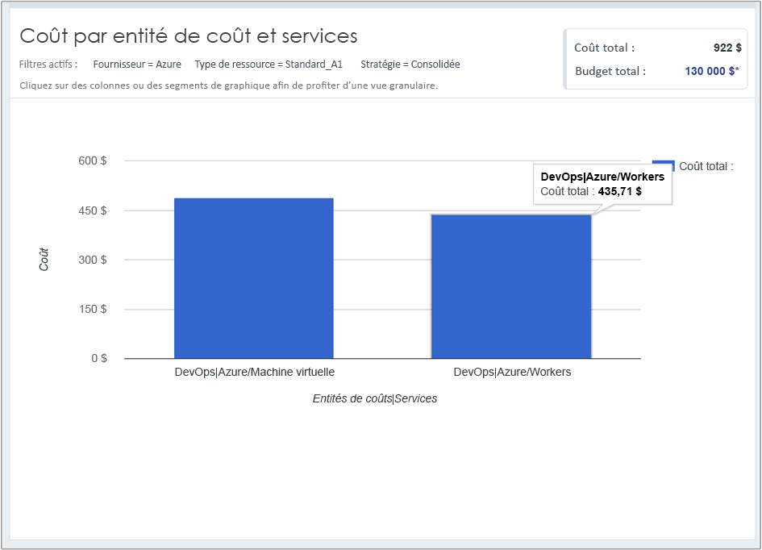

## Afficher les données de coût

Azure Cost Management (de Cloudyn) vous permet d’accéder à toutes vos données de ressources cloud. À partir des rapports de tableau de bord, vous trouverez des rapports standard et personnalisés dans une vue à onglets. Voici quelques exemples d’un tableau de bord populaire et d’un rapport qui indiquent des données de coûts immédiatement.

Dans cet exemple, le tableau de bord de gestion montre les coûts consolidés de l’entreprise Contoso pour toutes ses ressources cloud. Contoso utilise Azure, AWS et Google. Les tableaux de bord fournissent des informations en un coup d’œil et permettent de parcourir rapidement les rapports.  

Si vous n’êtes pas sûr du rôle d’un rapport dans un tableau de bord, placez le curseur sur le symbole **i** pour afficher une explication. Cliquez sur n’importe quel rapport dans un tableau de bord pour afficher le rapport complet.

Vous pouvez également afficher des rapports à l’aide du menu de rapports en haut du portail. Examinons les dépenses pour les ressources Azure de Contoso au cours des 30 derniers jours. Cliquez sur **Coûts** > **Analyse du coût** > **Analyse du coût réel**. Les cas échéant, effacez les valeurs définies pour les balises, les groupes ou les filtres dans votre rapport.

Dans cet exemple, le coût total est de 122 273 $ et le budget est de 290 000 $.

Maintenant, nous allons modifier le format du rapport, et définir des groupes et des filtres afin d’affiner les résultats pour les coûts d’Azure. Définissez la **plage de dates** sur les 30 derniers jours. Dans le coin supérieur droit, cliquez sur le symbole de la colonne à représenter sous la forme d’un graphique à barres et, sous Groupes, sélectionnez **Fournisseur**. Ensuite, définissez un filtre pour **Fournisseur** sur **Azure**.

Dans cet exemple, le coût total de ressources Azure était de 3 309 $ au cours des 30 derniers jours.

Cliquez avec le bouton droit de la souris sur la barre Fournisseur (Azure) et accédez à **Types de ressources**.

L’illustration suivante montre les coûts pour les ressources Azure chez Contoso. Le total était de 3 309 $. Dans cet exemple, environ la moitié des coûts concernaient les machines virtuelles Standard_A1, et l’autre moitié des coûts portaient sur différents services Azure et différentes instances de machine virtuelle.

Cliquez avec le bouton droit de la souris sur un type de ressource, puis sélectionnez **Entités de coût** pour afficher les entités et les services qui ont utilisé la ressource. Dans l’exemple d’image suivant, Stockage localement redondant est défini comme Type de ressource. Contoso|Azure/Storage a consommé 15,65 $. Engineering|Azure Storage a consommé 164,25 $. Shared Infrastructure|Azure/Storage a consommé 116,58 $. Le coût total des services est de 296 $.

Pour visionner un didacticiel vidéo sur vos données de facturation cloud, consultez [Analyse des données de facturation cloud avec Azure Cost Management de Cloudyn](https://youtu.be/G0pvI3iLH-Y).
