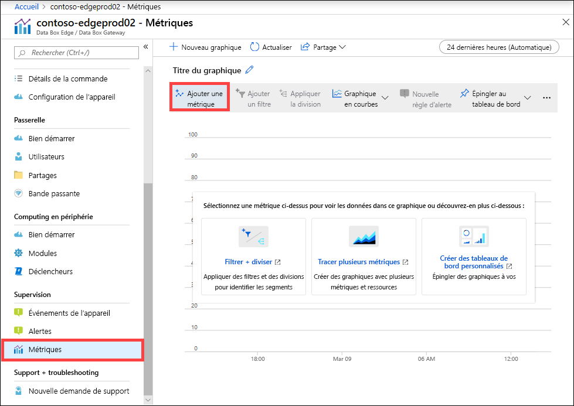
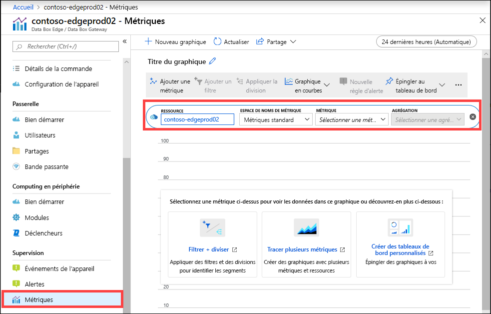
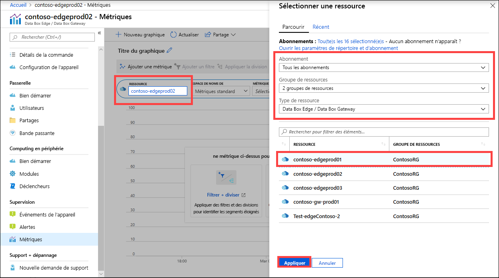
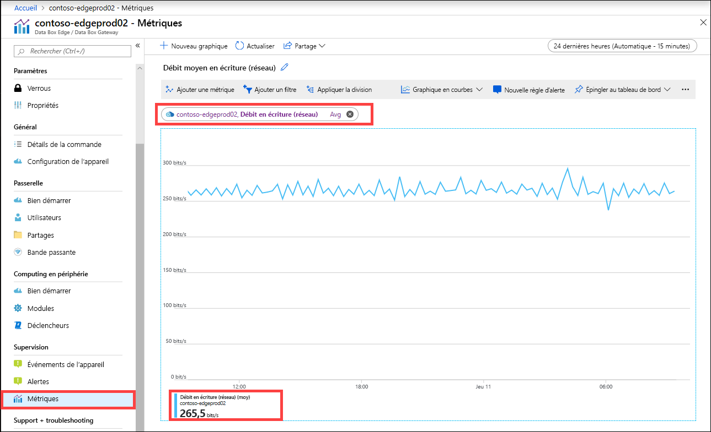
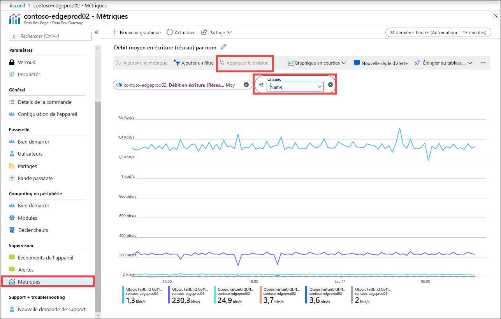
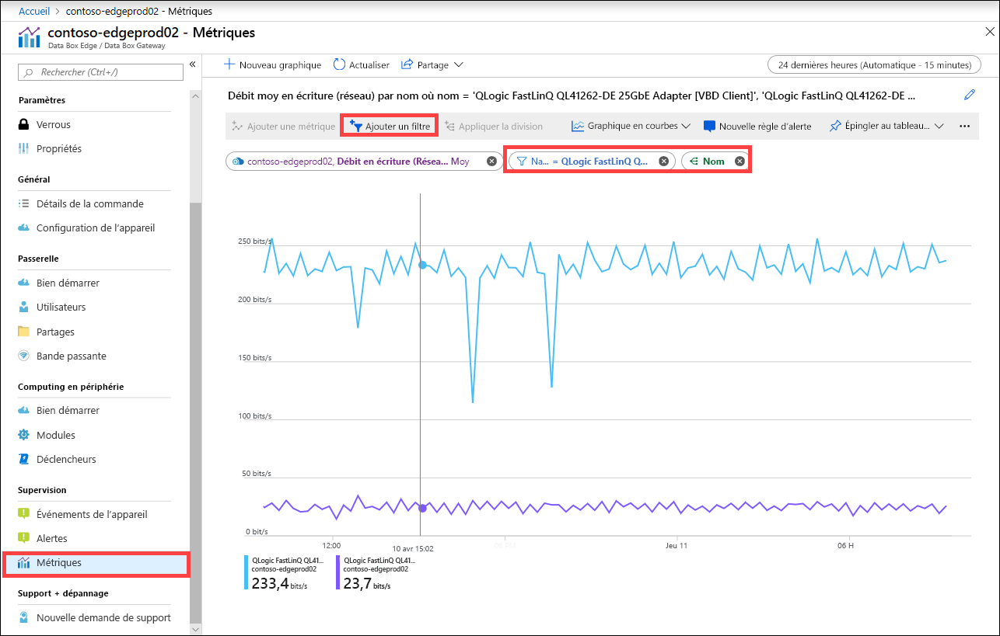
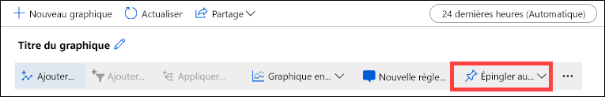
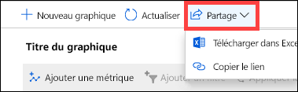

Vous pouvez également voir les métriques pour superviser les performances de l’appareil et, dans certains cas, pour résoudre les problèmes liés à l’appareil.

Effectuez les étapes suivantes dans le portail Azure pour créer un graphique des métriques d’appareil de votre choix.

1. Pour votre ressource dans le portail Azure, accédez à **Supervision > Métriques** et sélectionnez **Ajouter une métrique**.

    

2. La ressource est automatiquement renseignée.  

    

    Pour spécifier une autre ressource, sélectionnez-la. Dans le panneau **Sélectionner une ressource**, sélectionnez l’abonnement, le groupe de ressources, le type de ressource et la ressource pour laquelle vous souhaitez afficher les métriques et sélectionnez **Appliquer**.

    

3. Dans la liste déroulante, sélectionnez une métrique pour superviser votre appareil. Pour obtenir la liste complète de ces métriques, consultez [Métriques sur votre appareil](#metrics-on-your-device).

4. Si une métrique est sélectionnée dans la liste déroulante, l’agrégation peut également être définie. L’agrégation fait référence à la valeur réelle agrégée sur un intervalle de temps spécifié. Les valeurs d’agrégation peuvent être les valeurs moyenne, minimale ou maximale. Sélectionnez Moyenne, Maximum ou Minimum comme agrégation.

    

5. Si la métrique que vous avez sélectionnée comporte plusieurs instances, l’option de division est disponible. Sélectionnez **Appliquer la division**, puis sélectionnez la valeur de référence à utiliser pour la répartition.

    

6. Si vous voulez à présent voir la répartition uniquement pour quelques instances, vous pouvez filtrer les données. Par exemple, dans ce cas, si vous souhaitez voir le débit réseau uniquement pour les deux interfaces réseau connectées sur votre appareil, vous pouvez filtrer ces interfaces. Sélectionnez **Ajouter un filtre** et spécifiez le nom de l’interface réseau pour le filtrage.

    

7. Vous pouvez également épingler le graphique au tableau de bord pour y accéder facilement.

    

8. Pour exporter les données du graphique dans une feuille de calcul Excel ou obtenir un lien vers le graphique en vue de le partager, sélectionnez l’option de partage dans la barre de commandes.

    
