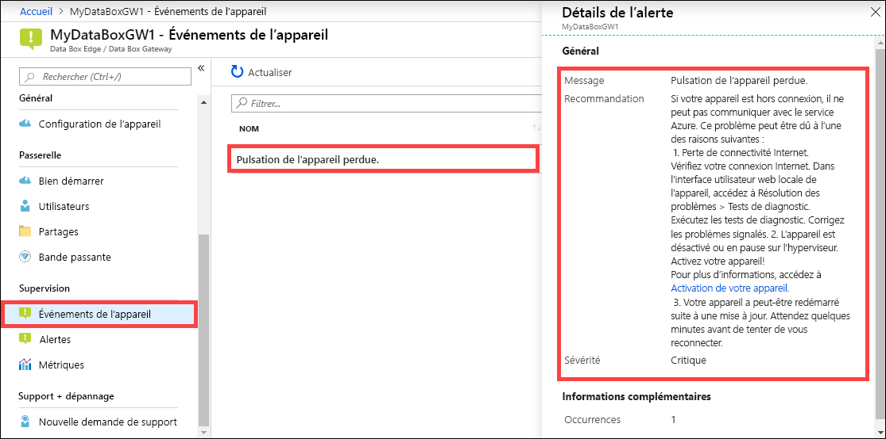

Effectuez les étapes suivantes dans le portail Azure pour voir un événement de l’appareil. 

1. Dans le Portail Azure, accédez à votre ressource, puis accédez à **Supervision > Événements de l’appareil**.
2. Sélectionnez un événement et affichez les détails de l’alerte. Prenez les mesures appropriées pour résoudre la condition d’alerte.

    