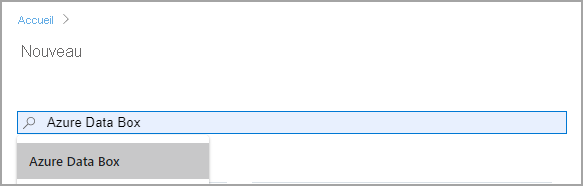
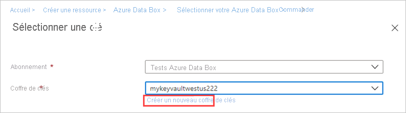
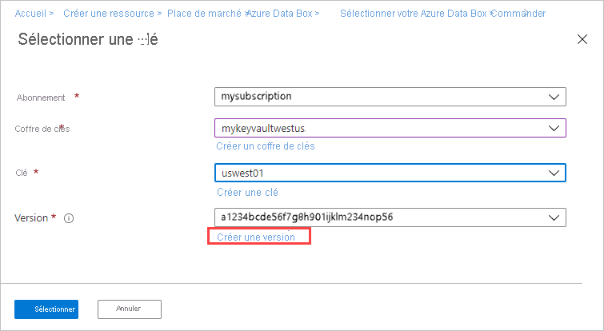
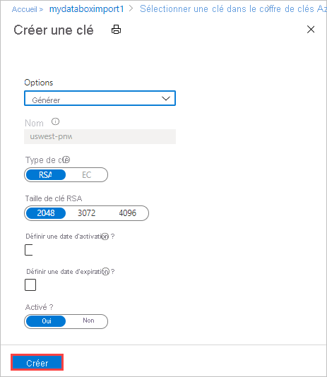
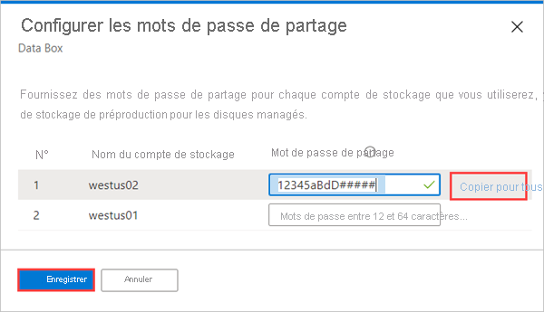
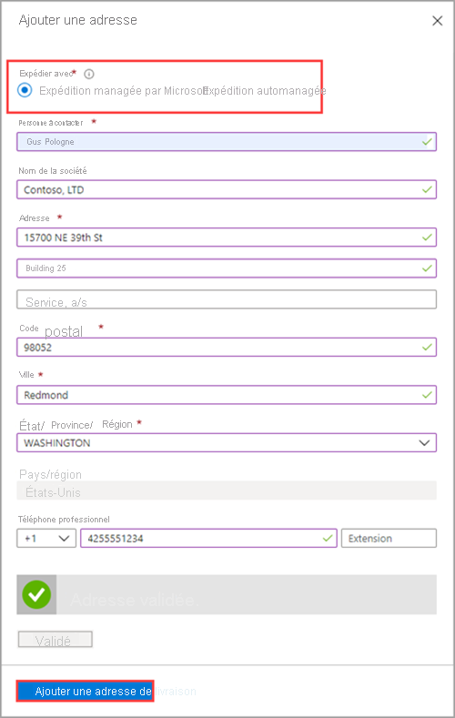

Effectuez les étapes suivantes dans le portail Azure pour commander un appareil :

1. Utilisez vos informations d’identification Microsoft Azure pour vous connecter à cette URL : [https://portal.azure.com](https://portal.azure.com).
2. Sélectionnez **+ Créer une ressource**, puis recherchez *Azure Data Box*. Sélectionnez **Azure Data Box**.

   

3. Sélectionnez **Create** (Créer).  

   

4. Vérifiez si le service Data Box est disponible dans votre région. Entrez ou sélectionnez les informations suivantes, puis sélectionnez **Appliquer**.

    |Paramètre  |Valeur  |
    |---------|---------|
    |Type de transfert     | Sélectionnez **Importer vers Azure**.        |
    |Abonnement     | Sélectionnez un abonnement EA, CSP ou Azure pour le service Data Box.   L’abonnement est lié à votre compte de facturation.       |
    |Resource group | Sélectionnez un groupe de ressources existant. Un groupe de ressources est un conteneur logique pour les ressources qui peuvent être gérées ou déployées ensemble. |
    |Pays/région source    |    Sélectionnez le pays ou la région où vos données se trouvent actuellement.         |
    |Région Azure de destination     |     Sélectionnez la région Azure où vous souhaitez transférer des données.   Pour plus d’informations, consultez [Disponibilité de Data Box par région](../articles/databox/data-box-overview.md#region-availability) ou [Disponibilité de Data Box Heavy par région](../articles/databox/data-box-heavy-overview.md#region-availability).  |

    

5. Sélectionnez le produit **Data Box** à commander, c’est-à-dire Data Box, comme indiqué ci-dessous, ou Data Box Heavy. 

    

    Pour Data Box, la capacité maximale utilisable pour une commande est de 80 To. Pour Data Box Heavy, la capacité maximale utilisable pour une commande est de 770 To. Vous pouvez créer plusieurs commandes pour des tailles de données supérieures.

    Si vous sélectionnez **Data Box Heavy**, l’équipe Data Box vérifie la disponibilité des appareils dans votre région. Elle vous informera quand vous pourrez poursuivre la commande.

6. Dans **Commande**, accédez à l’onglet **Informations de base**. Entrez ou sélectionnez les informations suivantes. Ensuite, sélectionnez **Suivant : Destination des données>** .

    |Paramètre  |Valeur  |
    |---------|---------|
    |Abonnement      | L’abonnement est automatiquement renseigné en fonction de la sélection antérieure.|
    |Resource group    | Groupe de ressources que vous avez sélectionné précédemment. |
    |Nom de la commande d’importation | Indiquez un nom convivial pour suivre la commande. <ul><li>Le nom peut comporter entre 3 et 24 caractères (lettres, chiffres ou traits d’union).</li><li>Il doit commencer et se terminer par une lettre ou un chiffre.</li></ul>    |

    

7. Dans l’écran **Destination des données**, sélectionnez la **Destination des données** : soit les comptes de stockage, soit les disques managés.

    Si vous utilisez un ou plusieurs **comptes de stockage** comme destination de stockage, vous voyez s’afficher l’écran suivant :

    

    Selon la région Azure spécifiée, sélectionnez un ou plusieurs comptes de stockage dans la liste filtrée des comptes de stockage existants. La Data Box peut être liée à 10 comptes de stockage maximum. Vous pouvez également créer un **compte de stockage blob**, **Usage général v1** ou **Usage général v2**.

   > [!NOTE]
   > - Si vous sélectionnez des comptes Azure Premium FileStorage, le quota provisionné sur le partage de compte de stockage augmente jusqu’à la taille des données copiées dans les partages de fichiers. Une fois le quota augmenté, il n’est pas ajusté de nouveau, par exemple si, pour une raison ou une autre, la Data Box ne peut pas copier vos données.
   > - Ce quota est utilisé pour la facturation. Une fois que vos données sont chargées dans le centre de données, vous devez ajuster le quota pour répondre à vos besoins. Pour plus d’informations, consultez [Présentation de la facturation](../articles/storage/files/understanding-billing.md).

    Les comptes de stockage avec des réseaux virtuels sont pris en charge. Pour autoriser le service Data Box à travailler avec des comptes de stockage sécurisés, activez les services approuvés dans les paramètres de pare-feu réseau du compte de stockage. Pour plus d’informations, découvrez comment [Ajouter Azure Data Box en tant que service approuvé](../articles/storage/common/storage-network-security.md#exceptions).

    Si vous utilisez Data Box pour créer un ou plusieurs **disques managés** à partir de disques durs virtuels (VHD) locaux, vous devez également fournir les informations suivantes :

    |Paramètre  |Valeur  |
    |---------|---------|
    |Groupes de ressources     | Créez un groupe de ressources si vous envisagez de créer des disques managés à partir de disques durs virtuels locaux. Vous pouvez utiliser un groupe de ressources existant uniquement si celui-ci a été créé avant la création d’une commande Data Box de disques managés par le service Data Box.   Spécifiez plusieurs groupes de ressources séparés par des points-virgules. Un maximum de 10 groupes de ressources sont pris en charge.|

    

    Le compte de stockage spécifié pour les disques managés est utilisé comme compte de stockage intermédiaire. Le service Data Box charge les disques durs virtuels en tant qu’objets blob de pages sur le compte de stockage intermédiaire avant de convertir celui-ci en disques managés et de le déplacer vers les groupes de ressources. Pour plus d’informations, voir [Vérifier le chargement des données dans Azure](../articles/databox/data-box-deploy-picked-up.md#verify-data-upload-to-azure-8).

   > [!NOTE]
   > Si un objet blob de pages n’est pas correctement converti en disque managé, il reste dans le compte de stockage et des frais de stockage vous sont facturés.

8. Sélectionnez **Suivant : Sécurité>** pour continuer.

    L’écran **Sécurité** vous permet d’utiliser votre propre clé de chiffrement et votre propre appareil, de partager des mots de passe et de choisir d’utiliser le chiffrement double.

    Tous les paramètres dans l’écran **Sécurité** sont facultatifs. Si vous ne changez aucun paramètre, les paramètres par défaut s’appliquent.

    

9. Si vous souhaitez utiliser votre propre clé gérée par le client afin de protéger la clé d’accès de déverrouillage pour votre nouvelle ressource, développez **Type de chiffrement**.

    La configuration d’une clé gérée par le client pour Azure Data Box est facultative. Par défaut, Data Box utilise une clé managée par Microsoft pour protéger la clé d’accès de déverrouillage.

    Une clé gérée par le client n’affecte pas la manière dont les données sont chiffrées sur l’appareil. La clé est utilisée uniquement pour chiffrer la clé d’accès de déverrouillage de l’appareil.

    Si vous ne souhaitez pas utiliser de clé gérée par le client, passez à l’étape 15.

   

10. Pour utiliser une clé gérée par le client, sélectionnez **Clé gérée par le client** comme type de clé. Choisissez ensuite **Sélectionner un coffre de clés et une clé**.
   
    

11. Dans le panneau **Sélectionner une clé dans Azure Key Vault** :

    - La section **Abonnement** est automatiquement renseignée.

    - Pour **Coffre de clés**, vous pouvez sélectionner un coffre de clés existant dans la liste déroulante.

      

      Si vous voulez créer un coffre de clés, sélectionnez **Créer un coffre de clés**. 
    
            

      Ensuite, dans l’écran **Créer un coffre de clés**, entrez le groupe de ressources et un nom de coffre de clés. Assurez-vous que les options **Suppression réversible** et **Protection de purge** sont activées. Acceptez toutes les autres valeurs par défaut, puis sélectionnez **Vérifier + créer**.

      

      Passez en revue les informations de votre coffre de clés, puis sélectionnez **Créer**. Patientez quelques minutes avant la fin de la création du coffre de clés.

      

12. Le panneau **Sélectionner une clé** affichera le coffre de clés sélectionné.

    

    Si vous souhaitez créer une nouvelle clé, sélectionnez **Créer une clé**. Vous devez utiliser une clé RSA. La taille peut être supérieure ou égale à 2048. Entrez un nom pour votre nouvelle clé, acceptez les autres valeurs par défaut, puis sélectionnez **Créer**.

      

      Vous serez averti quand la clé aura été créée dans votre coffre de clés. Votre nouvelle clé sera sélectionnée et s’affichera dans le panneau **Sélectionner une clé**.

13. Sélectionnez la **Version** de la clé à utiliser, puis choisissez **Sélectionner**.

      

    Si vous voulez créer une nouvelle version de clé, sélectionnez **Créer une version**.

    

    Choisissez les paramètres de la nouvelle version de clé, puis sélectionnez **Créer**.

    

    Les paramètres **Type de chiffrement** de l’écran **Sécurité** montrent votre coffre de clés et votre clé.

    

14. Sélectionnez une identité d’utilisateur que vous utiliserez pour gérer l’accès à cette ressource. Choisissez **Sélectionner une identité d’utilisateur**. Dans le volet de droite, sélectionnez l’abonnement et l’identité managée à utiliser. Choisissez ensuite **Sélectionner**.

    Une identité managée affectée par l’utilisateur est une ressource Azure autonome qui peut être utilisée pour gérer plusieurs ressources. Pour plus d’informations, consultez [Types d’identités managées](../articles/active-directory/managed-identities-azure-resources/overview.md).  

    Si vous avez besoin de créer une identité managée, suivez les instructions indiquées dans [Créer, lister, supprimer ou affecter un rôle à une identité managée affectée par l’utilisateur à l’aide du portail Azure](../articles/active-directory/managed-identities-azure-resources/how-to-manage-ua-identity-portal.md).
    
    

    L’identité d’utilisateur est indiquée dans les paramètres **Type de chiffrement**.

    

15. Si vous ne souhaitez pas utiliser les mots de passe générés par le système qu’Azure Data Box utilise par défaut, développez **Apporter son propre mot de passe** dans l’écran **Sécurité**.

    Les mots de passe générés par le système sont sécurisés et sont recommandés, à moins que votre organisation en décide autrement.

     

   - Afin d’utiliser votre propre mot de passe pour votre nouvel appareil, dans **Définir la préférence pour le mot de passe de l’appareil**, sélectionnez **Utiliser votre propre mot de passe**, puis tapez un mot de passe conforme aux exigences de sécurité.
     
     Le mot de passe doit être alphanumérique et contenir entre 12 et 15 caractères, au moins une lettre majuscule, une lettre minuscule, un caractère spécial et un chiffre.

     - Caractères spéciaux autorisés : @ # - $ % ^ ! + = ; : _ ( )
     - Caractères non autorisés : I i L o O 0
   
     

 - Afin d’utiliser vos propres mots de passe pour les partages :

   1. Dans **Définir la préférence pour les mots de passe de partage**, sélectionnez **Utiliser vos propres mots de passe**, puis **Sélectionnez des mots de passe pour les partages**.
     
       

    1. Tapez un mot de passe pour chaque compte de stockage dans la commande. Le mot de passe sera utilisé sur tous les partages pour le compte de stockage.
    
       Le mot de passe doit être alphanumérique et contenir entre 12 et 64 caractères, au moins une lettre majuscule, une lettre minuscule, un caractère spécial et un chiffre.

       - Caractères spéciaux autorisés : @ # - $ % ^ ! + = ; : _ ( )
       - Caractères non autorisés : I i L o O 0
     
    1. Afin d’utiliser le même mot de passe pour tous les comptes de stockage, sélectionnez **Copy to all** (Copier pour tous). 

    1. Lorsque vous avez terminé, sélectionnez **Enregistrer**.
     
       

    Dans l’écran **Sécurité**, vous pouvez utiliser **Afficher ou modifier les mots de passe** pour changer les mots de passe.

16. Dans **Sécurité**, si vous voulez activer le double chiffrement basé sur logiciel, développez **Double-encryption (for highly secure environments)** Double chiffrement (pour les environnements hautement sécurisés) et sélectionnez **Enable double encryption for the order** (Activer le double chiffrement pour la commande).

    

    Le chiffrement basé sur le logiciel est effectué en plus du chiffrement AES 256 bits des données sur Data Box.

    > [!NOTE]
    > L’activation de cette option peut augmenter le temps nécessaire au traitement des commandes et à la copie des données. Une fois votre commande créée, vous ne pouvez pas changer cette option.

    Sélectionnez **Suivant : Détails du contact>** pour continuer.

17. Dans **Détails du contact**, sélectionnez **+ Ajouter une adresse**.

    

18. Dans l’écran **Ajouter une adresse**, indiquez vos nom et prénom, le nom et l’adresse postale de la société, ainsi qu’un numéro de téléphone valide. Sélectionnez **Valider l’adresse**. Le service vérifie l’adresse pour connaître la disponibilité du service et vous informe si le service est disponible pour cette adresse.

    

    Si vous avez sélectionné l’expédition autogérée, vous recevez une notification par e-mail une fois la commande passée. Pour plus d’informations sur l’expédition gérée par vous-même, consultez [Utiliser l’expédition autogérée](../articles/databox/data-box-portal-customer-managed-shipping.md).

19. Sélectionnez **Ajouter une adresse de livraison** une fois que les détails de l’expédition ont été correctement validés. Vous revenez à l’onglet **Détails du contact**.

20. À côté de **E-mail**, entrez une ou plusieurs adresses e-mail. Le service envoie des notifications par courrier électronique concernant les mises à jour de l’état de la commande aux adresses de messagerie spécifiées.

    Nous vous recommandons d’utiliser un e-mail de groupe afin de continuer à recevoir des notifications si un administrateur du groupe quitte l’entreprise.

    

21. Sous **Passer en revue + commander**, passez en revue les informations liées à la commande, au contact, à la notification et aux conditions de confidentialité. Cochez la case correspondant à l’acceptation des conditions de confidentialité.

22. Sélectionnez **Commander**. La création d’une commande peut prendre quelques minutes.

    