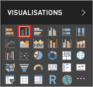
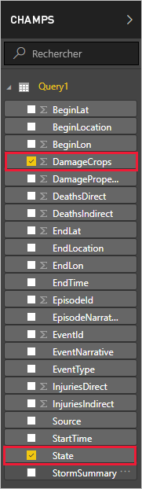
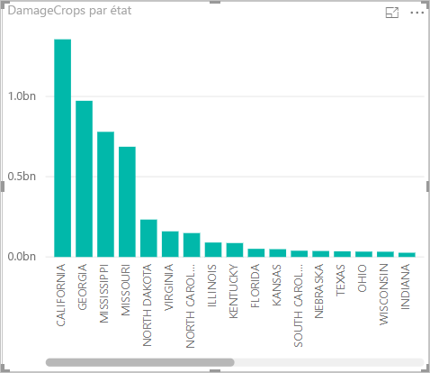

Maintenant que vous avez des données dans Power BI Desktop, vous pouvez créer des rapports basés sur ces données. Vous allez créer un rapport simple avec un histogramme qui montre les dégâts aux cultures par état.

1. Sur le côté gauche de la fenêtre principale de Power BI, sélectionnez la vue Rapport.

    

1. Dans le volet **VISUALISATIONS**, sélectionnez l’histogramme groupé.

    

    Un graphique vide est ajouté au canevas.

    

1. Dans la liste **CHAMPS**, sélectionnez **DamageCrops** (Dégâts aux cultures) et **State** (État).

    

    Vous avez maintenant un graphique qui montre les dommages subis par les cultures pour les 1 000 premières lignes de la table.

    

1. Enregistrez le rapport.