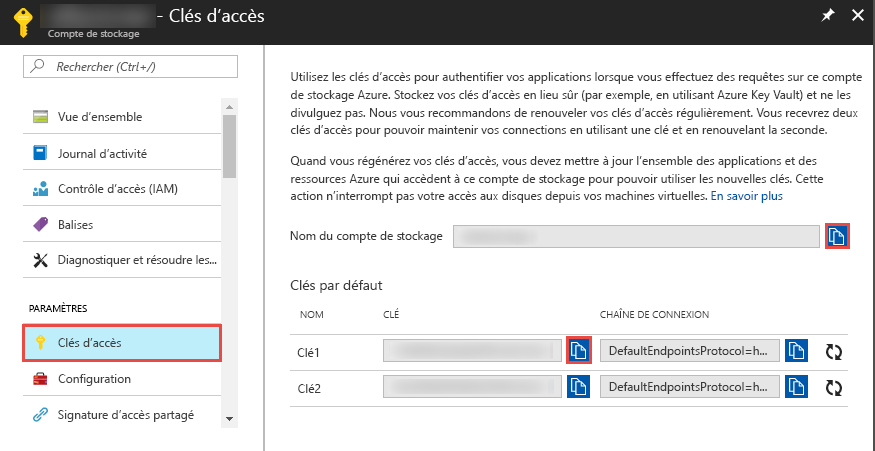
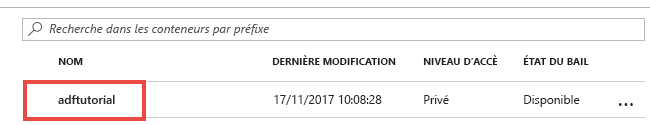

## <a name="prerequisites"></a>Prérequis

### <a name="azure-subscription"></a>Abonnement Azure
Si vous n’avez pas d’abonnement Azure, créez un [compte gratuit](https://azure.microsoft.com/free/) avant de commencer.

### <a name="azure-roles"></a>Rôles Azure
Pour créer des instances Data Factory, le compte d’utilisateur que vous utilisez pour vous connecter à Azure doit être membre des rôles *Contributeur* ou *Propriétaire*, ou *administrateur* de l’abonnement Azure. Pour visualiser les autorisations dont vous disposez dans l’abonnement, sélectionnez votre nom d’utilisateur dans le coin supérieur droit du Portail Azure, puis sélectionnez **Autorisations**. Si vous avez accès à plusieurs abonnements, sélectionnez l’abonnement approprié. 

Les exigences applicables à la création et à la gestion des ressources enfants pour Data Factory (jeux de données, services liés, pipelines, déclencheurs et runtimes d’intégration) sont les suivantes :
- Pour créer et gérer des ressources enfants dans le Portail Azure, vous devez appartenir au rôle **Contributeurs de Data Factory** au niveau du groupe de ressources ou à un niveau supérieur.
- Pour créer et gérer des ressources enfants à l’aide de PowerShell ou du Kit de développement logiciel (SDK), le rôle **Contributeur** au niveau du groupe de ressources ou à un niveau supérieur est suffisant.

Pour découvrir des exemples d’instructions concernant l’ajout d’un utilisateur à un rôle, consultez l’article décrivant comment [ajouter des rôles](../articles/billing/billing-add-change-azure-subscription-administrator.md).

Pour plus d’informations, consultez les articles suivants :
- [Rôle Contributeurs de fabrique de données](../articles/role-based-access-control/built-in-roles.md#data-factory-contributor)
- [Roles and permissions for Azure Data Factory](../articles/data-factory/concepts-roles-permissions.md) (Rôles et autorisations pour Azure Data Factory)

### <a name="azure-storage-account"></a>Compte Azure Storage
Dans ce guide de démarrage rapide, vous allez utiliser un compte Stockage Azure (un compte Stockage Blob, plus précisément) à usage général à la fois comme magasin de données *source* et de *destination*. Si vous ne possédez pas de compte Stockage Azure à usage général, consultez [Créer un compte de stockage](../articles/storage/common/storage-quickstart-create-account.md) pour en créer un. 

#### <a name="get-the-storage-account-name-and-account-key"></a>Obtenir le nom de compte de stockage et la clé de compte
Pour ce guide de démarrage rapide, vous devez disposer du nom et de la clé de votre compte de stockage Azure. La procédure suivante détaille les étapes à suivre pour obtenir le nom et la clé de votre compte de stockage : 

1. Dans un navigateur web, accédez au [portail Azure](https://portal.azure.com). Connectez-vous avec votre nom d’utilisateur et votre mot de passe Azure. 
2. Dans le menu de gauche, sélectionnez **Tous les services**, filtrez les services à l’aide du mot clé **Stockage**, puis sélectionnez **Comptes de stockage**.

   
3. Dans la liste des comptes de stockage, appliquez un filtre pour votre compte de stockage (si nécessaire), puis sélectionnez votre compte de stockage. 
4. Sur la page **Compte de stockage**, sélectionnez **Clés d’accès** dans le menu.

   
5. Copiez les valeurs des champs **Nom du compte de stockage** et **key1** dans le presse-papiers. Collez-les dans un bloc-notes ou tout autre éditeur et enregistrez le fichier. Vous les utiliserez ultérieurement dans ce guide de démarrage rapide.   

#### <a name="create-the-input-folder-and-files"></a>Créer les fichiers et le dossier d’entrée
Dans cette section, vous allez créer un conteneur d’objets blob nommé **adftutorial** dans un stockage Blob Azure. Ensuite, vous créerez un dossier nommé **input** (entrée) dans le conteneur et chargerez un exemple de fichier dans ce dossier. 

1. Sur la page **Compte de stockage**, basculez vers **Vue d’ensemble**, puis sélectionnez **Objets blob**. 

   
2. Dans la page **Service BLOB**, sélectionnez **+ Conteneur** dans la barre d’outils. 

       
3. Dans la boîte de dialogue **Nouveau conteneur**, saisissez le nom **adftutorial**, puis sélectionnez **OK**. 

   
4. Sélectionnez **adftutorial** dans la liste des conteneurs. 

   
5. Sur la page **Conteneur**, sélectionnez **Charger** dans la barre d’outils.  

   
6. Sur la page **Charger l’objet blob**, sélectionnez **Avancé**.

   
7. Ouvrez le **Bloc-notes** et créez un fichier nommé **emp.txt** avec le contenu suivant. Enregistrez-le dans le dossier **c:\ADFv2QuickStartPSH**. S’il n’existe pas déjà, créez le dossier **ADFv2QuickStartPSH**.
    
   ```
   John, Doe
   Jane, Doe
   ```    
8. Dans le portail Azure, sur la page **Charger l’objet blob**, recherchez et sélectionnez le fichier **emp.txt** pour le champ **Fichiers**. 
9. Entrez **input** dans le champ **Charger dans le dossier**. 

        
10. Vérifiez que le dossier est **input** et que le fichier est **emp.txt**, puis sélectionnez **Charger**.
    
    Vous devriez voir le fichier **emp.txt** et l’état du chargement dans la liste. 
12. Fermez la page **Charger l’objet blob** en cliquant sur **X** en haut à droite. 

    
1. Laissez la page **Conteneur** ouverte. Vous l’utiliserez pour vérifier la sortie à la fin de ce guide de démarrage rapide.