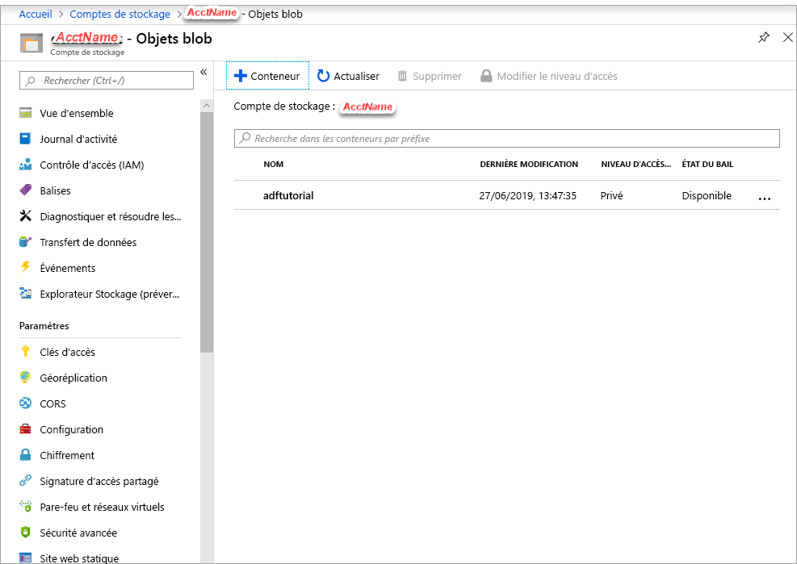

## <a name="prerequisites"></a>Conditions préalables

### <a name="azure-subscription"></a>Abonnement Azure
Si vous n’avez pas d’abonnement Azure, créez un [compte gratuit](https://azure.microsoft.com/free/) avant de commencer.

### <a name="azure-roles"></a>Rôles Azure
Pour créer des instances Data Factory, le compte d’utilisateur que vous utilisez pour vous connecter à Azure doit être membre des rôles *Contributeur* ou *Propriétaire*, ou *administrateur* de l’abonnement Azure. Pour visualiser les autorisations dont vous disposez dans l’abonnement, accédez au [portail Azure](https://portal.azure.com), sélectionnez votre nom d’utilisateur dans l’angle supérieur droit, choisissez **Autres options** (...), puis sélectionnez **Mes autorisations**. Si vous avez accès à plusieurs abonnements, sélectionnez l’abonnement approprié.

Les exigences applicables à la création et à la gestion des ressources enfants pour Data Factory (jeux de données, services liés, pipelines, déclencheurs et runtimes d’intégration) sont les suivantes :

- Pour créer et gérer des ressources enfants dans le Portail Azure, vous devez appartenir au rôle **Contributeurs de Data Factory** au niveau du groupe de ressources ou à un niveau supérieur.
- Pour créer et gérer des ressources enfants à l’aide de PowerShell ou du Kit de développement logiciel (SDK), le rôle **Contributeur** au niveau du groupe de ressources ou à un niveau supérieur est suffisant.

Pour découvrir des exemples d’instructions concernant l’ajout d’un utilisateur à un rôle, consultez l’article décrivant comment [ajouter des rôles](../articles/billing/billing-add-change-azure-subscription-administrator.md).

Pour plus d’informations, consultez les articles suivants :

- [Rôle Contributeurs de fabrique de données](../articles/role-based-access-control/built-in-roles.md#data-factory-contributor)
- [Roles and permissions for Azure Data Factory](../articles/data-factory/concepts-roles-permissions.md) (Rôles et autorisations pour Azure Data Factory)

### <a name="azure-storage-account"></a>Compte Azure Storage
Dans ce guide de démarrage rapide, vous allez utiliser un compte Stockage Azure (un compte Stockage Blob, plus précisément) à usage général à la fois comme magasin de données *source* et de *destination*. Si vous ne possédez pas de compte Stockage Azure à usage général, consultez [Créer un compte de stockage](../articles/storage/common/storage-quickstart-create-account.md) pour en créer un. 

#### <a name="get-the-storage-account-name-and-account-key"></a>Obtenir le nom de compte de stockage et la clé de compte
Pour ce guide de démarrage rapide, vous devez disposer du nom et de la clé de votre compte de stockage Azure. La procédure suivante détaille les étapes à suivre pour obtenir le nom et la clé de votre compte de stockage : 

1. Dans un navigateur web, accédez au [portail Azure](https://portal.azure.com) et connectez-vous à l’aide de vos nom d’utilisateur et mot de passe Azure.
2. Sélectionnez **Tous les services** > **Stockage** > **Comptes de stockage**.
3. Dans la page **Comptes de stockage**, appliquez un filtre pour votre compte de stockage (si nécessaire), puis sélectionnez votre compte de stockage. 
4. Dans la barre latérale de la page *\<Nom du compte>*  - **Compte de stockage**, accédez à l’étiquette **Paramètres** et sélectionnez **Clés d’accès**. La page *\<Nom du compte>*  - **Clés d’accès** s’affiche.

   
5. Copiez les valeurs des champs **Nom du compte de stockage** et **key1** dans le presse-papiers. Collez-les dans un bloc-notes ou tout autre éditeur et enregistrez le fichier. Vous les utiliserez ultérieurement dans ce guide de démarrage rapide.   

#### <a name="create-a-blob-container"></a>Création d’un conteneur d’objets blob
Dans cette section, vous allez créer un conteneur d’objets blob nommé **adftutorial** dans un stockage Blob Azure.

1. Dans la barre latérale de la page *\<Nom du compte>*  - **Clés d’accès**, sélectionnez **Vue d’ensemble** > **Objets blob**.
2. Dans la barre d’outils de la page *\<Nom du compte>*  - **Objets blob**, sélectionnez **Conteneur**.
3. Dans la boîte de dialogue **Nouveau conteneur**, saisissez le nom **adftutorial**, puis sélectionnez **OK**. La page *\<Nom du compte>*  - **Objets blob** est mise à jour pour inclure **adftutorial** dans la liste des conteneurs.

   

#### <a name="add-an-input-folder-and-file-for-the-blob-container"></a>Ajouter un dossier et un fichier d’entrée pour le conteneur d’objets blob
Dans cette section, vous créez un dossier nommé **input** (entrée) dans le conteneur que vous venez de créer, puis chargez un exemple de fichier dans ce dossier. Avant de commencer, ouvrez un éditeur de texte tel que **Bloc-notes**, puis créez un fichier nommé **emp.txt** avec le contenu suivant :

```emp.txt
John, Doe
Jane, Doe
```

Enregistrez-le dans le dossier **C:\ADFv2QuickStartPSH** (si le dossier n’existe pas, créez-le). Revenez ensuite au portail Azure et procédez comme suit :

1. Dans la page *\<Nom du compte>*  - **Objets blob**, là où vous vous êtes arrêté, sélectionnez **adftutorial** dans la liste mise à jour des conteneurs (si vous avez fermé la fenêtre ou accédé à une autre page, reconnectez-vous au [portail Azure](https://portal.azure.com), sélectionnez **Tous les services** > **Stockage** > **Comptes de stockage**, sélectionnez votre compte de stockage, puis sélectionnez **Objets blob** > **adftutorial**).
2. Dans la barre d’outils de la page du conteneur **adftutorial**, sélectionnez **Charger**.
3. Dans la page **Charger l’objet blob**, sélectionnez la zone **Fichiers**, puis recherchez et sélectionnez le fichier **emp.txt**.
4. Développez le titre **Avancé**. La page s’affiche à présent comme indiqué :

   
5. Dans la zone **Charger dans le dossier**, entrez **input**.
6. Cliquez sur le bouton **Charger**. Vous devriez voir le fichier **emp.txt** et l’état du chargement dans la liste.
7. Sélectionnez l’icône **Fermer** (**X**) pour fermer la page **Charger l’objet blob**.

Laissez la page du conteneur **adftutorial** ouverte. Vous l’utiliserez pour vérifier la sortie à la fin de ce guide de démarrage rapide.