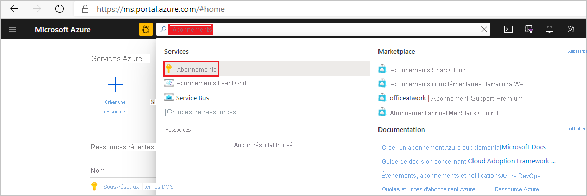
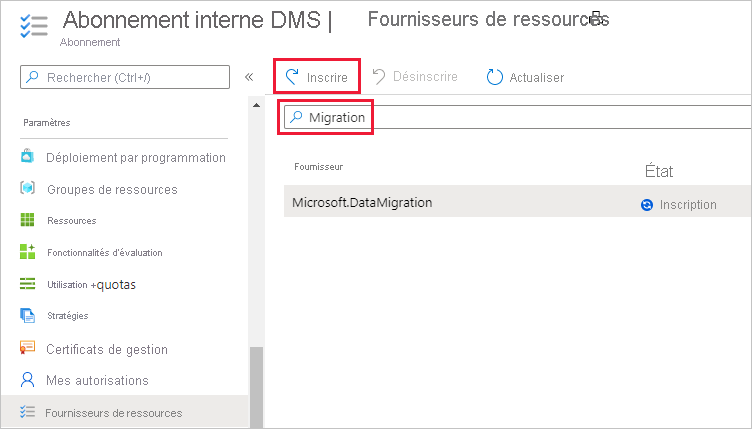

## Inscrire le fournisseur de ressources Microsoft.DataMigration

1. Connectez-vous au portail Azure. Recherchez et sélectionnez **Abonnements**.

   

2. Sélectionnez l’abonnement dans lequel vous voulez créer l’instance Azure Database Migration Service, puis sélectionnez **Fournisseurs de ressources**.

    

3. Recherchez « migration », puis sélectionnez **Inscrire** pour **Microsoft.DataMigration**.

        
