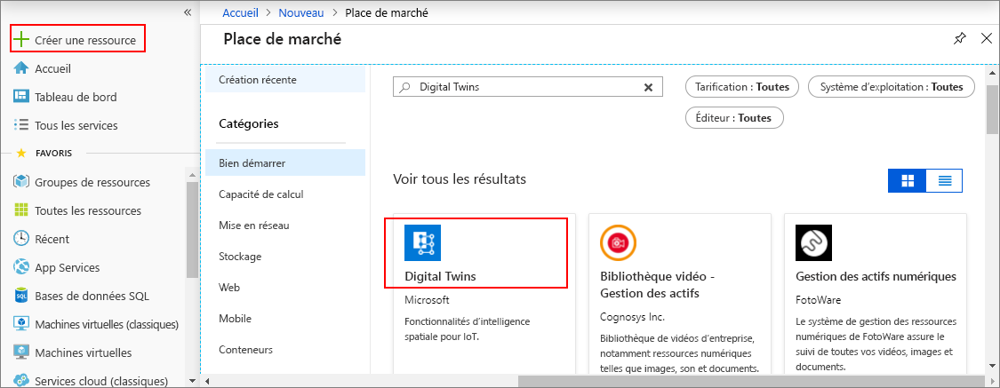

1. Connectez-vous au [Portail Azure](http://portal.azure.com).

1. Dans le volet de navigation de gauche, cliquez sur **Créer une ressource**. Recherchez *digital twins*, puis sélectionnez **Digital Twins (préversion)**. Cliquez sur **Créer** pour entamer le processus de déploiement.

    

1. Dans le volet **Digital Twins**, entrez les informations suivantes :
   * **Nom de la ressource** : créez un nom unique pour votre instance Digital Twins.
   * **Abonnement** : choisissez l’abonnement que vous souhaitez utiliser pour créer cette instance Digital Twins. 
   * **Groupe de ressources** : sélectionnez ou créez un [groupe de ressources](https://docs.microsoft.com/azure/azure-resource-manager/resource-group-overview#resource-groups) pour l’instance Digital Twins.
   * **Emplacement** : sélectionnez l’emplacement le plus proche de vos périphériques.

    

1. Vérifiez les informations concernant votre instance Digital Twins, puis cliquez sur **Créer**. La création de votre instance Digital Twins peut prendre quelques minutes. Vous pouvez suivre la progression dans le volet **Notifications**.

1. Ouvrez le volet **Vue d’ensemble** de votre instance Digital Twins. Notez le lien qui s’affiche sous **API de gestion**.

    1. L’URL de l’**API de gestion** respecte le format suivant : **_https://yourDigitalTwinsName.yourLocation.azuresmartspaces.net/management/swagger_**. Cette URL vous renvoie à la documentation de l’API REST d’Azure Digital Twins qui correspond à votre instance. Pour savoir comment lire et utiliser la documentation de cette API, consultez la section [Comment utiliser Azure Digital Twins Swagger](../articles/digital-twins/how-to-use-swagger.md).

    1. Modifiez l’URL de l’**API de gestion** pour qu’elle respecte le format suivant : **_https://yourDigitalTwinsName.yourLocation.azuresmartspaces.net/management/api/v1.0/_**. Votre application se servira de l’URL modifiée comme de l’URL de base pour accéder à votre instance. Copiez cette URL modifiée dans un fichier temporaire. Vous en aurez besoin dans la prochaine section.

    