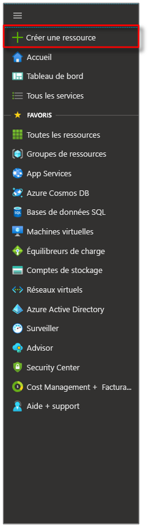
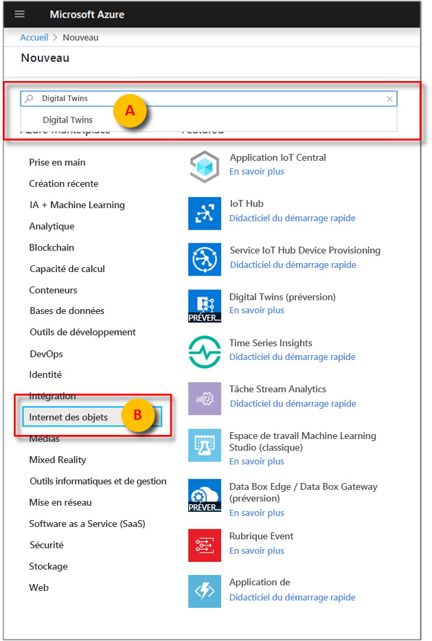
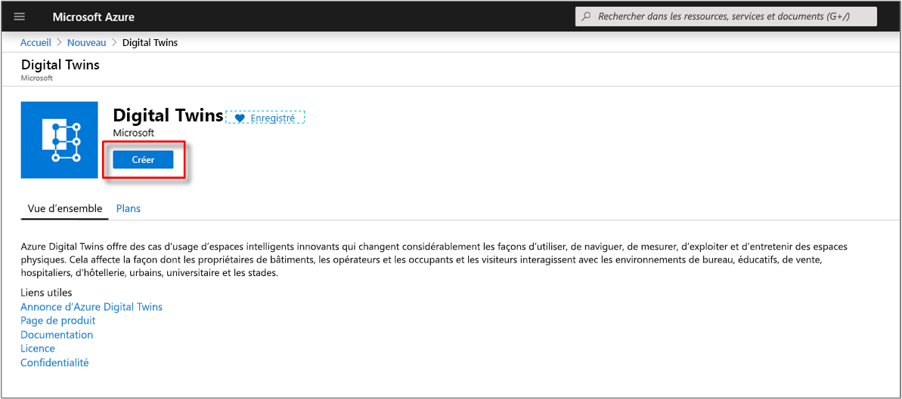
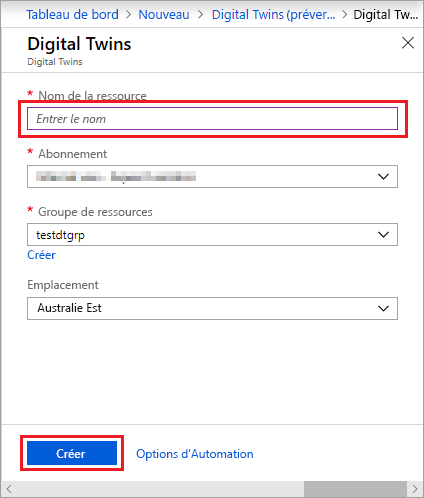
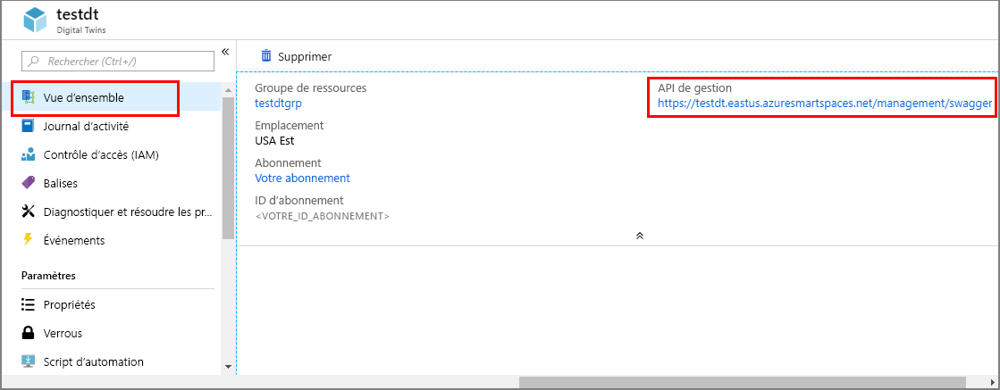

1. Connectez-vous au [portail Azure](https://portal.azure.com).

1. Sélectionnez la barre latérale, puis **+ Créer une ressource**. 

   [](./media/create-digital-twins-portal/azure-portal-create-a-resource.png#lightbox)

1. Recherchez **Digital Twins**, puis sélectionnez **Digital Twins**. 

   [](./media/create-digital-twins-portal/azure-portal-create-digital-twins.png#lightbox)

   Vous pouvez également sélectionner **Internet des objets**, puis **Digital Twins (version préliminaire)** .

1. Sélectionnez **Créer** pour commencer le processus de déploiement.

   [](./media/create-digital-twins-portal/azure-create-and-confirm-resource.png#lightbox)

1. Dans le volet **Digital Twins**, entrez les informations suivantes :
   * **Nom de la ressource** : créez un nom unique pour votre instance Digital Twins.
   * **Abonnement** : choisissez l’abonnement que vous souhaitez utiliser pour créer cette instance Digital Twins. 
   * **Groupe de ressources** : sélectionnez ou créez un [groupe de ressources](https://docs.microsoft.com/azure/azure-resource-manager/resource-group-overview#resource-groups) pour l’instance Digital Twins.
   * **Emplacement** : sélectionnez l’emplacement le plus proche de vos périphériques.

     [](./media/create-digital-twins-portal/create-digital-twins-param.png#lightbox)

1. Vérifiez les informations de votre instance Digital Twins et sélectionnez **Créer**. La création de votre instance Digital Twins peut prendre quelques minutes. Vous pouvez suivre la progression dans le volet **Notifications**.

1. Ouvrez le volet **Vue d’ensemble** de votre instance Digital Twins. Notez le lien sous **API de gestion**. L’URL de l’**API de gestion** respecte le format suivant : 
   
   ```URL
   https://yourDigitalTwinsName.yourLocation.azuresmartspaces.net/management/swagger
   ```
   
   Cette URL vous renvoie à la documentation de l’API REST d’Azure Digital Twins qui correspond à votre instance. Pour savoir comment lire et utiliser la documentation de cette API, consultez la section [Comment utiliser Azure Digital Twins Swagger](../articles/digital-twins/how-to-use-swagger.md). Copiez et modifiez l’URL de l’**API de gestion** pour qu’elle respecte le format suivant : 
    
   ```URL
   https://yourDigitalTwinsName.yourLocation.azuresmartspaces.net/management/api/v1.0/
   ```
    
   Votre application se servira de l’URL modifiée comme de l’URL de base pour accéder à votre instance. Copiez cette URL modifiée dans un fichier temporaire. Vous en aurez besoin dans la prochaine section.

   [](./media/create-digital-twins-portal/digital-twins-management-api.png#lightbox)