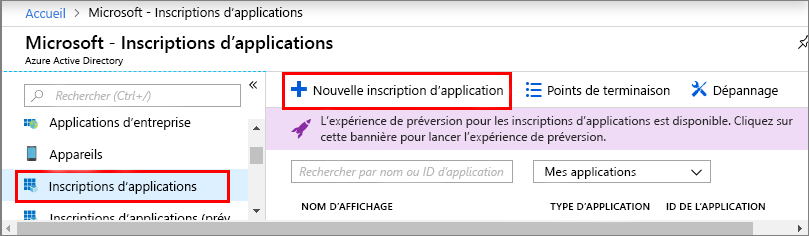

1. Dans le [Portail Azure](https://portal.azure.com), ouvrez **Azure Active Directory** dans le panneau de navigation sur le côté gauche, puis ouvrez le volet **Propriétés**. Copiez l’**ID de répertoire** dans un fichier temporaire. Cette valeur vous permettra de configurer un exemple d’application dans la section suivante.

    

1. Ouvrez le volet **Inscriptions d’applications**, puis cliquez sur **Nouvelle inscription d’application**.
    
    

1. Dans le champ **Nom**, attribuez un nom convivial à l’inscription de cette application. Sélectionnez **Type d’application** comme étant **_Natif_**, et **URI de redirection** comme étant **_https://microsoft.com_**. Cliquez sur **Créer**.

    

1. Ouvrez l’application inscrite, puis copiez la valeur du champ **ID d’application** dans un fichier temporaire. Cette valeur identifie votre application Azure Active Directory. L’ID d’application vous permettra de configurer votre exemple d’application dans les sections suivantes.

    

1. Ouvrez le volet d’inscription de votre application, et puis cliquez sur **Paramètres** > **Autorisations requises** :
    - Cliquez sur **Ajouter** en haut à gauche pour ouvrir le volet **Ajouter un accès d’API**.
    - Cliquez sur **Sélectionner une API**, puis sélectionnez **Azure Digital Twins**. Si votre recherche ne trouve pas cette API, sélectionnez **Azure Smart Spaces** à la place.
    - Sélectionnez l’option **Azure Digital Twins (Azure Smart Spaces Service)**, puis cliquez sur **Sélectionner**.
    - Cliquez sur **Sélectionner les autorisations**. Cochez la case des autorisations déléguées **Accès en lecture/écriture**, puis cliquez sur **Sélectionner**.
    - Cliquez sur **Terminé** dans le volet **Ajouter un accès d’API**.
    - Dans le volet **Autorisations requises**, cliquez sur le bouton **Accorder des autorisations**, puis acceptez l’accusé réception qui s’affiche.

       
