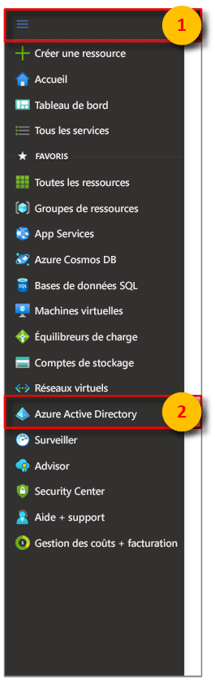
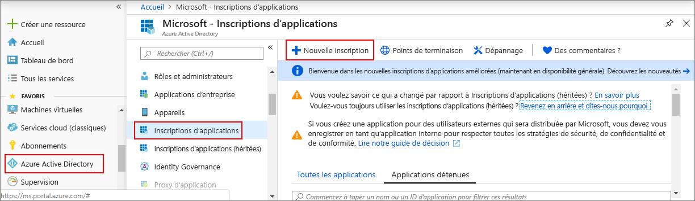
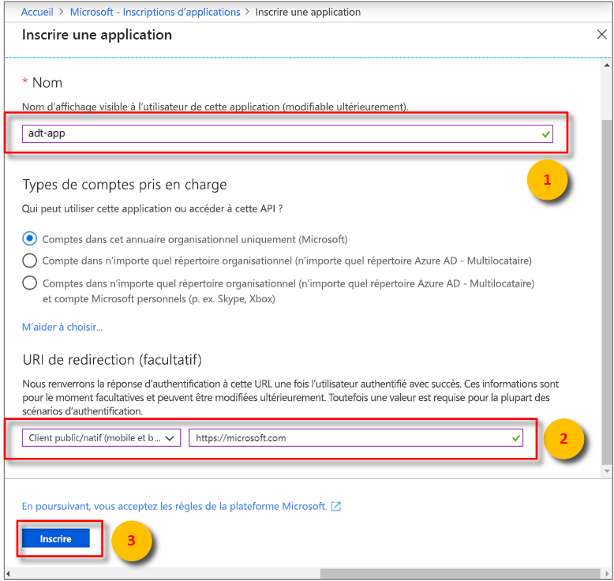
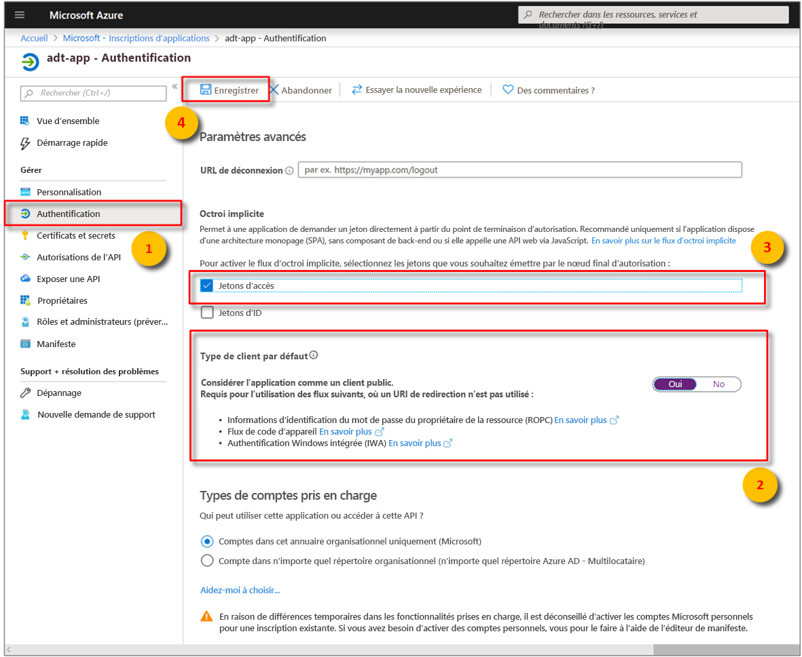
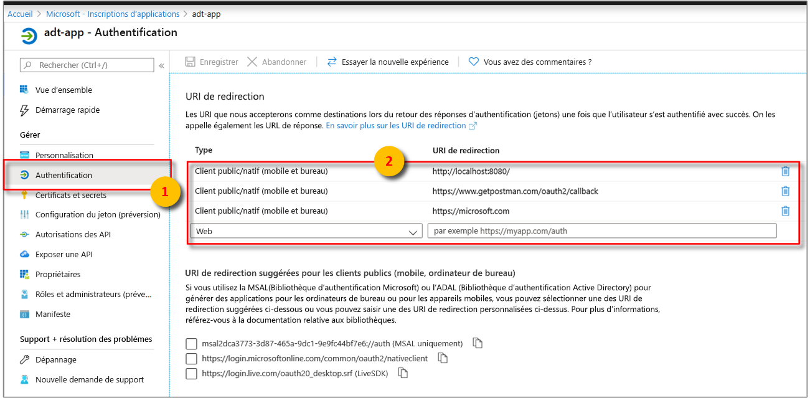
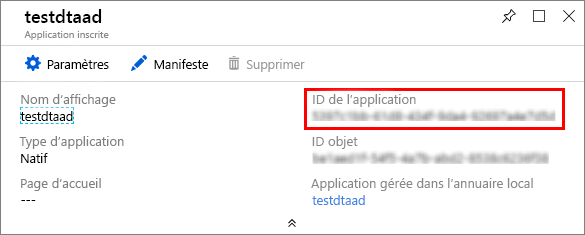
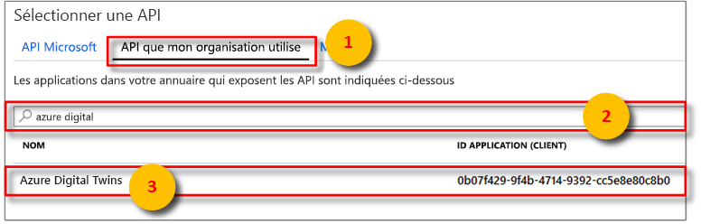
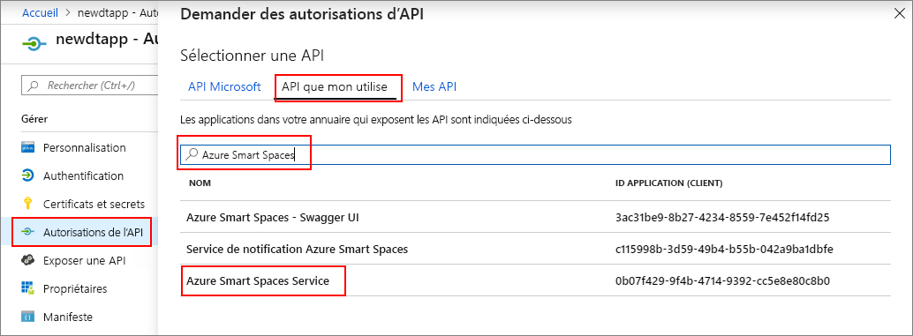
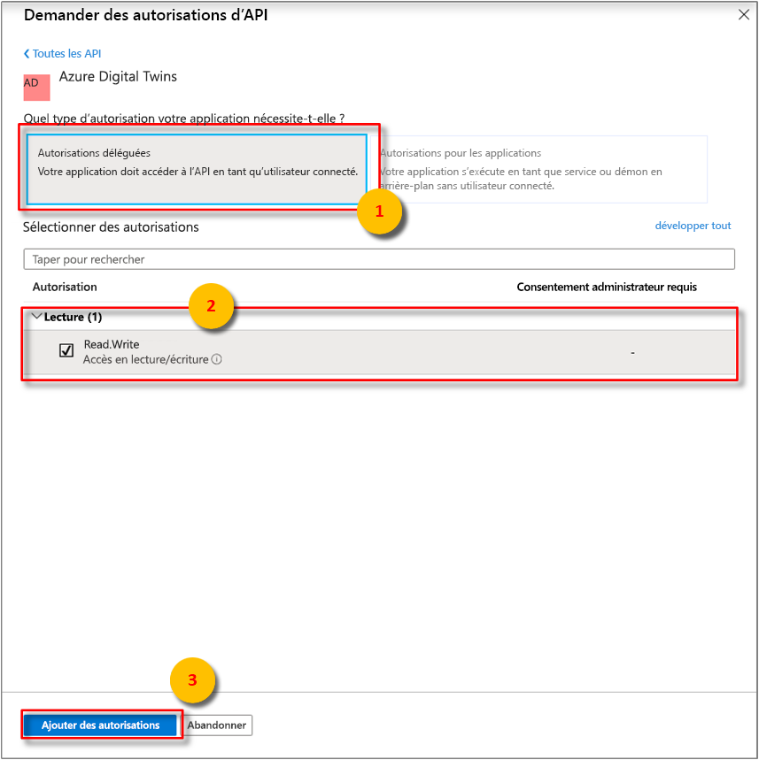
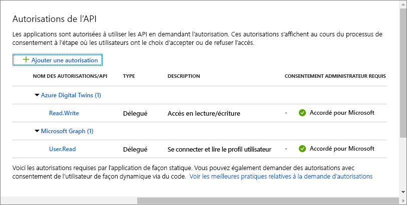

>[!NOTE]
>Cette section fournit les instructions sur [l’inscription de l'application Azure AD](https://docs.microsoft.com/azure/active-directory/develop/quickstart-register-app).

1. Dans le [Portail Azure](https://portal.azure.com), ouvrez **Azure Active Directory** dans le menu de gauche développable, puis ouvrez le volet **Inscriptions d’applications**. 

    

1. Sélectionnez le bouton **+ Nouvelle inscription**.

    

1. Dans la zone **Nom**, donnez un nom convivial à l’inscription de cette application. 

    1. Sous la section **URI de redirection (facultatif)** , entrez `https://microsoft.com` dans la zone de texte.     

    1. Vérifiez quels comptes et locataires sont pris en charge par votre application Azure Active Directory.

    1. Sélectionnez **Inscription**.

    

1. Le panneau **Authentification** spécifie les paramètres importants de configuration d’authentification. 

    1. Ajoutez des **URI de redirection** et configurez des **Jetons d’accès** en sélectionnant **+ Ajouter une plateforme**.

    1. Sélectionnez **Oui** pour indiquer que l’application est un **client public**.

    1. Vérifiez quels comptes et locataires sont pris en charge par votre application Azure Active Directory.

    

1. Après avoir sélectionné la plateforme appropriée, configurez vos **URI de redirection** et **Jetons d’accès** dans le volet latéral situé à droite de l’interface utilisateur.

    1. **L’URI de redirection** doit correspondre à l’adresse fournie par la requête d’authentification :

        * Pour les applications hébergées dans un environnement de développement local, sélectionnez **Client public (mobile et bureau)** . Veillez à affecter la valeur **Oui** à **Client public**.
        * Pour les applications monopages hébergées sur Azure App Service, sélectionnez **Web**.

    1. Déterminez si une **URL de déconnexion** est appropriée.

    1. Activez le flux d’octroi implicite en cochant les **Jeton d'accès** ou **Jetons d'ID**.
                
    

    Cliquez sur **Configurer**, puis sur **Enregistrer**.

1.  Ouvrez le volet **Vue d’ensemble** de votre application inscrite, et copiez les valeurs des entités suivantes dans un fichier temporaire. Ces valeurs vous permettront de configurer votre exemple d’application dans les sections suivantes.

    - **ID d’application (client)**
    - **ID de l’annuaire (locataire)**

    

1. Ouvrez le volet **API autorisées** pour l’inscription de votre application. Sélectionnez le bouton **+ Ajouter une autorisation**. Dans le volet **Demander des autorisations d’API**, sélectionnez l’onglet **API utilisées par mon organisation**, puis recherchez un des éléments suivants :
    
    1. `Azure Digital Twins`. Sélectionnez l’API **Azure Digital Twins**.

        

    1. Vous pouvez également rechercher `Azure Smart Spaces Service`. Sélectionnez l’API **Azure Smart Spaces Service**.

        

    > [!IMPORTANT]
    > Le nom et l’ID de l’API Azure AD qui s’affichent dépendent de votre locataire :
    > * Les comptes de locataire et client utilisés pour les tests doivent rechercher `Azure Digital Twins`.
    > * Les autres comptes Microsoft doivent rechercher `Azure Smart Spaces Service`.

1. L'une ou l’autre API apparaît sous **Azure Digital Twins** dans le même volet **Demander des autorisations d’API**. Sélectionnez l'option de liste déroulante **Read** (Lire), puis activez la case à cocher **Read.Write** (Lire.Écrire). Sélectionnez le bouton **Ajouter des autorisations**.

    

1. Selon les paramètres de votre organisation, vous devrez peut-être prendre des mesures supplémentaires pour autoriser l’accès de l’administrateur à cette API. Contactez votre administrateur pour obtenir plus d’informations. Une fois l’accès administrateur approuvé, la colonne **Consentement administrateur requis** du volet **Autorisations des API** affichera vos autorisations. 

    

    Vérifiez que **Azure Digital Twins** s’affiche.
