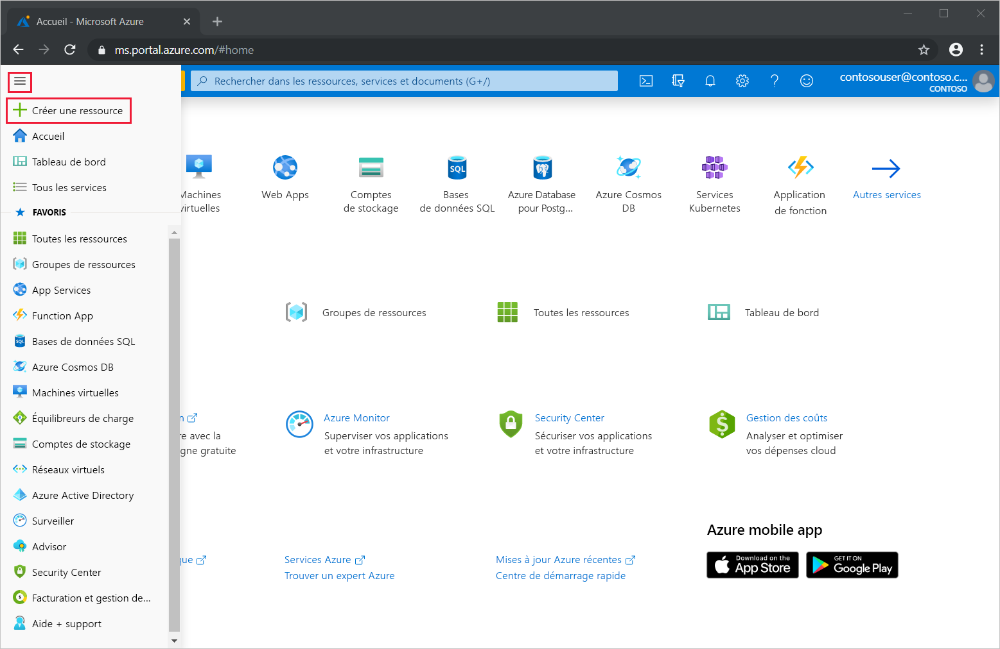
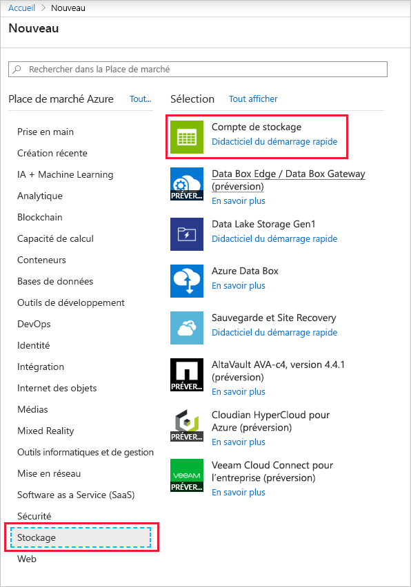
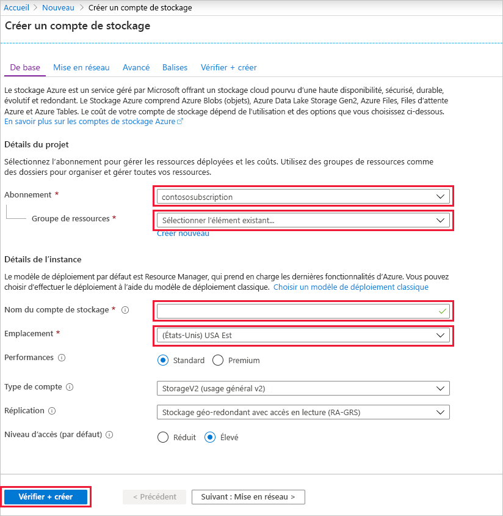
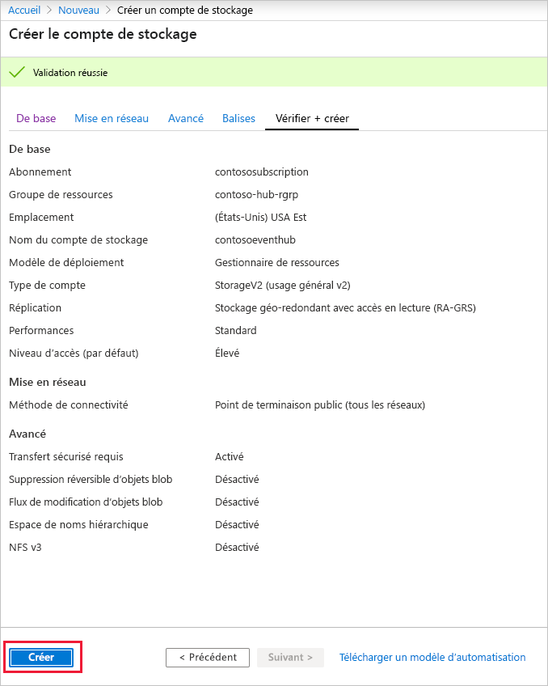
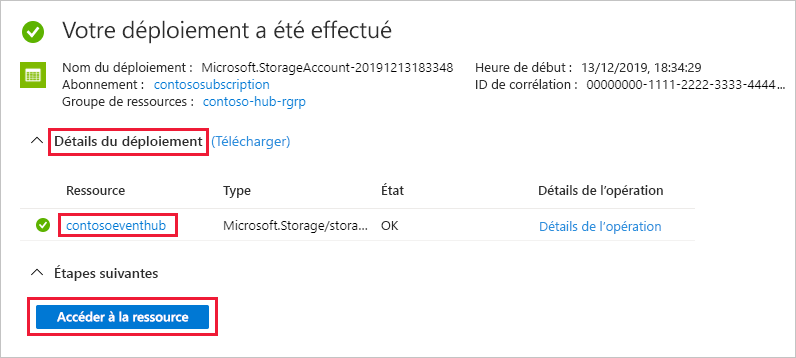
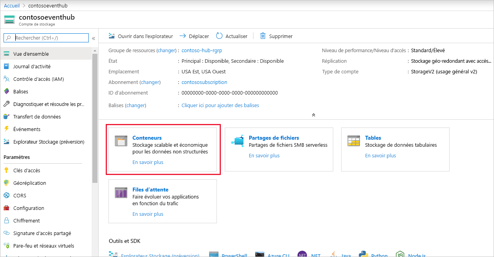
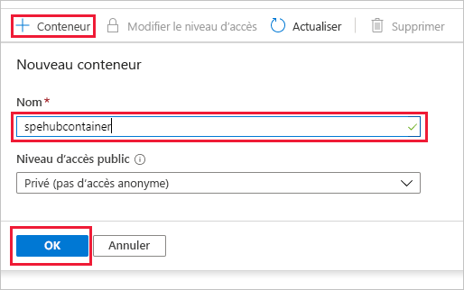

### Créer un compte de stockage pour Event Processor Host
Event Processor Host est un agent intelligent qui simplifie la réception d’événements provenant d’Event Hubs en gérant les points de contrôle persistants et les destinataires parallèles. Pour les points de contrôle, Event Processor Host nécessite un compte de stockage. L’exemple suivant montre comment créer un compte de stockage et comment obtenir ses clés pour l’accès :

1. Dans le menu du Portail Azure, sélectionnez **Créer une ressource**.

    

2. Sélectionnez **Stockage** > **Compte de stockage**.
   
    

3. Sur la page **Créer un compte de stockage**, procédez comme suit : 

   1. Entrez le **nom du compte de stockage**.
   2. Choisissez un **abonnement** Azure qui contient le hub d’événements.
   3. Choisissez ou créez le **groupe de ressources** qui contient le hub d’événements.
   4. Choisissez l’**emplacement** dans lequel stocker la ressource. 
   5. Sélectionnez **Revoir + créer**.
   
        

4. Sur la page **Vérifier + créer**, vérifiez les valeurs, puis sélectionnez **Créer**. 

    
5. Une fois le message **Déploiements réussis** affiché dans vos notifications, sélectionnez **Accéder à la ressource** pour ouvrir la page Compte de stockage. Vous pouvez aussi développer **Détails du déploiement** et sélectionner ensuite votre nouvelle ressource dans la liste des ressources.  

     
6. Sélectionnez **Conteneurs**.

    
7. Sélectionnez **+ Conteneur** en haut, entrez le **nom** du conteneur, puis sélectionnez **OK**. 

    
8. Choisissez **Clés d’accès** dans le menu de la page **Compte de stockage**, puis copiez la valeur de **key1**.

    Enregistrez les valeurs suivantes dans le Bloc-notes ou un autre emplacement temporaire.
    - Nom du compte de stockage
    - Clé d’accès au compte de stockage
    - Nom du conteneur
