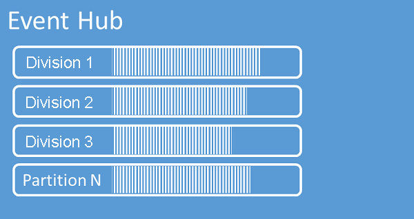

Event Hub organise les séquences d’événements dans une ou plusieurs partitions. Les événements les plus récents sont ajoutés à la fin de cette séquence. Une partition peut être considérée comme un « journal de validation ».

Les partitions contiennent des données d’événement contenant le corps de l’événement, un jeu de propriétés défini par l’utilisateur qui décrit l’événement, et des métadonnées telles que son décalage dans la partition, son numéro dans la séquence de flux et l’horodatage côté service auquel il a été accepté.

Event Hubs est conçu pour faciliter le traitement de gros volumes d’événements, et le partitionnement aide à cela de deux manières :

Tout d’abord, même si Event Hubs est un service PaaS, il y a une réalité physique sous-jacente, et la gestion d’un journal qui conserve l’ordre des événements exige que ces événements soient conservés ensemble dans le stockage sous-jacent et ses réplicas, ce qui entraîne un plafond de débit pour ce type de journal. Le partitionnement permet d’utiliser plusieurs journaux parallèles pour le même hub d’événements et, par conséquent, la multiplication de la capacité de débit d’E/S brute disponible.

De plus, vos propres applications doivent être en mesure de traiter le volume d’événements envoyé dans un hub d’événements. Cela peut être complexe et nécessiter une capacité de traitement parallèle importante ayant fait l’objet d’un scale-out. Le raisonnement pour les partitions est le même que ci-dessus : La capacité d’un processus unique à gérer les événements est limitée. Par conséquent, vous avez besoin de plusieurs processus, et c’est grâce aux partitions que votre solution alimente ces processus tout en garantissant que chaque événement a un propriétaire de traitement clair. 

Event Hubs conserve les événements pendant une durée de conservation configurée qui s’applique à toutes les partitions. Les événements sont automatiquement supprimés lorsque la période de conservation est atteinte. Si vous spécifiez une période de conservation d’une journée, l’événement devient indisponible exactement 24 heures après qu’il a été accepté. Vous ne pouvez pas supprimer explicitement des événements. 

La durée de conservation autorisée est de sept jours pour Event Hubs Standard et jusqu’à 90 jours pour Event Hubs Dedicated. Si vous avez besoin d’archiver des événements au-delà de la période de conservation autorisée, vous pouvez faire en sorte qu’ils soient [stockés automatiquement dans Stockage Azure ou Azure Data Lake en activant la fonctionnalité de capture d’Event Hubs](../articles/event-hubs/event-hubs-capture-overview.md), et si vous avez besoin d’effectuer des recherches ou des analyses dans des archives profondes, vous pouvez [les importer facilement dans Azure Synapse](../articles/event-hubs/store-captured-data-data-warehouse.md) ou d’autres magasins et plateformes d’analytique similaires. 

La limite de conservation des données en fonction du temps appliquée par Event Hubs a pour but d’éviter que des volumes importants de données historiques client soient interceptés dans un magasin profond qui n’est indexé que par un horodatage et qui n’autorise que l’accès séquentiel. La philosophie architecturale est que les données historiques nécessitent une indexation plus riche et un accès plus direct que l’interface d’événements en temps réel fournie par Event Hubs ou Kafka. Les moteurs de flux d’événements ne sont pas parfaits pour assumer le rôle de lacs de données ou d’archives à long terme pour le provisionnement d’événements. 

Comme les partitions sont indépendantes et contiennent leur propre séquence de données, elles évoluent souvent à des vitesses différentes. Dans Event Hubs, ce n’est pas un problème qui nécessite une intervention administrative comme ce serait le cas par exemple dans Apache Kafka, mais une distribution inégale provoquera une charge inégale sur vos processeurs d’événements en aval.

Le nombre de partitions est spécifié lors de la création, et il doit être compris entre 1 et 32 dans Event Hubs Standard. Le nombre de partitions peut aller jusqu’à 2000 partitions par unité de capacité dans Event Hubs Dedicated. 

Nous vous recommandons de choisir au moins autant de partitions que vous pensez devoir être nécessaires en [unités de débit (TU)](../articles/event-hubs/event-hubs-faq.md#what-are-event-hubs-throughput-units) soutenues pendant la charge maximale de votre application pour ce hub d’événements particulier. Vous devez calculer avec une partition unique ayant une capacité de débit de 1 TU (1 Mo en entrée, 2 Mo en sortie). Vous pouvez mettre à l’échelle les TU sur votre espace de noms ou les unités de capacité de votre cluster indépendamment du nombre de partitions. Un hub d’événements avec 32 partitions et un hub d’événements avec 1 partition entraînent exactement le même coût lorsque l’espace de noms est défini sur une capacité de 1 TU. 

Les applications contrôlent le mappage des événements sur les partitions de l’une des trois façons suivantes :

- En spécifiant la clé de partition, qui est mappée de manière cohérente (à l’aide d’une fonction de hachage) à l’une des partitions disponibles. 
- En ne spécifiant pas de clé de partition, ce qui permet de choisir de manière aléatoire une partition pour un événement donné.
- En envoyant explicitement des événements à une partition spécifique.

Le fait de spécifier une clé de partition permet de conserver les événements associés dans la même partition et dans l’ordre exact dans lequel ils ont été envoyés. La clé de partition est une chaîne qui est dérivée de votre contexte d’application et qui identifie les relations entre les événements.

Une séquence d’événements identifiée par une clé de partition est un *flux*. Une partition est un magasin de journaux multiplexé pour de nombreux flux de ce type. 

Dans un [cluster Event Hubs dédié](../articles/event-hubs/event-hubs-dedicated-overview.md), le nombre de partitions d’un hub d’événements peut être [augmenté](../articles/event-hubs/dynamically-add-partitions.md) après sa création, mais dans ce cas, la distribution des flux entre les partitions changera à mesure que le mappage des clés de partition aux partitions changera. Vous devez donc tenter d’éviter de telles modifications si l’ordre relatif des événements est important dans votre application.

Il est tentant de définir le nombre de partitions sur la valeur maximale autorisée, mais gardez toujours à l’esprit que vos flux d’événements doivent être structurés de sorte que vous puissiez tirer parti de plusieurs partitions. Si vous avez impérativement besoin de préserver l’ordre parmi tous les événements ou seulement quelques sous-flux, vous ne pourrez peut-être pas tirer parti de nombreuses partitions. En outre, de nombreuses partitions rendent le côté traitement plus complexe. 

Bien qu’il soit possible d’envoyer directement aux partitions, cela n’est pas recommandé. Au lieu de cela, vous pouvez utiliser des constructions de niveau supérieur présentées dans la section [Éditeurs d’événements](../articles/event-hubs/event-hubs-features.md#event-publishers). 

