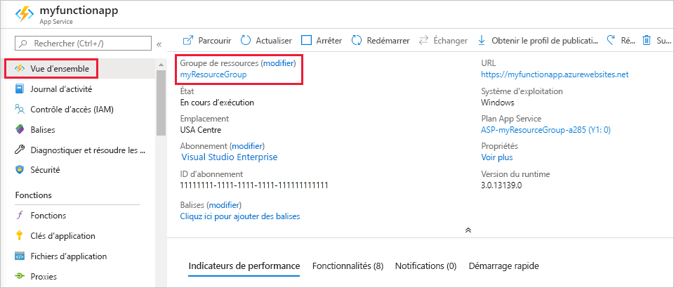

1. Dans Visual Studio Code, appuyez sur F1 pour ouvrir la palette de commandes. Dans la palette de commandes, recherchez et sélectionnez `Azure Functions: Open in portal`.

1. Choisissez votre application de fonction et appuyez sur Entrée. La page de l’application de fonction est ouverte dans le [portail Azure](https://portal.azure.com).

1. Sous l’onglet **Vue d’ensemble**, sélectionnez le lien nommé sous **Groupe de ressources**.

    

1. Sur la page **Groupe de ressources**, passez en revue la liste des ressources incluses et vérifiez qu’elles correspondent à celles que vous souhaitez supprimer.
 
1. Sélectionnez **Supprimer le groupe de ressources** et suivez les instructions.

   Cette opération peut prendre quelques minutes. Une fois terminée, une notification s’affiche pendant quelques secondes. Vous pouvez également sélectionner l’icône représentant une cloche en haut de la page pour afficher la notification.