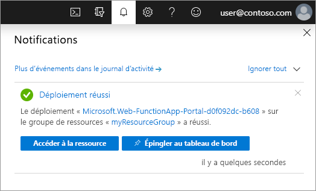

1. Dans le menu du portail Azure ou dans la page **Accueil**, sélectionnez **Créer une ressource**.

1. Dans la page **Nouveau**, sélectionnez **Calcul** > **Application de fonction**.

1. Dans la page **De base**, utilisez les paramètres d’application de fonction comme indiqué dans le tableau ci-dessous.

    | Paramètre      | Valeur suggérée  | Description |
    | ------------ | ---------------- | ----------- |
    | **Abonnement** | Votre abonnement | Abonnement sous lequel est créée cette nouvelle application de fonction. |
    | **[Groupe de ressources](../articles/azure-resource-manager/management/overview.md)** |  *myResourceGroup* | Nom du nouveau groupe de ressources dans lequel créer votre Function App. |
    | **Nom de l’application de fonction** | Nom globalement unique | Nom qui identifie votre nouvelle Function App. Les caractères valides sont `a-z` (insensible à la casse), `0-9`et `-`.  |
    |**Publier**| Code | Option permettant de publier des fichiers de code ou un conteneur Docker. |
    | **Pile d’exécution** | Langage préféré | Choisissez un runtime qui prend en charge votre langage de programmation de fonction favori. La modification dans le portail n’est disponible que pour les scripts JavaScript, PowerShell, TypeScript et C#. Les fonctions de la bibliothèque de classes C#, ainsi que les fonctions Java et Python doivent être [développées localement](../articles/azure-functions/functions-develop-local.md#local-development-environments).  |
    |**Version**| Numéro de version | Choisissez la version de votre runtime installé. |
    |**Région**| Région recommandée | Choisissez une [région](https://azure.microsoft.com/regions/) près de chez vous ou près d’autres services auxquels ont accès vos fonctions. |

1. Sélectionnez **Suivant : Hébergement**. Dans la page **Hébergement**, entrez les paramètres suivants.

    | Paramètre      | Valeur suggérée  | Description |
    | ------------ | ---------------- | ----------- |
    | **[Compte de stockage](../articles/storage/common/storage-account-create.md)** |  Nom globalement unique |  Créez un compte de stockage utilisé par votre application de fonction. Les noms des comptes de stockage doivent comporter entre 3 et 24 caractères, uniquement des lettres minuscules et des chiffres. Vous pouvez également utiliser un compte existant qui doit répondre aux [exigences relatives aux comptes de stockage](../articles/azure-functions/storage-considerations.md#storage-account-requirements). |
    |**Système d’exploitation**| Windows | Un système d’exploitation est présélectionné pour vous en fonction de la sélection de votre pile d’exécution, mais vous pouvez modifier le paramètre si nécessaire. La modification sur le portail est prise en charge sur Windows uniquement. |
    | **[Plan](../articles/azure-functions/functions-scale.md)** | **Consommation (serverless)** | Plan d’hébergement qui définit la façon dont les ressources sont allouées à votre Function App. Dans le plan de **Consommation** par défaut, les ressources sont ajoutées dynamiquement en fonction des besoins de vos fonctions. Avec cet hébergement [serverless](https://azure.microsoft.com/overview/serverless-computing/), vous payez uniquement pour la durée d’exécution de vos fonctions. Si vous exécutez dans un plan App Service, vous devez gérer la [mise à l’échelle de votre application de fonction](../articles/azure-functions/functions-scale.md).  |

1. Sélectionnez **Suivant : Supervision**. Dans la page **Supervision**, entrez les paramètres suivants.

    | Paramètre      | Valeur suggérée  | Description |
    | ------------ | ---------------- | ----------- |
    | **[Application Insights](../articles/azure-functions/functions-monitoring.md)** | Default | Crée une ressource Application Insights avec le même *nom de l’application* dans la région prise en charge la plus proche. En développant ce paramètre ou en sélectionnant **Créer nouveau**, vous pouvez modifier le nom Application Insights ou choisir une autre région dans une [zone géographique Azure](https://azure.microsoft.com/global-infrastructure/geographies/) où vous souhaitez stocker vos données. |

1. Sélectionnez **Vérifier + créer** pour passer en revue les sélections de configuration d’application.

1. Dans la page **Vérifier + créer**, vérifiez vos paramètres, puis sélectionnez **Créer** pour provisionner et déployer l’application de fonction.

1. Cliquez sur l’icône **Notifications** en haut à droite du portail pour voir le message **Le déploiement a été effectué**.

1. Sélectionnez **Accéder à la ressource** pour afficher votre nouvelle application de fonction. Vous pouvez également sélectionner **Épingler au tableau de bord**. L’épinglage permet de revenir plus facilement à cette ressource d’application de fonction à partir de votre tableau de bord.

    
