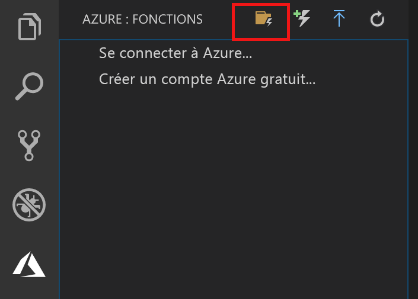
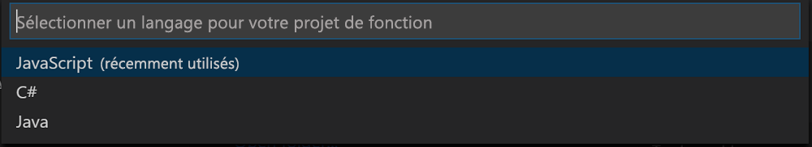

## Créer un projet Azure Functions

Le modèle de projet Azure Functions dans Visual Studio Code crée un projet qui peut être publié dans une application de fonction sur Azure. Une application de fonctions vous permet de regrouper les fonctions dans une unité logique pour la gestion, le déploiement et le partage des ressources.

1. Dans Visual Studio Code, sélectionnez le logo Azure pour afficher la zone **Azure : Fonctions**, puis sélectionnez l’icône Créer un projet.

    

1. Choisissez un emplacement pour votre espace de travail de projet et optez pour **Sélectionner**.

    > [!NOTE]
    > Cet article a été conçu pour être terminé en dehors d’un espace de travail. Dans ce cas, ne sélectionnez pas de dossier de projet qui fait partie d’un espace de travail.

1. Sélectionnez le langage pour votre projet d’application de fonction. Dans cet article, JavaScript est utilisé.
    

1. Lorsque vous y êtes invité, choisissez **ajouter à l’espace de travail**.

Visual Studio Code crée le projet d’application de fonction dans un nouvel espace de travail. Ce projet contient les fichiers de configuration [host.json](../articles/azure-functions/functions-host-json.md) et [local.settings.json](../articles/azure-functions/functions-run-local.md#local-settings-file), ainsi que des fichiers de projet spécifiques au langage. Vous obtenez également un nouveau référentiel Git dans le dossier du projet.