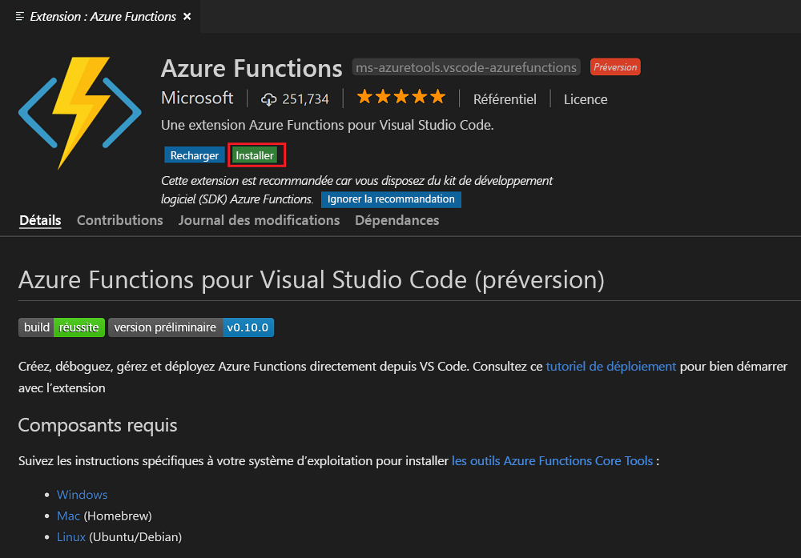
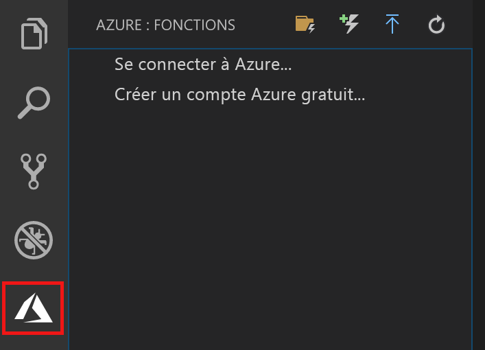

## Installer l’extension Azure Functions

Vous pouvez utiliser l’extension Azure Functions pour créer et tester des fonctions, et les déployer dans Azure.

1. Dans Visual Studio Code, ouvrez **Extensions**, puis recherchez **azure functions** ou [sélectionnez ce lien dans Visual Studio Code](vscode:extension/ms-azuretools.vscode-azurefunctions).

1. Sélectionnez **Installer** pour installer l’extension pour Visual Studio Code :

    

1. Une fois l’installation effectuée, sélectionnez l’icône Azure dans la barre d’activités. Vous devriez voir une zone Azure Functions dans la barre latérale.

    