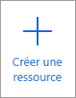

1. Ouvrir le portail Azure à partir de [https://portal.azure.com](https://portal.azure.com)

1. Sélectionner le bouton **Créer une ressource**

    

1. Sélectionnez **Calcul** > **Function App**.

    

1. Utilisez les paramètres d’application de fonction comme indiqué dans le tableau sous l’image.

    

    | Paramètre      | Valeur suggérée  | Description |
    | ------------ | ---------------- | ----------- |
    | **Abonnement** | Votre abonnement | Abonnement sous lequel est créée cette nouvelle application de fonction. |
    | **[Groupe de ressources](../articles/azure-resource-manager/management/overview.md)** |  *myResourceGroup* | Nom du nouveau groupe de ressources dans lequel créer votre Function App. |
    | **Nom de l’application de fonction** | Nom globalement unique | Nom qui identifie votre nouvelle Function App. Les caractères valides sont `a-z` (insensible à la casse), `0-9`et `-`.  |
    |**Publier**| Code | Option permettant de publier des fichiers de code ou un conteneur Docker. |
    | **Pile d’exécution** | Langage préféré | Choisissez un runtime qui prend en charge votre langage de programmation de fonction favori. Choisissez **.NET** pour les fonctions C# et F#. |
    |**Région**| Région recommandée | Choisissez une [région](https://azure.microsoft.com/regions/) près de chez vous ou près d’autres services auxquels ont accès vos fonctions. |

    Sélectionnez le bouton **Suivant : Hébergement >** .

1. Entrez les paramètres d’hébergement suivants.

    

    | Paramètre      | Valeur suggérée  | Description |
    | ------------ | ---------------- | ----------- |
    | **[Compte de stockage](../articles/storage/common/storage-account-create.md)** |  Nom globalement unique |  Créez un compte de stockage utilisé par votre application de fonction. Les noms des comptes de stockage doivent comporter entre 3 et 24 caractères, uniquement des lettres minuscules et des chiffres. Vous pouvez également utiliser un compte existant qui doit répondre aux [exigences relatives aux comptes de stockage](../articles/azure-functions/functions-scale.md#storage-account-requirements). |
    |**Système d’exploitation**| Système d’exploitation préféré | Un système d’exploitation est présélectionné pour vous en fonction de la sélection de votre pile d’exécution, mais vous pouvez modifier le paramètre si nécessaire. |
    | **[Plan](../articles/azure-functions/functions-scale.md)** | Premium | Pour Type de plan, sélectionnez **Premium (préversion)** , puis sélectionnez les valeurs par défaut pour *Plan Windows* et *Référence et taille* . |

    Sélectionnez le bouton **Suivant : Surveillance >** .

1. Entrez les paramètres de surveillance suivants.

    

    | Paramètre      | Valeur suggérée  | Description |
    | ------------ | ---------------- | ----------- |
    | **[Application Insights](../articles/azure-functions/functions-monitoring.md)** | Default | Crée une ressource Application Insights avec le même *nom de l’application* dans la région prise en charge la plus proche. En développant ce paramètre, vous pouvez changer le **Nouveau nom de ressource** ou choisir un autre **Emplacement** dans une [Zone géographique Azure](https://azure.microsoft.com/global-infrastructure/geographies/) où vous voulez stocker vos données. |

    Sélectionnez **Vérifier + créer** pour passer en revue les sélections de configuration d’application.

1. Sélectionnez **Créer** pour configurer et déployer l’application de fonction.