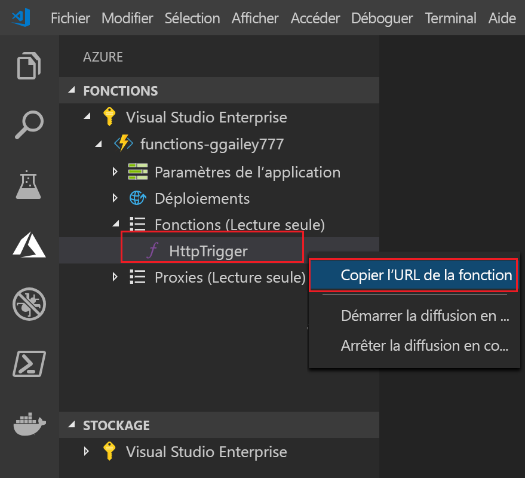

## Publication du projet sur Azure

Visual Studio Code vous permet de publier votre projet de fonctions directement sur Azure. Pendant le processus, vous créez une application de fonction et les ressources associées dans votre abonnement Azure. L’application de fonction fournit un contexte d'exécution pour vos fonctions. Le projet est empaqueté et déployé sur la nouvelle application de fonction dans votre abonnement Azure.

Par défaut, Visual Studio Code crée toutes les ressources Azure nécessaires pour créer votre application de fonction. Les noms de ces ressources sont basés sur le nom d’application de fonction que vous choisissez. Si vous souhaitez avoir un contrôle total sur les ressources créées, vous pouvez à la place [Publier à l’aide des options avancées](../articles/azure-functions/functions-develop-vs-code.md#enable-publishing-with-advanced-create-options).

Cette section suppose que vous créez une nouvelle application de fonction dans Azure.

> [!IMPORTANT]
> La publication sur une application de fonction existante remplace le contenu de cette application dans Azure.

1. Dans Visual Studio Code, appuyez sur F1 pour ouvrir la palette de commandes. Dans la palette de commandes, recherchez et sélectionnez `Azure Functions: Deploy to function app...`.

1. Si ce n'est déjà fait, vous êtes invité à vous **connecter à Azure**. Vous pouvez également **créer un compte Azure gratuit**. Une fois la connexion établie à partir du navigateur, revenez à Visual Studio Code. 

1. Si vous disposez de plusieurs abonnements, **sélectionnez un abonnement** pour l'application de fonction, puis choisissez **+ Créer une nouvelle application de fonction dans Azure**.

1. Tapez un nom global unique qui identifie votre application de fonction et appuyez sur Entrée. Les caractères valides pour un nom d’application de fonction sont `a-z`, `0-9` et `-`.

    Lorsque vous appuyez sur Entrée, les ressources Azure suivantes sont créées dans votre abonnement :

    * **[Groupe de ressources](../articles/azure-resource-manager/management/overview.md)**  : contient toutes les ressources Azure créées. Le nom est basé sur le nom de votre application de fonction.
    * **[Compte de stockage](../articles/storage/common/storage-account-create.md)**  : un compte de stockage standard est créé avec un nom unique, basé sur le nom de votre application de fonction.
    * **[Plan d'hébergement](../articles/azure-functions/functions-scale.md)**  : un plan de consommation est créé dans la région USA Ouest pour héberger votre application de fonction serverless.
    * **Application de fonction** : votre projet est déployé dans cette nouvelle application de fonction avant d'y être exécuté.

    Une notification s’affiche après que votre application de fonction a été créée et que le package de déploiement a été appliqué. Sélectionnez **Afficher la sortie de** dans cette notification pour afficher les résultats de la création et du déploiement, y compris les ressources Azure que vous avez créées.

1. Dans la zone **Azure : Fonctions**, développez la nouvelle application de fonction sous votre abonnement. Développez **Fonctions**, cliquez avec le bouton droit sur **HttpTrigger**, puis choisissez **Copier l'URL de fonction**.

    
