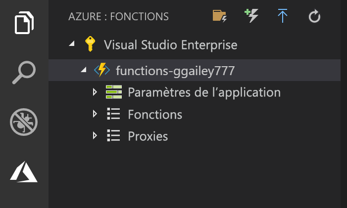

## Publication du projet sur Azure

Visual Studio Code vous permet de publier votre projet de fonctions directement sur Azure. Pendant le processus, vous créez une application de fonction et les ressources associées dans votre abonnement Azure. L’application de fonction fournit un contexte d'exécution pour vos fonctions. Le projet est empaqueté et déployé sur la nouvelle application de fonction dans votre abonnement Azure. 

Cet article suppose que vous créez une nouvelle application de fonction. La publication sur une application de fonction existante remplace le contenu de cette application dans Azure.

1. Dans la zone **Azure : Functions**, sélectionnez l’icône Déployer sur Function App.

    

1. Choisissez le dossier du projet, qui est votre espace de travail actuel.

1. Si vous avez plusieurs abonnements, choisissez celui où vous souhaitez héberger votre application de fonction, puis choisissez **+ Créer une application de fonction**.

1. Tapez un nom global unique qui identifie votre application de fonction et appuyez sur Entrée. Les caractères valides pour un nom d’application de fonction sont `a-z`, `0-9` et `-`.

1. Choisissez **+ Créer un groupe de ressources**, tapez un nom de groupe de ressources, par exemple `myResourceGroup`, et appuyez sur Entrée. Vous pouvez également utiliser un groupe de ressources existant.

1. Choisissez **+ Créer un compte de stockage**, tapez un nom global unique du nouveau compte de stockage utilisé par votre application de fonction et appuyez sur Entrée. Les noms des comptes de stockage doivent comporter entre 3 et 24 caractères, uniquement des lettres minuscules et des chiffres. Vous pouvez également utiliser un compte existant.

1. Choisissez également un emplacement dans une [région](https://azure.microsoft.com/regions/) proche de chez vous, ou proche d’autres services auxquels vos fonctions ont accès.

    La création d’applications de fonction démarre une fois que vous avez choisi votre emplacement. Une notification s’affiche après que votre application de fonction a été créée et que le package de déploiement a été appliqué.

1. Sélectionnez **Afficher la sortie de** dans les notifications pour afficher les résultats de la création et du déploiement, y compris les ressources Azure que vous avez créées.

    

1. Notez l’URL de la nouvelle application de fonction dans Azure. Vous l’utiliserez pour tester votre fonction une fois que le projet aura été publié sur Azure.

    

1. En revenant dans la zone **Azure : Functions**, vous voyez la nouvelle application de fonction affichée sous votre abonnement. Lorsque vous développez ce nœud, vous voyez les fonctions dans l’application de fonction, ainsi que les paramètres d’application et les proxys de fonction.

    

    À partir du nœud de votre application de fonction, tapez Ctrl et cliquez (clic droit) pour choisir d’effectuer diverses tâches de gestion et de configuration relatives à l’application de fonction dans Azure. Vous pouvez également choisir d’afficher l’application de fonction dans le portail Azure.
