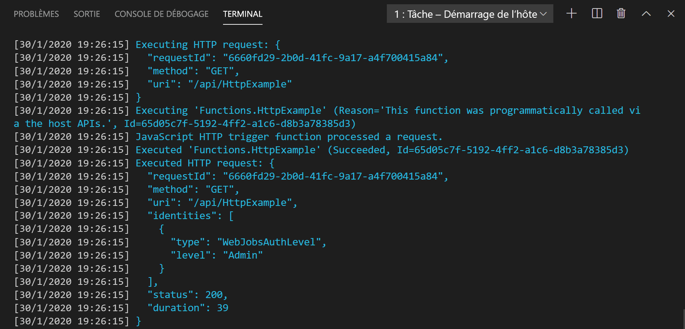

## <a name="run-the-function-locally"></a>Exécuter la fonction localement

Azure Functions Core Tools s’intègre à Visual Studio Code pour vous permettre d’exécuter et de déboguer un projet Azure Functions localement. Pour plus d’informations sur le débogage dans Visual Studio Code, consultez [Déboguer localement des fonctions PowerShell Azure](../articles/azure-functions/functions-debug-powershell-local.md). 

1. Appuyez sur F5 pour démarrer le projet d’application de fonction. La sortie de Core Tools est affichée dans le panneau **Terminal**.

1. Dans le panneau **Terminal**, copiez le point de terminaison de l’URL de votre fonction déclenchée via HTTP.

    

1. Ajoutez la chaîne de requête `?name=<yourname>` à cette URL, puis utilisez `Invoke-RestMethod` dans une deuxième invite de commandes PowerShell pour exécuter la requête, comme suit :

    ```powershell
    PS > Invoke-RestMethod -Method Get -Uri http://localhost:7071/api/HttpTrigger?name=PowerShell
    Hello PowerShell
    ```

    Vous pouvez également exécuter la requête GET depuis un navigateur avec l’URL suivante :

    <http://localhost:7071/api/HttpExample?name=PowerShell>

    Quand vous appelez le point de terminaison HttpTrigger sans passer de paramètre `name` comme paramètre de requête ou dans le corps, la fonction retourne une erreur `BadRequest`. Quand vous examinez le code dans run.ps1, vous voyez que cette erreur est voulue.

1. Les informations relatives à la requête s’affichent dans le panneau **Terminal**.

    

1. Quand vous avez terminé, appuyez sur **Ctrl+C** pour arrêter Core Tools.

Après avoir vérifié que la fonction s’exécute correctement sur votre ordinateur local, il est temps de publier le projet sur Azure.