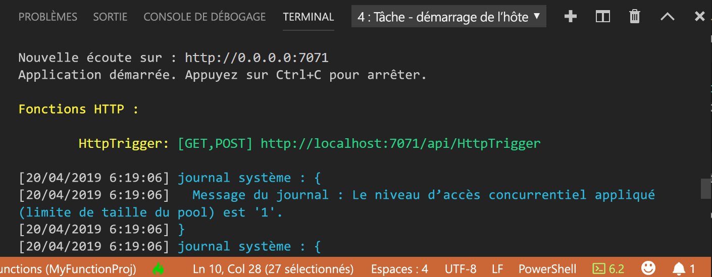

## <a name="run-the-function-locally"></a>Exécuter la fonction localement

Azure Functions Core Tools s’intègre à Visual Studio Code pour vous permettre d’exécuter et de déboguer un projet Azure Functions localement.  

1. Pour déboguer votre fonction, insérez un appel à l’applet de commande [`Wait-Debugger`](/powershell/module/microsoft.powershell.utility/wait-debugger?view=powershell-6) dans le code de fonction avant d’attacher le débogueur, puis appuyez sur F5 pour démarrer le projet d’application de fonction et attacher le débogueur. La sortie de Core Tools est affichée dans le panneau **Terminal**.

1. Dans le panneau **Terminal**, copiez le point de terminaison de l’URL de votre fonction déclenchée via HTTP.

    

1. Ajoutez la chaîne de requête `?name=<yourname>` à cette URL, puis utilisez `Invoke-RestMethod` dans une deuxième invite de commandes PowerShell pour exécuter la requête, comme suit :

    ```powershell
    PS > Invoke-RestMethod -Method Get -Uri http://localhost:7071/api/HttpTrigger?name=PowerShell
    Hello PowerShell
    ```

    Vous pouvez également exécuter la demande GET à partir d’un navigateur.

    Quand vous appelez le point de terminaison HttpTrigger sans passer `name` comme paramètre de requête ou dans le corps, la fonction retourne une erreur [HttpStatusCode]::BadRequest. Quand vous examinez le code dans run.ps1, vous voyez que cette erreur est voulue.

1. Pour arrêter le débogage, appuyez sur MAJ + F5.

Après avoir vérifié que la fonction s’exécute correctement sur votre ordinateur local, il est temps de publier le projet sur Azure.

> [!NOTE]
> N’oubliez pas de supprimer tous les appels à `Wait-Debugger` avant de publier vos fonctions sur Azure. 