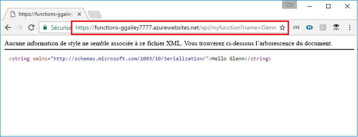

## Vérifier la fonction dans Azure

Vous pouvez utiliser un navigateur web pour vérifier la fonction déployée.  Copiez l’URL, y compris la clé de fonction, dans la barre d’adresse de votre navigateur web. Ajoutez la chaîne de requête `&name=<yourname>` à l’URL avant d’exécuter la requête.

  

Vous pouvez aussi utiliser cURL pour vérifier la fonction déployée. À l’aide de l’URL, laquelle inclut la clé de fonction, que vous avez copiée à l’étape précédente, ajoutez la chaîne de requête `&name=<yourname>` à l’URL.

 

