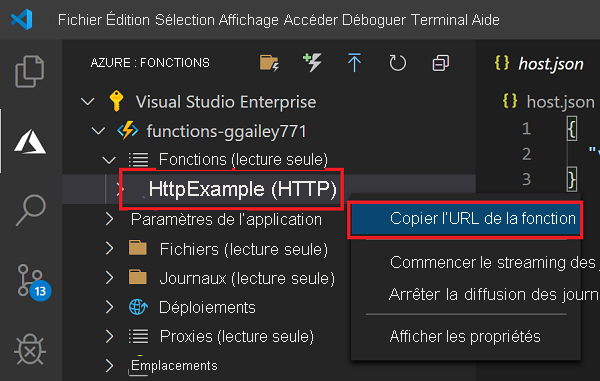

## <a name="run-the-function-in-azure"></a>Exécuter la fonction dans Azure

1. Dans la zone **Azure : Fonctions** de la barre latérale, développez la nouvelle application de fonction sous votre abonnement. Développez **Fonctions** , cliquez avec le bouton droit (Windows) ou appuyez sur <kbd>Ctrl -</kbd> clic (macOS) sur **HttpExample** , puis sélectionnez **Copier l’URL de la fonction**.

    

1. Collez cette URL pour la requête HTTP dans la barre d’adresse de votre navigateur, ajoutez la chaîne de requête `name` sous la forme `?name=Functions` à la fin de cette URL, puis exécutez la requête. L’URL qui appelle la fonction déclenchée via HTTP doit être au format suivant :

    ```http
    http://<FUNCTION_APP_NAME>.azurewebsites.net/api/httpexample?name=Functions
    ```

    L’exemple suivant montre la réponse dans le navigateur à la requête GET distante retournée par la fonction :

    
