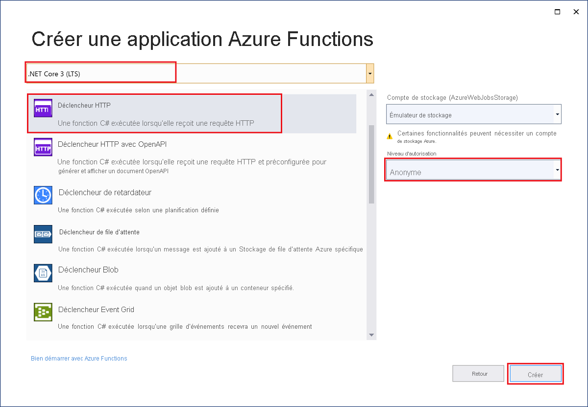

Le modèle de projet Azure Functions dans Visual Studio crée un projet que vous pouvez publier dans une application de fonction dans Azure. Vous pouvez utiliser une application de fonction pour regrouper des fonctions en une unité logique afin de faciliter la gestion, le déploiement, la mise à l’échelle et le partage des ressources.

1. Dans Visual Studio, dans le menu **Fichier**, sélectionnez **Nouveau** > **Projet**.

1. Dans **Créer un projet**, entrez *functions* dans la zone de recherche, puis choisissez le modèle **Azure Functions**.

1. Dans **Configurer votre nouveau projet**, entrez un **Nom de projet**, puis sélectionnez **Créer**. Le nom d’application de la fonction doit être valide en tant qu’espace de noms C#, afin de ne pas utiliser des traits d’union, des traits de soulignement ou d’autres caractères non alphanumériques.

1. Pour les paramètres **Nouveau projet - &lt;nom de votre projet&gt;** , utilisez les valeurs du tableau suivant :

    | Paramètre      | Valeur  | Description                      |
    | ------------ |  ------- |----------------------------------------- |
    | **Runtime Functions** | **Azure Functions v2  (.NET Core)** | Cette valeur crée un projet de fonction qui utilise la version 2.x du runtime Azure Functions, qui prend en charge .NET Core. La version 1.x d’Azure Functions prend en charge .NET Framework. Pour plus d’informations, consultez [Vue d’ensemble des versions du runtime Azure Functions](../articles/azure-functions/functions-versions.md).   |
    | **Modèle de fonction** | **Déclencheur HTTP** | Cette valeur crée une fonction déclenchée par une requête HTTP. |
    | **Compte de stockage**  | **Émulateur de stockage** | Étant donné qu’une fonction Azure nécessite un compte de stockage, celui-ci est attribué ou créé quand vous publiez votre projet sur Azure. Un déclencheur HTTP n’utilise pas de chaîne de connexion de compte Stockage Azure ; tous les autres types de déclencheurs nécessitent une chaîne de connexion de compte Stockage Azure valide.  |
    | **Droits d’accès** | **Anonyme** | La fonction créée peut être déclenchée par n’importe quel client sans fournir une clé. Ce paramètre d’autorisation facilite le test de votre nouvelle fonction. Pour plus d’informations sur les clés et autorisations, consultez [Clés d’autorisation](../articles/azure-functions/functions-bindings-http-webhook-trigger.md#authorization-keys) et [Liaisons HTTP et webhook](../articles/azure-functions/functions-bindings-http-webhook.md). |
    

    
    

    Veillez à définir les **Droits d’accès** sur **Anonyme**. Si vous choisissez le niveau par défaut **Fonction**, vous êtes invité à présenter la [clé de fonction](../articles/azure-functions/functions-bindings-http-webhook-trigger.md#authorization-keys) dans les requêtes d’accès à votre point de terminaison de fonction.

1. Sélectionnez **OK** pour créer le projet de fonction et la fonction déclenchée par HTTP.
