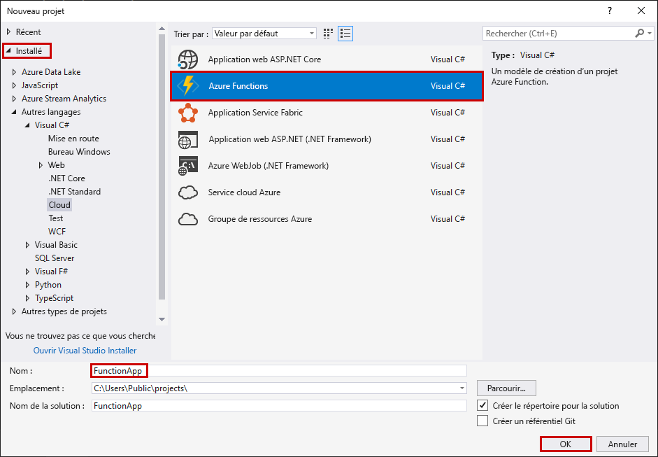
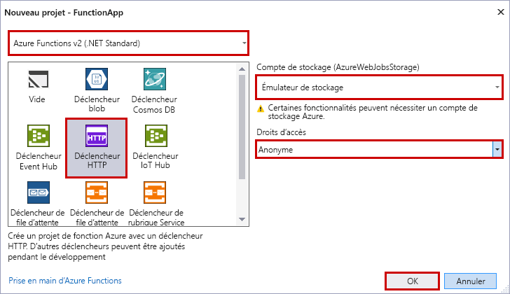

Le modèle de projet Azure Functions dans Visual Studio crée un projet qui peut être publié dans une application de fonction dans Azure. Vous pouvez utiliser une application de fonction pour regrouper les fonctions dans une unité logique pour la gestion, le déploiement et le partage des ressources.

1. Dans Visual Studio, dans le menu **Fichier**, sélectionnez **Nouveau** > **Projet**.

2. Dans la boîte de dialogue **Nouveau projet**, sélectionnez **Installé** > **Visual C#**  > **Cloud** > **Azure Functions**. Entrez un nom pour votre projet et sélectionnez **OK**. Le nom d’application de la fonction doit être valide en tant qu’espace de noms C#, afin de ne pas utiliser des traits d’union, des traits de soulignement ou d’autres caractères non alphanumériques.

    

3. Utilisez les paramètres spécifiés dans le tableau à la suite de l’image.

     

    | Paramètre      | Valeur suggérée  | Description                      |
    | ------------ |  ------- |----------------------------------------- |
    | **Version** | Azure Functions 2.x  (.NET Core) | Ce paramètre crée un projet de fonction qui utilise le runtime d’Azure Functions version 2.x qui prend en charge .NET Core. La version 1.x d’Azure Functions prend en charge .NET Framework. Pour plus d’informations, consultez [Cibler la version du runtime Azure Functions](../articles/azure-functions/functions-versions.md).   |
    | **Modèle** | Déclencheur HTTP | Ce paramètre crée une fonction déclenchée par une demande HTTP. |
    | **Compte de stockage**  | Émulateur de stockage | Un déclencheur HTTP n’utilise pas la connexion de compte de stockage Azure. Tous les autres types de déclencheurs nécessitent une chaîne de connexion de compte de stockage valide. |
    | **Droits d’accès** | Anonyme | La fonction créée peut être déclenchée par n’importe quel client sans fournir une clé. Ce paramètre d’autorisation facilite le test de votre nouvelle fonction. Pour plus d’informations sur les clés et autorisations, consultez [Clés d’autorisation](../articles/azure-functions/functions-bindings-http-webhook.md#authorization-keys) dans [HTTP et liaisons de webhook](../articles/azure-functions/functions-bindings-http-webhook.md). |
    
    > [!NOTE]
    > Veillez à définir les **Droits d’accès** sur `Anonymous`. Si vous choisissez le niveau par défaut de `Function`, vous êtes invité à présenter la [clé de fonction](../articles/azure-functions/functions-bindings-http-webhook.md#authorization-keys) dans les demandes d’accès à votre point de terminaison de fonction.
    
4. Sélectionnez **OK** pour créer le projet de fonction et la fonction déclenchée par HTTP.
