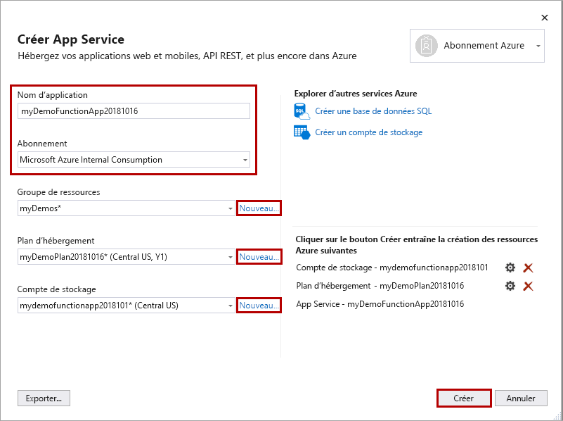

1. Dans **l’Explorateur de solutions**, cliquez avec le bouton droit sur le projet, puis sélectionnez **Publier**.

1. Dans **Cible**, sélectionnez **Azure** :::image type="content" source="media/functions-vstools-publish/functions-visual-studio-publish-profile-step-1.png" alt-text="Sélectionner une cible Azure":::

1. Dans **Cible spécifique**, sélectionnez **Application de fonction Azure (Windows)**

    :::image type="content" source="media/functions-vstools-publish/functions-visual-studio-publish-profile-step-2.png" alt-text="Sélectionner une application de fonction Azure":::

1. Dans **Instance de fonction**, sélectionnez **Créer une application de fonction...** , puis utilisez les valeurs spécifiées dans le tableau suivant :

    | Paramètre      | Valeur  | Description                                |
    | ------------ |  ------- | -------------------------------------------------- |
    | **Nom** | Nom globalement unique | Nom qui identifie uniquement votre nouvelle application de fonction. Acceptez ce nom ou entrez un nouveau nom. Les caractères valides sont `a-z`, `0-9` et `-`. |
    | **Abonnement** | Votre abonnement | Sélectionnez l’abonnement Azure à utiliser. Acceptez cet abonnement ou sélectionnez-en un nouveau dans la liste déroulante. |
    | **[Groupe de ressources](../articles/azure-resource-manager/management/overview.md)** | Nom de votre groupe de ressources |  Groupe de ressources dans lequel créer votre application de fonction. Sélectionnez un groupe de ressources existant dans la liste déroulante, ou choisissez **Créer** pour créer un groupe de ressources.|
    | **[Type de plan](../articles/azure-functions/functions-scale.md)** | Consommation | Quand vous publiez votre projet dans une application de fonction qui s’exécute dans un [Plan Consommation](../articles/azure-functions/functions-scale.md#consumption-plan), vous payez uniquement pour les exécutions de votre application de fonction. D’autres plans d’hébergement occasionnent des coûts plus élevés. |
    | **Lieu** | Emplacement du service d’application | Choisissez un **Emplacement** dans une [région](https://azure.microsoft.com/regions/) proche de chez vous, ou proche d’autres services auxquels vos fonctions ont accès. |
    | **[Stockage Azure](../articles/storage/common/storage-account-create.md)** | Compte de stockage à usage général | Le runtime Functions exige un compte Stockage Azure. Sélectionnez **Nouveau** pour configurer un compte de stockage universel. Vous pouvez également choisir un compte existant qui répond aux [exigences relatives aux comptes de stockage](../articles/azure-functions/functions-scale.md#storage-account-requirements).  |

    

1. Sélectionnez **Créer** pour créer une application de fonction et les ressources associées dans Azure. 
1. Dans **Instance de fonction**, assurez-vous que **Exécuter à partir du fichier de package** est coché. Votre application de fonction est déployée en utilisant [Zip Deploy](../articles/azure-functions/functions-deployment-technologies.md#zip-deploy) avec le mode [Exécuter à partir du fichier de package](../articles/azure-functions/run-functions-from-deployment-package.md) activé. Il s’agit de la méthode de déploiement recommandée pour votre projet fonctions, car elle offre de meilleures performances. 

    :::image type="content" source="media/functions-vstools-publish/functions-visual-studio-publish-profile-step-4.png" alt-text="Terminer la création du profil":::

1. Sélectionnez **Terminer**, puis dans la page Publier, sélectionnez **Publier** pour déployer le package contenant vos fichiers projet dans votre nouvelle application de fonction dans Azure. 

    Une fois le déploiement terminé, l’URL racine de l’application de fonction dans Azure est affichée sous l’onglet **Publier**. 
    
1.  Sous l’onglet Publier, choisissez **Gérer dans Cloud Explorer**. La nouvelle ressource Azure d’application de fonction est alors ouverte dans Cloud Explorer. 
    
    :::image type="content" source="media/functions-vstools-publish/functions-visual-studio-publish-complete.png" alt-text="Publier un message de réussite":::
    
    Cloud Explorer vous permet d’utiliser Visual Studio pour afficher le contenu du site, démarrer et arrêter l’application de fonction, et accéder directement aux ressources de l’application de fonction sur Azure et dans le portail Azure. 
