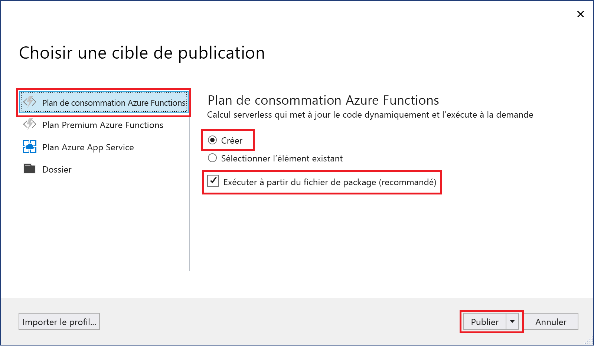
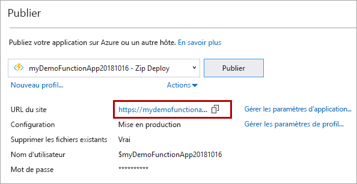

1. Dans **l’Explorateur de solutions**, cliquez avec le bouton droit sur le projet, puis sélectionnez **Publier**.

2. Dans **Choisir une cible de publication**, utilisez les options de publication spécifiées dans le tableau suivant : 

    | Option      | Description                                |
    | ------------ |  -------------------------------------------------- |
    | **Plan de consommation Azure Functions** | Créez une application de fonction dans un environnement cloud Azure qui s’exécute dans un [plan de consommation](../articles/azure-functions/functions-scale.md#consumption-plan). Quand vous utilisez un plan de consommation, vous payez seulement pour les exécutions de votre application de fonction. D’autres plans d’hébergement occasionnent des coûts plus élevés. Si vous exécutez un plan autre que le plan de consommation, vous devez gérer la [mise à l’échelle de votre application de fonction](../articles/azure-functions/functions-scale.md).| 
    | **Créer** | Une nouvelle application de fonction, avec les ressources associées, est créée dans Azure.  Si vous choisissez **Sélectionner existant**, tous les fichiers de l’application de fonction existante dans Azure sont remplacés par les fichiers du projet local. Utilisez cette option uniquement quand vous republiez des mises à jour d’une application de fonction existante. |
    | **Exécuter à partir d’un fichier de package** | Votre application de fonction est déployée en utilisant [Zip Deploy](../articles/azure-functions/functions-deployment-technologies.md#zip-deploy) avec le mode [Exécuter à partir du fichier de package](../articles/azure-functions/run-functions-from-deployment-package.md) activé. Ce déploiement, qui offre de meilleures performances, constitue la méthode recommandée pour exécuter vos fonctions.  Si vous n’utilisez pas cette option, veillez à ce que votre projet d’application de fonction ne s’exécute pas localement avant de publier sur Azure. |

    

3. Sélectionnez **Créer un profil**. Si vous ne vous êtes pas encore connecté à votre compte Azure à partir de Visual Studio, sélectionnez **Connexion**. Vous pouvez également créer un compte Azure gratuit.

4. Dans **App Service : Créer**, utilisez les valeurs spécifiées dans le tableau suivant :

    | Paramètre      | Valeur  | Description                                |
    | ------------ |  ------- | -------------------------------------------------- |
    | **Nom** | Nom globalement unique | Nom qui identifie uniquement votre nouvelle application de fonction. Acceptez ce nom ou entrez un nouveau nom. Les caractères valides sont `a-z`, `0-9` et `-`. |
    | **Abonnement** | Votre abonnement | Sélectionnez l’abonnement Azure à utiliser. Acceptez cet abonnement ou sélectionnez-en un nouveau dans la liste déroulante. |
    | **[Groupe de ressources](../articles/azure-resource-manager/management/overview.md)** | Nom de votre groupe de ressources |  Groupe de ressources dans lequel créer votre application de fonction. Sélectionnez un groupe de ressources existant dans la liste déroulante, ou choisissez **Créer** pour créer un groupe de ressources.|
    | **[Plan d’hébergement](../articles/azure-functions/functions-scale.md)** | Nom de votre plan d’hébergement | Sélectionnez **Nouveau** pour configurer un plan serverless. Veillez à choisir la **Consommation** sous **Taille**. Quand vous publiez votre projet dans une application de fonction qui s’exécute dans un [Plan Consommation](../articles/azure-functions/functions-scale.md#consumption-plan), vous payez uniquement pour les exécutions de votre application de fonction. D’autres plans d’hébergement occasionnent des coûts plus élevés. Si vous exécutez un plan autre que le plan **Consommation**, vous devez gérer la [mise à l’échelle de votre application de fonction](../articles/azure-functions/functions-scale.md).  |
    | **Lieu** | Emplacement du service d’application | Choisissez un **Emplacement** dans une [région](https://azure.microsoft.com/regions/) proche de chez vous, ou proche d’autres services auxquels vos fonctions ont accès. |
    | **[Stockage Azure](../articles/storage/common/storage-account-create.md)** | Compte de stockage à usage général | Le runtime Functions exige un compte Stockage Azure. Sélectionnez **Nouveau** pour configurer un compte de stockage universel. Vous pouvez également choisir un compte existant qui répond aux [exigences relatives aux comptes de stockage](../articles/azure-functions/functions-scale.md#storage-account-requirements).  |

    

5. Sélectionnez **Créer** pour créer une application de fonction et ses ressources associées dans Azure avec ces paramètres et déployer votre code de projet de fonction. 

6. Sélectionnez Publier et, une fois le déploiement terminé, notez la valeur de **URL du site**, qui est l’adresse de votre application de fonction dans Azure.

    
