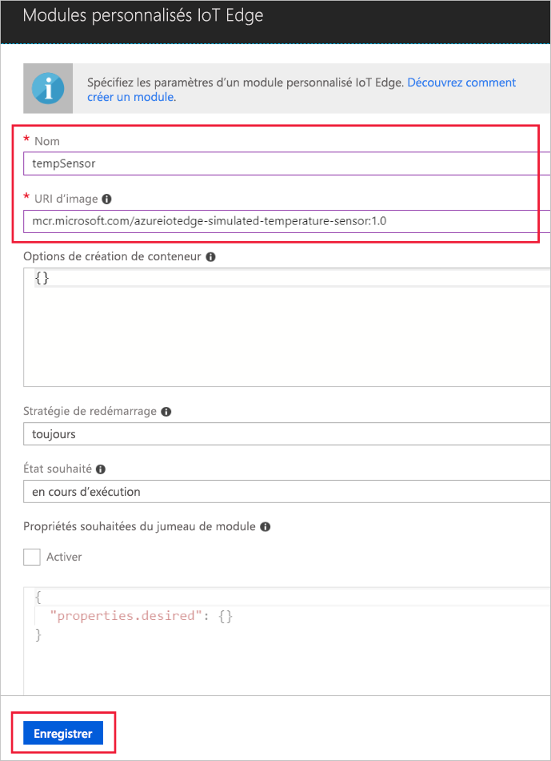

Une des fonctionnalités clés d’Azure IoT Edge est la capacité de déployer des modules sur vos appareils IoT Edge à partir du cloud. Un module IoT Edge est un package exécutable implémenté en tant que conteneur. Dans cette section, vous déployez un module qui génère des données de télémétrie pour votre appareil simulé. 

1. Accédez à votre hub IoT dans le portail Azure.
1. Accédez à **IoT Edge** et sélectionnez votre appareil IoT Edge.
1. Sélectionnez **Définir modules**.
1. Dans la section **Modules de déploiement** de la page, cliquez sur **Ajouter** puis sélectionnez **Module IoT Edge**.
1. Dans le champ **Nom**, entrez `tempsensor`. 
1. Dans le champ **URI de l’image**, entrez `mcr.microsoft.com/azureiotedge-simulated-temperature-sensor:1.0`. 
1. Laissez les autres paramètres inchangés et sélectionnez **Enregistrer**.

   

1. De retour à l’étape **Ajouter des modules**, sélectionnez **Suivant**.
1. À l’étape **Spécifier des routes**, vous devez avoir un itinéraire par défaut qui envoie tous les messages depuis tous les modules vers IoT Hub. Si ce n’est pas le cas, ajoutez le code suivant, puis sélectionnez **Suivant**.

   ```json
   {
       "routes": {
           "route": "FROM /* INTO $upstream"
       }
   }
   ```

1. À l’étape **Vérifier le déploiement**, sélectionnez **Envoyer**.
1. Revenez à la page de détails de l’appareil et sélectionnez **Actualiser**. Outre le module edgeAgent qui a été créé lors du premier démarrage du service, vous devriez voir un autre module runtime appelé **edgeHub** ainsi que le module **tempSensor** dans la liste. 

   
