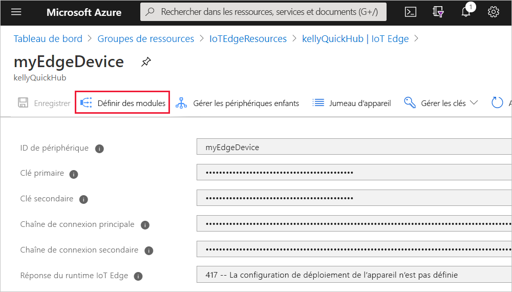
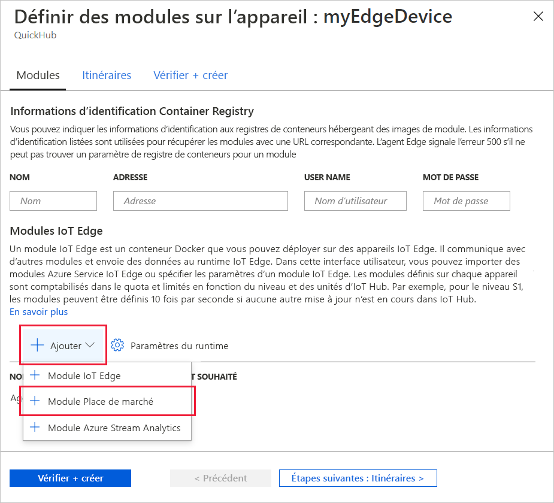
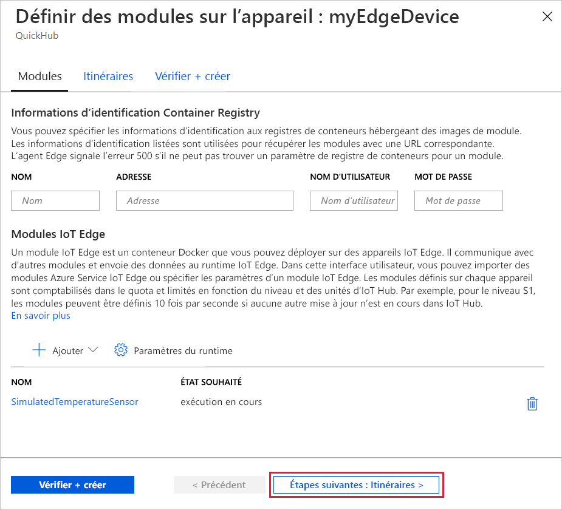
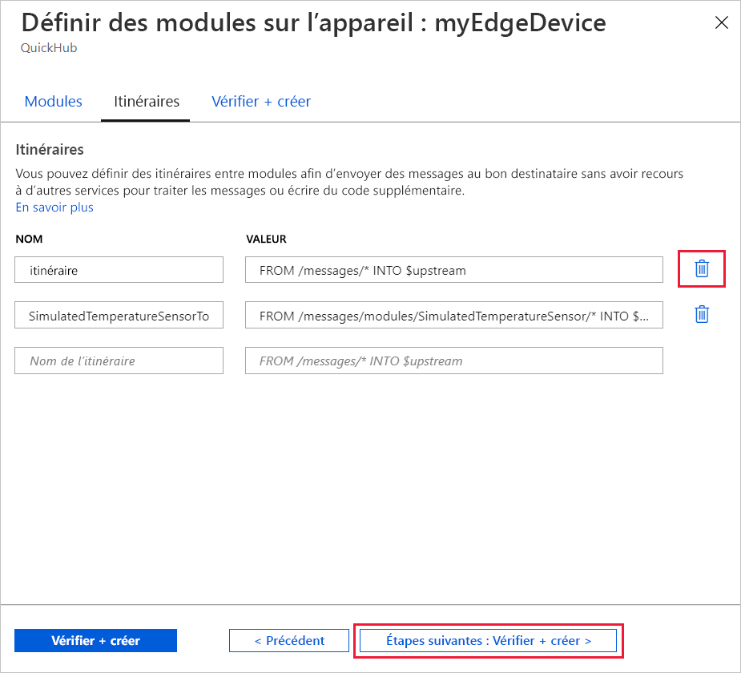
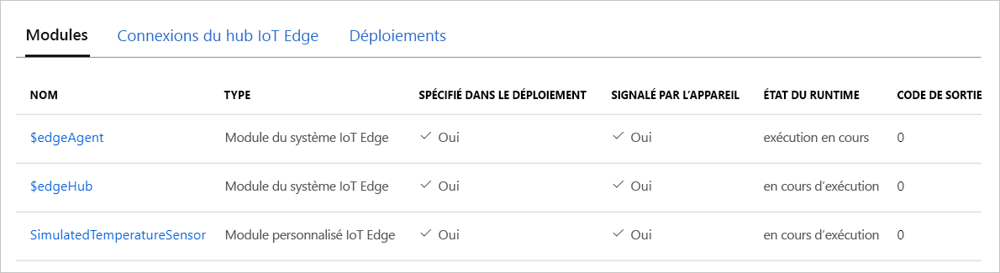

Une des fonctionnalités clés d’Azure IoT Edge est la capacité de déployer du code sur vos appareils IoT Edge à partir du cloud. Les *modules IoT Edge* sont des packages exécutables implémentés en tant que conteneurs. Dans cette section, vous allez déployer un module prédéfini à partir de la [section Modules IoT Edge de la Place de marché Azure](https://azuremarketplace.microsoft.com/marketplace/apps/category/internet-of-things?page=1&subcategories=iot-edge-modules) directement à partir de votre hub IoT Azure.

Le module que vous déployez dans cette section simule un capteur et envoie les données générées. Ce module s’avère être un extrait de code utile quand vous prenez en main IoT Edge, car vous pouvez utiliser les données simulées à des fins de développement et de test. Si vous souhaitez voir exactement ce que fait ce module, vous pouvez afficher le [code source du capteur de température simulé](https://github.com/Azure/iotedge/blob/027a509549a248647ed41ca7fe1dc508771c8123/edge-modules/SimulatedTemperatureSensor/src/Program.cs).

Pour déployer votre premier module à partir de la Place de marché Azure, effectuez les étapes suivantes :

1. Connectez-vous au [portail Azure](https://portal.azure.com) et accédez à votre IoT Hub.

1. Dans le menu du volet gauche, sous **Gestion automatique des appareils**, sélectionnez **IoT Edge**.

1. Cliquez sur l’ID de l’appareil cible dans la liste des appareils.

1. Dans la barre supérieure, sélectionnez **Définir des modules**.

   

1. Dans la section **Modules IoT Edge** de la page, cliquez sur **Ajouter**, puis sélectionnez **Module de la Place de marché** dans le menu déroulant.

   

1. Dans la **Place de marché de module IoT Edge**, recherchez « Capteur de température simulé » et sélectionnez ce module.

1. Notez que le module SimulatedTemperatureSensor est ajouté à la section Modules IoT Edge, avec l’état souhaité **en cours d’exécution**.

   Sélectionnez **Suivant : Routes** pour passer à l’étape suivante de l’Assistant.

   

1. Sous l’onglet **Routes** de l’Assistant, vous pouvez définir la manière dont les messages sont transmis entre les modules et le hub IoT. Les routes sont construites à l’aide de paires nom/valeur. Vous devez voir deux routes sur cette page. La routes par défaut appelée **route** envoie tous les messages à IoT Hub (on emploie le terme `$upstream`). Une deuxième route appelée **SimulatedTemperatureSensorToIoTHub** a été créée automatiquement quand vous avez ajouté le module à partir de la Place de marché. Cette route envoie tous les messages du module de température simulé à IoT Hub. Vous pouvez supprimer la route par défaut, car elle est redondante dans ce cas.

   Sélectionnez **Suivant : Vérifier + créer** pour passer à l’étape suivante de l’Assistant.

   

1. Sous l’onglet **Vérifier + créer** de l’Assistant, vous pouvez afficher un aperçu du fichier JSON qui définit tous les modules déployés sur votre appareil IoT Edge. Notez que le module **SimulatedTemperatureSensor** est également inclus, ainsi que deux modules runtime, **edgeAgent** et **edgeHub**. Sélectionnez **Créer** lorsque vous avez terminé.

   Lorsque vous envoyez un nouveau déploiement vers un appareil IoT Edge, rien n’est envoyé en mode push à votre appareil. Au lieu de cela, l’appareil interroge régulièrement IoT Hub pour connaître les nouvelles instructions. Si l’appareil détecte un manifeste de déploiement mis à jour, il utilise les informations sur le nouveau déploiement pour extraire les images de module à partir du cloud, puis commence à exécuter localement les modules. Ce processus peut prendre quelques minutes.

1. Une fois que vous avez créé les détails de déploiement du module, l’Assistant vous renvoie à la page de détails de l’appareil. Dans la page de détails de l’appareil, affichez l’état du déploiement sous l’onglet **Modules**. Doivent figurer trois modules : $edgeAgent, $edgeHub et SimulatedTemperatureSensor. Si un ou plusieurs modules sont répertoriés comme spécifiés dans le déploiement, mais ne sont pas signalés par l’appareil, votre appareil IoT Edge est encore en train de les démarrer. Attendez quelques instants, puis sélectionnez **Actualiser** en haut de la page.

   
