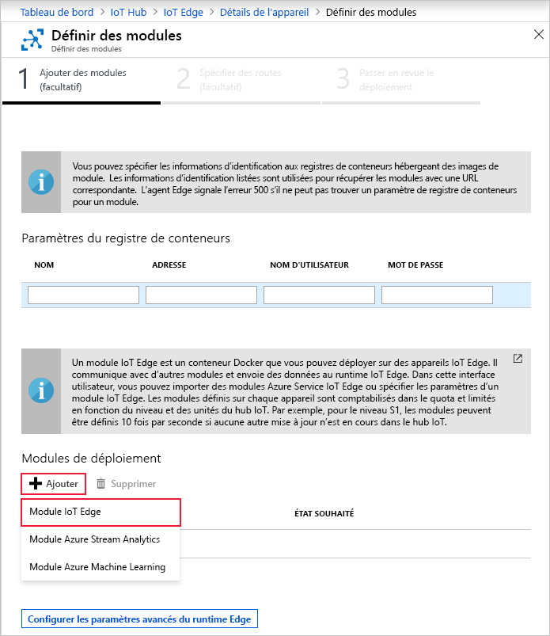

Une des fonctionnalités clés d’Azure IoT Edge est la capacité de déployer des modules sur vos appareils IoT Edge à partir du cloud. Un module IoT Edge est un package exécutable implémenté en tant que conteneur. Dans cette section, vous déployez un module qui génère des données de télémétrie pour votre appareil simulé.

1. Accédez à votre hub IoT dans le portail Azure.

2. Accédez à **IoT Edge** sous **Gestion automatique des appareils** et sélectionnez votre appareil IoT Edge.

3. Sélectionnez **Définir modules**. Un Assistant en trois étapes s’ouvre dans le portail et vous guide tout au long des processus d’ajout de modules, de spécification de routes et de vérification du déploiement. 

4. Dans l’étape **Ajouter des modules** de l’Assistant, recherchez la section **Modules de déploiement**. Cliquez sur **Ajouter**, puis sélectionnez **Module IoT Edge**.

   

5. Dans le champ **Nom**, entrez `tempSensor`.

6. Dans le champ **URI de l’image**, entrez `mcr.microsoft.com/azureiotedge-simulated-temperature-sensor:1.0`.

7. Laissez les autres paramètres inchangés et sélectionnez **Enregistrer**.

   

8. Une fois revenu à la première étape de l’Assistant, sélectionnez **Suivant**.

9. À l’étape **Spécifier des routes** de l’Assistant, il doit exister une route par défaut qui envoie tous les messages de tous les modules vers IoT Hub. Si ce n’est pas le cas, ajoutez le code suivant, puis sélectionnez **Suivant**.

   ```json
   {
       "routes": {
           "route": "FROM /messages/* INTO $upstream"
       }
   }
   ```

10. À l’étape **Passer en revue le déploiement** de l’Assistant, sélectionnez **Envoyer**.

11. Revenez à la page de détails de l’appareil et sélectionnez **Actualiser**. Outre le module edgeAgent qui a été créé lors du premier démarrage du service, vous devriez voir un autre module runtime appelé **edgeHub** ainsi que le module **tempSensor** dans la liste.

   Plusieurs minutes peuvent être nécessaires avant que les nouveaux module soient visibles. L’appareil IoT Edge doit récupérer ses nouvelles informations de déploiement sur le cloud, démarrer les conteneurs, puis communiquer son nouvel état à IoT Hub. 

   
