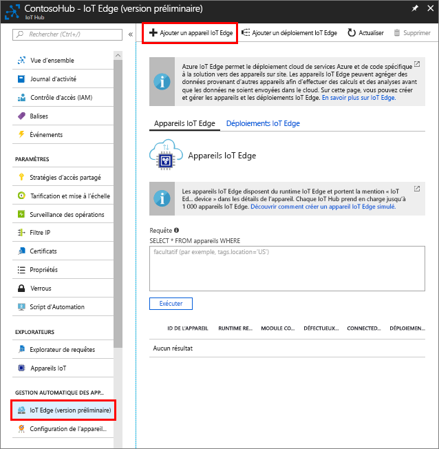

Créez une identité d’appareil pour votre appareil simulé afin qu’il puisse communiquer avec votre IoT Hub. Étant donné que les appareils IoT Edge se comportent et peuvent être gérés différemment des appareils IoT standard, vous déclarez qu’il s’agit d’un appareil IoT Edge dès le départ. 

1. Accédez à votre hub IoT dans le portail Azure.
1. Sélectionnez **IoT Edge**, puis **Ajouter un appareil IoT Edge**.

   

1. Donnez à votre appareil simulé un ID d’appareil unique.
1. Sélectionnez **Enregistrer** pour ajouter votre appareil.
1. Sélectionnez votre nouvel appareil dans la liste des appareils.
1. Copiez la valeur de **Chaîne de connexion—clé primaire** et enregistrez-la. Vous utiliserez cette valeur pour configurer le runtime IoT Edge dans la section suivante. 

